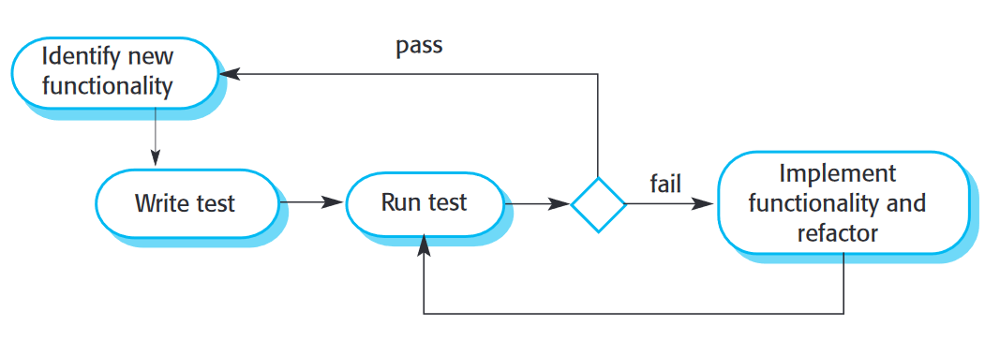

# Test

## Test-driven Development (TDD)

* Tests are written before code and 'passing' the test is the critical driver of development
* You develop code incrementally, along with a test for that increment.
    You dont move on to the next increment before code has passed its test
* TDD was introduced as part of agile methods such as XP.
    However, it can also be used in plan-driven development processes.

### Process Activities

* Start by identifying the increment of functionality that is required. This should normally be small and implementable in a few lines of code
* Write a test for this functionality and implement this as an automated test
* Run the test, along with all other tests that have been implemented. Initially, you have not implemented the functionality so the new test will fail
* Implement the functionality and re-run the test
* Once all tests run successfully, you move on to implementing the next chunk of functionality

### Benefits

* **Code Coverage**
    * Every code segment that you write has at least one associated test so all code written has at least one test
* **Regression Testing**
    * A regression test suite is developed incrementally as a program is developed.
* **Simplified Debugging**
    * When a test fails, it should be obvious where the problem lies. The newly written code needs to be checked and modified
* **System Documentation**
    * The tests themselves are a form of documentation that describe what the code should be doing. 

## Plan-Driven Testing

### V Model

