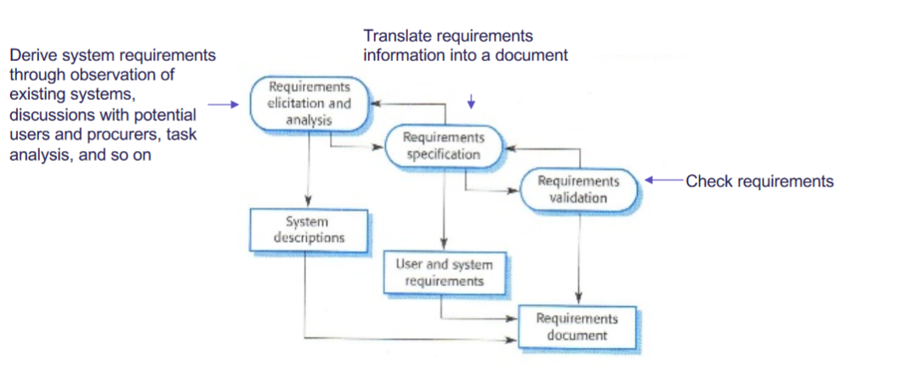
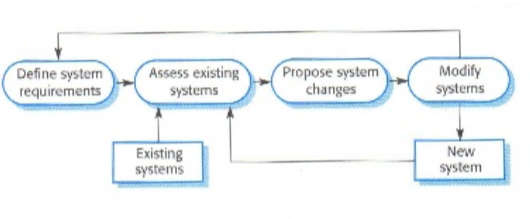

## SE Process Activities

Four fundamental software engineering activities

1. **Software specification**

    * The functionality of the software and constraints on its operation must be defined

        

2. **Software development**

    * The software to meet the specification must be produced

    

3. **Software Validation**

    * The software must be validated to ensure that it does what the customer wants
    * Validation:
        * Are we building the right systems?
        * Conforms to customers' expectations and experience
    * Verification
        * Are we building the system right?
        * Conforms to specification
    * Techniques:
        * <u>Testing</u> of programs and prototypes
        * <u>Reviewing</u> of specifications, documentation and programs
    * Stages of testing
        * Component testing $\to$ System testing $\to$ Customer testing

4. **Software evolution**

    * The software must evolve to meet changing customer needs

## Software Process Models

1. **Waterfall Model **(Plan-driven)

    * Seperate and distinct phases of specification, design, implementation, test, and operations

    

    

2. **Incremental Model** (Plan-driven, agile or mix)

    * Specification, development and validation are interleaved.
    * System is developed as a series of versions (increments), with each version adding functionality to the previous version.

    

    

3. **Integration & configurations model** (Reuse)

    * System is assembled from existing configurable components.
    * Plan-driven or agile
    * 

    

### Waterfall

It is a plan-driven process, as the process activities are planned and scheduled
before starting development.

1.  **Requirements analysis and definition** 
    * The system’s services, constraints and
        goals are established by consultation with system users. They are then
        defined in detail and serve as a system specification.
2. **System and software design** 
    * The systems design process allocates the
        requirements to either hardware or software systems. It establishes an
        overall system architecture. Software design involves identifying and
        describing the fundamental software system abstractions and their
        relationships.
3. **Implementation and unit testing** 
    * During this stage, the software design is
        realized as a set of programs or program units. Unit testing involves verifying
        that each unit meets its specification.
4. **Integration and system testing** 
    * The individual program units or programs
        are integrated and tested as a complete system to ensure that the software
        requirements have been met. After testing, the software system is delivered
        to the customer.
5. **Operation and maintenance** 
    * Normally, this is the longest life-cycle phase.
        The system is installed and put into practical use. Maintenance involves
        correcting errors that were not discovered in earlier stages of the life cycle,
        improving the implementation of system units, and enhancing the system’s
        services as new requirements are discovered.

#### When should you consider waterfall?

1. **Embedded systems** Because of the inflexibility of hardware it is usually not
    possibly to delay decisions on the software’s functionality until it is being
    implemented.
2. **Life critical systems** Because the specification and design documents must
    be complete so that it is possible to create an extensive security analysis of
    the software specification and design. Safety-related problems in the specs
    and design are usually very expensive to correct at the implementation
    stage.
3. **Large software systems** that are a part of broader engineering systems
    Because the hardware in the system may be developed using a similar
    model and companies find it easier to use a common model for hardware
    and software. Furthermore, where several companies are involved,
    complete specs may be needed to allow for the independent development
    of different subsystems.

#### How can I decide if agile or waterfall is best fit for my situation?

Boehm: **Analyse af home ground**

The waterfall model should not be used in developing systems where informal team
communication is possible and software requirements change quickly. In this case, iterative
and agile methods are better.

