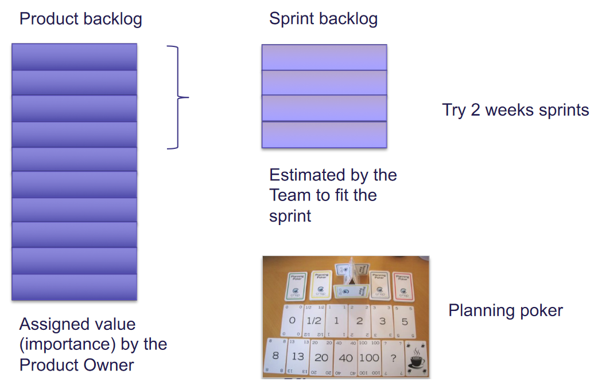

# Project Planning and Management

## Plan-driven Development

**Udviklingsprocessen** er **planlagt** i detaljer **inden** teknisk arbejde startes.

Managers kan bruge planen til at **understøtte** projekt **decision making**, og til at måle **progress**

### Project Planning

* **Opdele** arbjedet i **dele**
* **Tildele** dem til project team **members**
* **Forudse** **problemer** der måske opstår
* **Forberede** foreløbige **løsninger** til disse problemer

En plan **indeholder** **normalt**:

* **Introduktion**
* **Organization**
    * Bekriver **organizationen** af devteam
* **Risk analysis**
* **Hardware / Software resource requirements**
* **Work Breakdown**
    * **Opdeling** af arbejde into **aktiviteter** og identificering af **milestones**
* **Project Schedule**
    * **Dependency** between **activities**, estimated **time** for hver milestone
* **Monitoring and reporting mechanisms**

### Fordele og Ulemper

**Fordele**

* Kan tage hånd om **organizational** **issues**.
* Potentielle **problemer** og **dependancies** opdages før start

**Ulemper**

* Mange **beslutninger** skal laves om pga. **ændringer** i **miljø** hvori softwaren udvikles og skal bruges

### Måling af Progress

Måles vha. **Milestones** og relateret dokumentation

### Process

## Agile Planning

### XP: Story-based Estimation and Planning

**Planning game**, baseret på **user stories** der reflekterer features der burde være **inkluderet** i systemet.

Projekt team **læser** og **diskuterer** stories og **rangerer** dem ifht. hvor lang **tid** de synes at tage at implementere.

* Stories **tildeles** effort points / **story points**
* **antallet** af story points implemteret **pr. dag/sprint** måles ud fra devteams "**velocity**"

### Scrum Planning

## Estimation

**Based on a triangular distribution**

$$
E=(a+m+b)\ /\ 3
$$

**Based on a double triangular distribution**

$$
E=(a+4m+b)\ /\ 6\\
SD= (b-a)\ /\ 6
$$

where 

* $a$ is best-case estimate
* $m$ is most likely estimate
* $b$ is worst-case estimate

#### COCOMO

An empirical model based on project experience.

Well-documented, ‘independent’ model which is not tied to a specific software vendor.

Long history from initial version published in 1981 (COCOMO-81) through various instantiations to COCOMO 2.

COCOMO 2 takes into account different approaches to software development, reuse, etc. 

