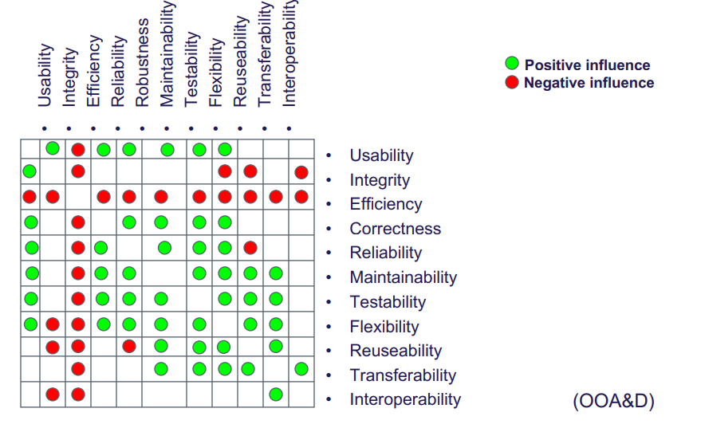
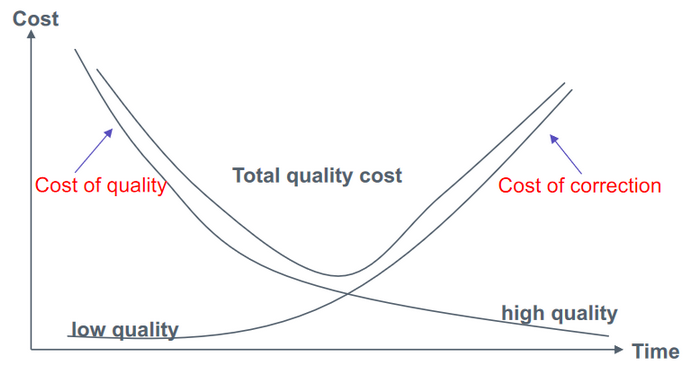

# Quality Management

"Quality Management: How is quality defined - agile versus plan driven approaches"

Kvalitet kan **deles** ind i 3 kategorier

* **Produkt** kvalitet
* **Process** kvalitet
* **Forventingskvalitet**

**Dårlig** **kvalitet** kan koste

* **Tab**

* **Spildt** arbejde

* **Vedligeholdelse** er ofte **dyrere** end udvikling

  ​    

## **Software Qualities**

### Trade-off

## Quality Management

* Quality Assurance
    * Planlægge eller designe processer for at <u>undgå</u> dårlig kvalitet
* Quality Control
    * Det at <u>**overvåge**</u> at work products overholder kvalitetsstandarder

* Lav quality management er billigt i starten, men bliver dyrerer og dyrerer

* Høj quality management har initial cost, men bliver billigere senere fordi der sker færre fejl, og koden er mere stabil

* Det handler om at finde en balance

  ​    

### Validation and Verification

**Validation**

* Bygger vi de rigtige systemer?
* Overholder kundens forventninger og erfaringer

**Verifikation**

* Bygger vi systemet **ordenligt**?
* Overholder **specifikationer**
* **Objektiv** process
* Tjekker om softwaren er af **høj kvalitet**, men **ikke** om det er **brugbart**

#### Teknikker

* **Testing** af programmer og prototyper
* **Reviewing** af specifikationer, dokumentation og programmer

#### Inspection

**Verifikation**, tjekker om specifikationerne overholdes, men ikke med **kunden**.

Tjekker ikke ikke-funktionelle karaktaristika såsom **reliability** og **maintainability**.

Menneske-baseret tjek af dokumenter og filer såsom **kode**.

* **Ikke** eksekvering af kode

#### Testing

**Validation**, da vi tester **produktet** eller **prototyper**.

**Eksekvering** af **kode**.

#### Peer Review

Software **review**, work product undersøges af skaber, samt en eller flere kollegaer.

* Evaluerer **teknisk** indhold og kvalitet.

## V-Modellen

### Test and Review in Models

#### Waterfall

#### Incremental and Iterative

#### Integration and Configuration

## Quality in Agile

* **Definition of Done**

    * Team agree on what criteria must be met before a task is complete

* **Sprint Review**

    *  Product Owner and other stakeholders <u>validate</u> the sprint delivery meets expectations

* **Check before check-in**

    * Developers are responsible for organizing their own code reviews with other team members before the code is checked in to the build system

* **Never break the build**

    * Team members should not check in code that causes the system to fail

        Developers have to test their code changes against the whole system and be confident that these work as expected

* **Fix problems when you see them**

    * If a programmer discovers problems or obscurities in code developed by someone else, they can fix these directly rather than referring them back to the original developer

**Pair Programming** in XP

* Flere **programmeringstimer** i stedet for procrastinating
* Stamina og **insight** i koden hvis en i parret er **syg**
* Real-time code **review**