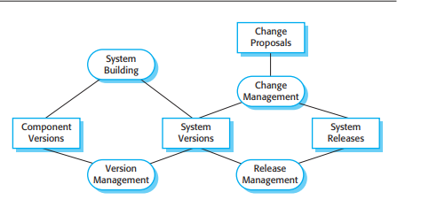

# Configuration Management

Configuration management har at gøre med **policies**, **processer**, og **værktøjer** til at håndtere skiftende software **versioner**.

* Der kan være flere versioner under udvikling på samme tid

Essentielt for **teams** der arbejder på samme tid på koden.

Configuration Management **policies og processes** definerer hvordan forslåede system ændringer skal processeres og recordes.

## Key Activities

* **Change Management**
    * Hold styr på **foreslåede** **ændringer** i software fra udviklere og kunder.
    * Udregn **cost** og **impact** ved ændringer
* **Version Management**
    * Holde styr på de forskellige **versioner** af system **komponenter**
    * Sikre sig at ændringer ikke **interfere** med hinanden
* **System Building**
    * **Samle** program **komponenter**, **data** og **libraries**.
    * **Compile** og linke disse for at lave et **eksekverbart** system
* **Release Management**
    * Gøre software klar til **ekstern** **release**
    * Holde styr på de **versioner** der er released til kunder.

## Challenges

To personer vil ændre i den **samme** fil.

* **Pessimistisk** file locking
    * Filen kan kun åbnes af en person af gangen
    * <u>Ikke</u> optimalt
* **Optimisisk version merging (Git)**
    * **VM** holder styr på de **ændringer** der er lavet i filen fra **hver** bruger.
    * VM kan herefter **merge** ændringer sammen.

## Centraliseret vs Distribueret VC

**Centraliseret**

* Et **single** **master** repository holder styr på **alle** versioner der er under udvilking
* **Subversion** (SVN)

**Decentraliseret**

* **Flere** versioner af **repository** eksistere på **samme** tid.
* **Git**

## Release

Består af:

* Eksekverbar kode
* Konfigurationsfiler
* Data filer
* Installer
* Elektronisk eller papir dokumentation

## Continous Integration (Agile)

1. **Check out** mainline fra VM into udviklers **workspace**
2. **Byg** systemet og kør **automatiske** tests
    * Hvis **ikke** test passer skal sidste "committer" advares
3. Lav **ændringer**
4. Byg systemet i **lokalt** workspace
5. Når **tests** er passed, check into **build sistem**
6. Byg system på **build** **server** og kør tests
7. Hvis tests passer, commit til ny **mainline**

## Daily Build

Development organization sætter en delivery time.

* En ny version bygges ud fra leverede komponenter
* Version udleveres til test team som kører predefinerede tests
* Fejl fundet under tests dokumenteres og returneres til udviklere, som reparerer disse fejl

## Plandriven vs Agile CM

