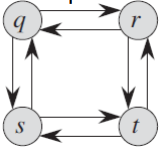
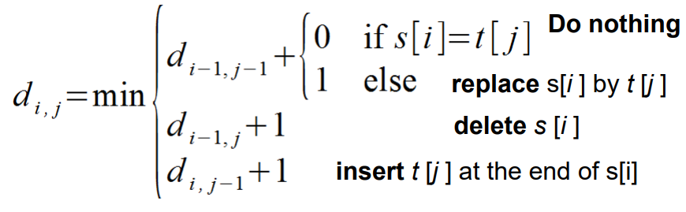
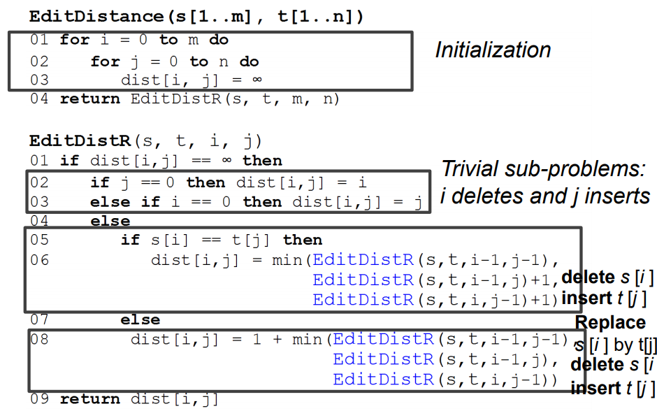
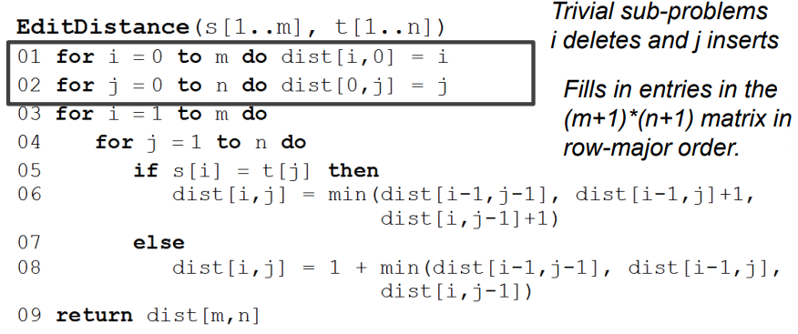
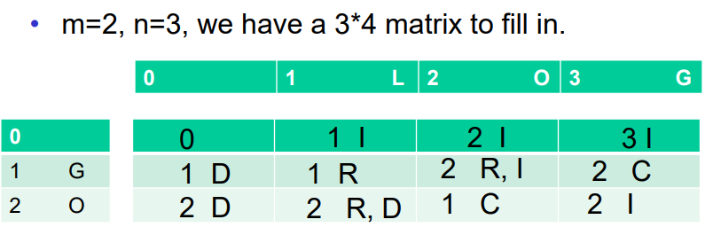
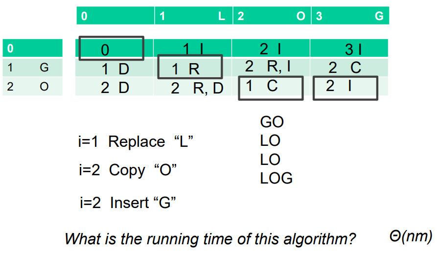

# Dynamic Programming

$$
\newcommand{\dr}[1]{{\color{darkred}#1}}\nonumber
$$

**Intended Learning Outcome**

* To understand the principles of dynamic programming.
    * Overlapping sub-problems and optimal sub-structure. 
    * Top-down with memoization and bottom-up. 
* To understand the DP algorithm for edit distance.
* To be able to apply the DP algorithm design technique. 


## Dynamic Programming

* A powerful technique to solve **optimization problems**.
* An optimization problem can have many possible solutions, each solution has a value, and we wish to find a solution with the optimal (i.e., minimum or maximum) value. 
* An algorithm should compute the **optimal value** plus, if needed, an **optimal solution**.


## Two Key Characteristics of DP

**Overlapping sub-problems**

* Sub-problems share sub-sub-problems.
* A divide-and-conquer algorithm does more work than necessary, as it needs to repeatedly solve the common sub-sub-problems. 

**Optimal Substructure**

* The optimal solution to a problem incorporates optimal solutions to sub-problems. 
* Un-weighted shortest path **(YES)**
    * Shortest path $A=<q,r,t>$  from q to t.
    * Sub-paths of $A, <q,r>$ and $<r,t>$, are also the shortest path
* Un-weighted longest simple path. **(NO)**
    * Longest path $B =<q,r,t>$  from q to t.
    * Sub-paths of $B, <q,r>$ and $<r,t>$ may not be the longest paths 



*  $<q,s,t,r>$
* $<r,q,s,t>$


## Two approaches of DP

**Top-down with memoization**

* Solve each sub-problem only ***once*** and **store** the answers to the solved sub-problems in a table.
* Next time, when you need to solve a solved sub-problem, just look up the table to get the answer. 

**Bottom-up with recursion**

* Depending on some natural notion on the **size** of a sub-problem. 

* Solving any particular sub-problem depends only on solving **smaller** sub-problems. 
* Sort the sub-problems by size and solve them in size order, smallest first. And save the solutions.


**Pros and Cons**

* Both should have the same asymptotic running time.
* If all sub-problems must be solved, memoization (recursion) is usually slower (by a constant factor) than Bottom-up (loops). 
* If not all sub-problems need to be solved, memoization only solves the necessary ones. 


## Structure of DP

**Construction**

<center>Recurrence for the optimal value</center>

* *What are the sub-problems?* 

* *Which choices have to be considered in order to solve a sub-problem?*

* *How are the trivial sub-problems solved?* 

* *Write a memoized version of the algorithm or in which order do we have to solve the sub-problems (bottom-up)*

    <center>Constructing a solution</center>

* *Remember the (optimal) choices made* 

* *Use the remembered choices to construct a solution*

**Analysis**

* *How many different sub-problems are there in total?* 
* *How many choices have to be considered when solving each subproblem?* 


## Edit Distance Problem

**Definition**

* Two strings $s[1..m]$ and $t[1..n]$
* Find **edit distance** $dist(s,t)$ between the two input strings s and t.
    * The smallest number of **edit operations** that turns s into t
* Edit operations:
    * **Replace** one letter with another
    * **Delete** one letter
    * **Insert** one letter


**Example**

* "ghost" into "house"

```
ghost	-	delete g
host	-	insert u
houst	-	replace t by e
house
```


### Two Cases

**The last letters in s and t are different, e.g., s=milk t=windy** 

* Option 1: Replace k by y, $dist(s, t)=dist(mil, wind)+1$
* Option 2: Delete k, $dist(s, t) = dist(mil, windy)+1$
* Option 3: Insert y in the end of s, $dist(s, t) = dist(milk, wind)+1$
* $dist(s, t) = min (dist(mil, wind)+1, dist(mil, windy)+1, dist(milk, wind)+1)$

**The last letters in s and t are the same, e.g., s=milk t=link**

* Option 1: Keep k, $dist(s, t)=dist(mil, lin)$
* Option 2: Delete k, $dist(s, t) = dist(mil, link)+1$
* Option 3: Insert k in the end, $dist(s, t) = dist(milk, lin)+1$
* $dist(s, t) = min (dist(mil, lin), dist(mil, link)+1, dist(milk, lin)+1)$


Optimal sub-structure for edit distance?

* YES! The optimal solution to a problem incorporates optimal solutions to sub-problems


### Sub-problems

$d_{i,j} = dist (s [1..i ], t [1..j ])$

* then $dist(s,t)=d_{m,n}$


Let’s look at the last symbol: $s [i ]$ and $t [j ]$. There are three options, do whatever is the cheapest:

* **Option 1**
    * **If** $s [i ] = t [j ]$, then turn $s [1..i-1]$ to $t [1..j-1]$ 
        * $milk,link:d_{i,j}=d_{i-1,j-1}$
    * **Else** replace $s[i]$ by $t[j]$ and turn $s[1..i-1]$ to $t[1..j-1]$
        * $milk,windy; {\color{darkred}{mil}}y, {\color{darkred}{wind}}y:d_{i,j}=1+d_{i-1,j-1}$
* **Option 2 - Delete**
    * Delete $s[i]$ and turn $s[1..i-1]$ into $t[1..j]$
        * $milk, windy; {\color{darkred} mil}, {\color{darkred}windy}: d_{i,j}=1+d_{i-1,j}$
* **Option 3 - Insert**
    * Insert $t[j]$ at the end of $s[1..i]$ and turn $s[1..i]$ to $t[1..j-1]$
        * $milk, windy; \dr{milk}y, \dr{wind}y: d_{i,j}=1+d_{i,j-1}$


### Recurrence, Optimal Substructure



How do we solve trivial sub-problems?

* To turn empty string to $t [1..j ]$, do $j$ inserts
* To turn $s [1..i ]$ to empty string, do $i$ deletes


### DP Algorithm - Memoization 




#### Analysis

* *How many different sub-problems are there in total?*
    * $n*m$
* *How many choices have to be considered when solving each subproblem?*
    * *3 (copy/replace, insert, and delete)*
* *Thus, Θ(nm)*


If we solve editor distance in a naïve D&C manner, what is the complexity?

* *Exponential runtime.*


### DP Algorithm - Bottom-up







