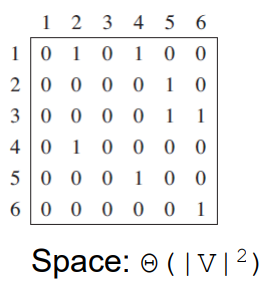

# All-pairs Shortest Paths (Dynamic Programming)

**Intended Learning Outcome**

* Adjacency matrix and distance/predecessor matrix
* Repeated squaring and Floyd-Warshall algorithm
* Definition of transitive closure of a directed graph

## All-pairs Shortest Paths

Shortest paths between all pairs of vertices in a graph. 

How to solve the problem efficiently?

* Repeatedly run one-to-all shortest paths |V| times.
* Repeated squaring algorithm
* Floyd-Warshall algorithm

### Representing a Graph

Graph $G=(V,E,W)$

Adjacency list vs Adjacency matrix

#### Adjacency List

**Total space:** $\Theta(|V|+|E|)$

#### Adjacency Matrix

### One-to-All Shortest Path

**Input**

* Directed, weighted graph $G=(V,E,W)$
* Source vertex s

**Shortest-path weight**

$$
\delta(u,v)= \left\{
\begin{array}{}
 \min\{w(p):u\overset{p}{\leadsto} v\} & \mbox{if there is a path from }u\mbox{ to }v,\\
 \infty & \mbox{otherwise}.
\end{array} \right.
$$

**Output**

* A set of vertices $S, |S|=|V|$
    * Each $u\in S: u.d()$ and $u.parent()$
    * Not reachable: $u.d()=\infty$

#### Relaxing Technique

Relaxing an edge $(u,v)$

* $u.d() + w(u,v)$ vs $v.d()$

Intuition

* Improve the existing shortest path from $s$ to $v$

#### Dijkstra's Algorithm

Complexity depends on how to implement the min-priority queue

* binary min-heap

#### Bellman-Ford

### All-pairs Shortest Path

**Input**

* Let $n=|V|$

* Adjacency matrix $W \in R^{n\times n}$ where
    * $w_{ij}=0$ if $i=j$
    * $w_{ij}>0$ if $i\neq j$ and edge $(i,j)\in E$
    * $w_{ij}= \infty$ if $i\neq j$ and edge $(i,j) \notin E$

**Output**

* Distance matrix $D \in R^{n\times n}$ where
    * $d_{ij}= \delta(i,j)$: the shortest path weight from vertex $i$ to vertex $j$
* Predecessor matrix $P\in R ^{n\times n}$ where
    * $i$-th row == shortest-path tree rooted at vertex $i$
        * One-to-all shortest paths
    * $p_{ij}=Nil$ if
        * $i=j$ or
        * no path from vertex $i$ to $j$
    * $p_{ij}=j.parent()$
        * Vertex $j$'s parent on the shortest path from vertex $i$ to vertex $j$

#### Base Case

$l^{(m)}_{ij}:$

* the minimum weight of any path from vertex $i$ to vertex $j$ that contains at most $\mathbf m$ edges

Matrices $L^{(m)}=\left(l^{(m)}_{ij}\right)\in R^{n\times n},\quad m\in [0,n-1]$, where $n=|V|$

$m=0$

$m=1$

#### Recursive Case

$m\geq 1$

**Intuition of obtaining** $l^{(m)}_{ij}$

* $l^{(m-1)}_{ik}$ shortest path weight from $i$ to $k$ using at most $m-1$ edges
* Extend the shortest path $i \leadsto k$ with one more edge $(k,j)$
    * $l^{(m-1)}_{ik}+w_{kj}$
    * $1 \leq k \leq n$
* $l^{(m)}_{ij}$ = get minimum = shortest path weight from $i$ to $j$

#### Distance Matrix

Matrices $L^{(m)}=\left(l^{(m)}_{ij}\right)\in R^{n\times n},\quad m\in [0,n-1]$, where $n=|V|$

Final distance matrix $L^{(n-1)}_{ij}$

* Path $p=<v_i,v_i+1,\dots,v_j>$
* Simple: distinct vertices on the path
* At most $n-1$ edges

Shortest path weights

$$
\delta(i,j)=L^{(n-1)}_{ij}=L^{(n)}_{ij}=L^{(n+1)}_{ij}=\cdots
$$

