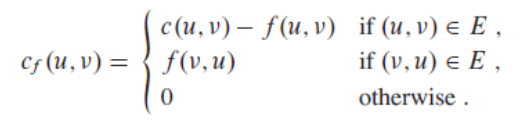
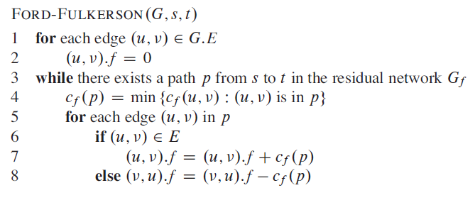
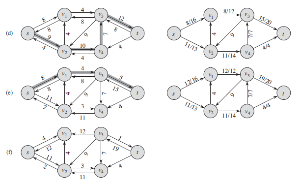
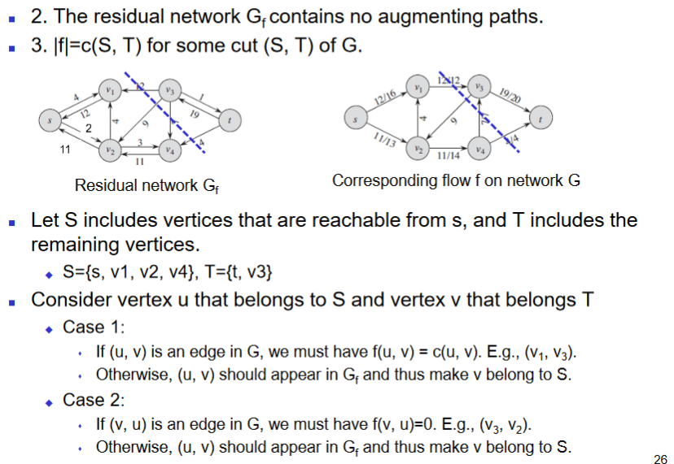
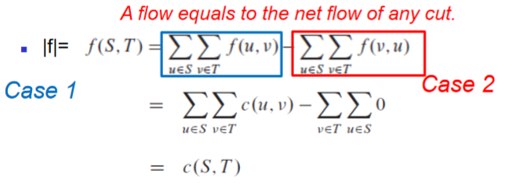
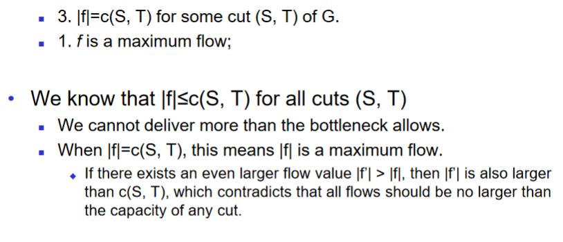

# Flow Networks and Maximum Flow

**Intended Learning Outcome**

* to understand the formalization of flow networks and flows;
    * and the definition of the maximum-flow problem. 
* to understand the Ford-Fulkerson method for finding maximum flows. 
* to understand the Edmonds-Karp algorithm and to be able to analyze its worst-case running time;
* to be able to apply the Ford-Fulkerson method to solve the maximum-bipartite-matching problem.

## Flow Network

A **flow network** $G=(V,E)$ is a directed graph

* Each edge $(u,v)\in E$ has a nonnegative **capacity** $c(u,v)\geq0$
* If $(u,v)\notin E$ then $c(u,v)=0$
* If E contains an edge (u, v), then there is no edge (v, u) in the reverse direction.
* Two special vertices: a ***source*** $s$ and a ***sink*** $t$. 
* For any other vertex v, there is a path $s\to v\to t$

A **flow** in G is a real-valued function $f:V\times V \to R$

Flow *in* equals flow *out*

### Examples

### Maximum-flow Problem

Consider the source s

The **value** of flow $f$, denoted as $|f|$, is defined as

$$
|f|=\sum_{v\in V}f(s,v)-\sum_{v_\in V} f(v,s)
$$

* Total flow out of the source minus the flow into the source.
* Typically, a flow network will not have any edges into the source, and the flow into the source will be zero. 

**Maximum-flow problem:**

Given a flow network G with source s and sink t, we wish to find a flow of maximum value.

### Anti-parallel edges

To simplify the discussion, we do not allow both (u, v) and (v, u) together in the graph.

* If E contains an edge (u, v), then there is no edge (v, u) in the reverse direction.

Easy to eliminate such antiparallel edges by introducing artificial vertices.

### Multiple sources and multiple sinks

Example: multiple factories and warehouses

Introducing a super-source s and super-sink t

* Connect s to each of the original source $s_i$ and set is capacity to $\infty$
* Connect t to each of the original sink $t_i$ and set its capacity to $\infty$

## The Ford-Fulkerson Method

A method but not an algorithm

* It encompasses several implementations with different running times

The Ford-Fulkerson method is based on

* Residual Networks
* Augmenting paths

### Residual Networks

Given a flow network $G$ and a flow $f$, the residual network $G_f$ consists of edges whose **residual capacities** are greater than 0

* **Formally**: $G_f=(V,E_f)$, where $E_f=\{(u,v)\in V \times V:c_f(u,v)>0\}$

**Residual capacities:**

* The amount of additional flow that can be allowed on edge (u, v).
* The amount of flow that can be allowed on edge (v, u), i.e., the amount of flow that can be canceled on the opposite direction of edge (u, v).

#### Example

### Augmenting Paths

Given a flow network G and a flow f, an **augmenting path** $p$ is a simple path from s to t in the **residual network** $G_f$

* $p=<s, v_2, v_3, t>$

**Residual capacity** of an augmenting path $p$:

* How much additional flow can we send through an augmenting path?
* $c_f(p)=\min(c_f(u,v):(u,v)$ is on path $p)$
    * $c_f(p)=\min(5,4,5)=4$
* The edge with the minimum capacity in $p$ is called **critical** edge (bottleneck)
    * $(v_2,v_3)$ is the critical edge of $p$

### Augmenting a flow

Given an agumenting path $p$ we define a flow $f_p$ on the residual network $G_f$

* the flow value of $|f_p|=c_f(p)>0$

#### Examples

### The Method

1. Find an augmenting path in the residual network
2. Augment the existing flow by the flow of the augmenting path
3. Keep doing this until no augmenting path exists in the residual network

The algorithms based on this method differ in how they choose *p* in line 3

Correctness is proved by the **Max-flow min-cut** theorem

#### Example

### Correctness of Ford-Fulkerson

Why is this method correct?

How do we know that when the method terminates, i.e., when there are no more augmenting paths, we have actually found a maximum flow?

**Max-flow min-cut theorem**

#### Cuts

#### Minimum Cut

#### Max-flow min-cut theorem

If $f$ is a flow in $G$ the follwoing conditions are equivalent:

1. f is a maximum flow
2. The residual network $G_f$ contains no augmenting paths
3. $|f|=c(S,T)$ for some cut $(S,T)$ of $G$

The correctness of Ford-Fulkerson method

* $2\to1$
* We prove $2\to 3$ and then $3\to1$

#### 2 to 3

#### 3 to 1

### Worst-case Running time

Assume integer flows: capacities are integer values

* Appropriate scaling transformation can transfer rational numbers to integral numbers

Each augmentation increases the value of the flow by some positive amount

* worst case. each time the flow value increases by 1

$<s,u,v,t>$, $<s,v,u,t>$, $<s,u,v,t>$, $...$

Identifying the augmenting path and augmentation can be done in $O(E)$

Total worst-case running time $O(E\cdot|f^*|)$, where $f^*$ is the max-flow found by the algorithm

*Lesson learned: how an augmenting path is chosen is very important*

## The Edmonds-Karp Algorithm

In line 3 of Ford-Fulkerson method, the Edmonds-Karp regards the residual network as an unweighted graph and finds the shortest path as an augmenting path

* Finding the shortest path in an un-weighted graph is done by calling breath first search (BFS) from source vertex s.

**Example on [L03 slides](extra/Lecture-3.pdf#page=33) 38-42**

