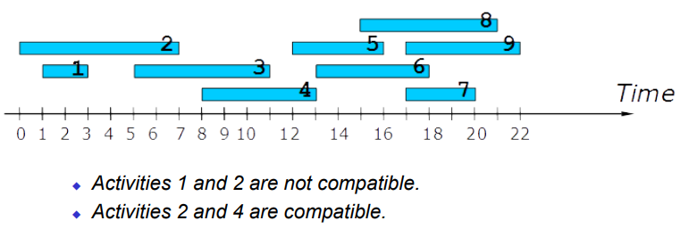
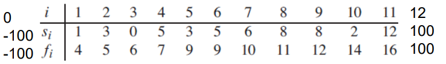
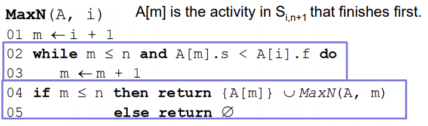
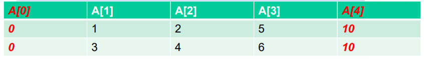
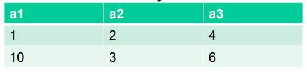
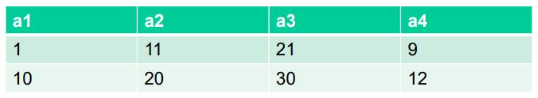
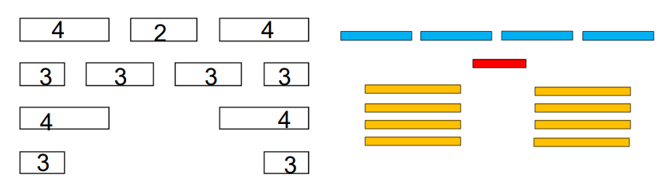

# Greedy Algorithms

We look at the **Activity Selection Problem**

## Activity Selection

Input

* A set of $n$ activities, each with start and end times $s_i$ and $f_i$
    * The i-th activity lasts during the period $[s_i,f_i)$

Output

* The **largest** subset of mutually *compatible* activities
* Activities are compatible if their intervals do not intersect

### Definitions

* Sort activities in A on the end time
    * We also assume "sentinel" activities $a_0$ and $a_{n+1}$

* $S_{i,j}$: a set of activities that start after activity $a_i$ finishes, and that finish before activity $a_j$ starts
    * $S_{2,11}=\{a_4, a_6, a_7, a_8, a_9\}$
        * Start after $a_2.f=5$ and finish before $a_{11}.s=12$. Interval $[5,12)$
    * $S_{0,12}=\{a_1,a_2,a_3,a_4,a_5,a_6,a_7,a_8,a_9,a_{10},a_{11}\}$
        * Start after $a_0.f=-100$ and finish before $a_{12}.s=100$. Interval $[-100,100)$
* $M_{i,j}$: a maximum set of mutually compatible activities in $S_{i,j}$
* $C_{i,j}$: the cardinality of $M{i,j}$

Activity Selection: identify $C_{0, n+1}$ (and $M_{0,n+1}$)

## Greedy Algorithm

### Greedy Strategy

What if we only consider **"the best" (as of now)** activity and be sure that it belongs to an optimal solution

* Choose the activity that **finishes first** in $S_{i,j}$
    * Intuition: leave as much time as possible for other activities
    * Then, solve *only one* sub-problem for the remaining activities

### Greedy Algorithm

$MaxN(A,i)$

* Assume that we have $n$ activities in total
* Return the maximum-size set of mutually compatible activities in $S_{i,n+1}$
* In the beginning, we call $MaxN(A,0)$ that returns the maximum-size set of mutually compatible activities in $S_{0,n+1}$

The found activity $a_m$ that finishes first must belong to the maximum-size set of mutually compatible activities. 

Then, we only need to consider activities in $S_{m,n+1}$.

### Example

* $MaxN(A,0), A[1]$ is chosen, so $\{a_1\}$
    * $A[1]$ is the activity that finishes first from $S_{0,4}$
* $MaxN(A,1), A[3]$ is chosen, so $\{a_1, a_3\}$
    * $A[3]$ is the activity that finishes first from $S_{1,4}$
* $MaxN(A,3)$, nothing is chosen, so still $\{a_1,a_3\}$

$\{a_1, a_3\}$ is the maximum-size set of mutually compatible activities

### Correctness

Why the activity that finishes first must be in the maximum-size set of mutually compatible activities

* Consider any nonempty sub-problem $S_{ij}$ and let $a_x$ be an activity in $S_{ij}$ with the earliest finish time

* Let $M_{ij}$ be a maximum-size set of mutually compatible activities in $S_{ij}$

    Let $a_y$ be the activity in $M_{ij}$ with the earliest finish time

* Lucky: if $a_x = a_y$ we have proved that $a_x$ belongs to a maximum-size set of mutually compatible activities

* Unlucky: If not, be replacing $a_y$ by $a_x$, $M_{ij}$ is still a maximum-size set of mutually compatible activities

    * $a_x.f \leq a_y.f$

* $M_{0,4}=\{a_2, a_3\}$ replacing $a_2$ with $a_1$, all activities in $\{a_1,a_3\}$ are still compatible, and thus it is still a maximum-size set

## Greedy Exchange

It is a different proof technique compared to contradiction or induction.

Greedy exchange is often used in proving the correctness of greedy algorithms.

* Assume that we already have an optimal solution that is produced by any other optimal algorithm.
    * $M_{ij}$ in our previous proof
* We show that it is possible to incrementally modify the optimal solution into the solution produced by our greedy algorithm in such a way that does not worsen the solution’s quality.
    * Replace $a_y$ with $a_x$, still compatible and with the same cardinality
* Thus, the quality of our greedy solution is at least as small as that of any other optimal solution.

## Greedy Choice Property

We can assemble a globally optimal solution by making locally optimal (greedy) choices. 

* We need to prove that there is always an optimal solution to the original problem that includes the greedy choice, so that the greedy choice is always safe.

The challenge is to choose the right interpretation of “the best choice”:

* How about the activity that starts first?
* The shortest activity?
* The activity that overlaps the smallest number of the remaining activities?

**The activity that starts first?**

* $\{a_2, a_3\}$, but not $a_1$ that starts first.

**The shortest activity?**

* $\{a_1, a_2, a_3\}$, but not $a_4$ that is the shortest activity

**The activity that overlaps the smallest number of the remaining activities?**

* The second row gives the maximum-size set of mutually compatible activities, but it does not include the activity with the smallest overlaps, i.e., the one with 2

## Principles of Greedy Algorithms

* First, we need to show the [optimal sub-structure](01-dc.md#two-key-characteristics-of-dp) property
    * Like with DP
* The main challenge is to decide the interpretation of “the best” so that it leads to a global optimal solution, i.e., proving the *greedy choice property*
    * Or you find counter-examples demonstrating that your greedy choice does not lead to a global optimal solution.
* **Greedy exchange** is a useful proof technique for proving the greedy choice property.

