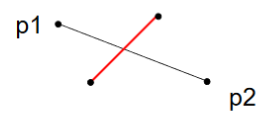

# Computational Geometry Algorithms: Sweeping Techniques

## Basic Geometric Operations

### Line-segment properties

The line-segment $\overline{p_1p_2}$ between $p_1=(x_1,y_1)$ and $p_2=(x_2,y_2)$

* Contains any point $p_3$ that is on the line passing through $p_1$ and $p_2$ and is on or between $p_1$ and $p_2$ on the line
* The set of **convex combinations**
    * $p_3=\alpha \cdot p_1 + (1-\alpha)p_2$ where $0\leq \alpha \leq$ 
* We call $p_1$ and $p_2$ the endpoints of the line-segment $\overline{p_1p_2}$

**Directed line-segment** $\overrightarrow{p_1p_2}$ from $p_1$ to $p_2$

### Cross Product

**Cross product**

* $(p_3-p_1)\times(p_2-p_1)=(x_3-x_1)(y_2-y_1)-(x_2-x_1)(y_3-y_1)$

Or **determinant** of the following matrix

* 

**Positive** $\to$ $p_1p_3$ is clockwise from $p_1p_2$

**Negative** $\to$ $p_1p_3$ is counterclockwise from $p_1p_2$

**Zero** $\to$ collinear

#### Summary

### Line Intersection

A segment $\overline {p_1p_2}$ **straddles** a line if point $p_1$ lies on one side of the line but $p_2$ lies on the other side

* Along the line, one needs to turn different directions to go to $p_1$ and $p_2$

Two line segments **intersect** if and only if either of the following two conditions holds:

* Each segment straddles the line containing the other
* An endpoint of one segment lies on the other segment