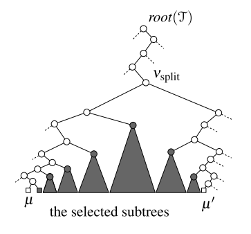
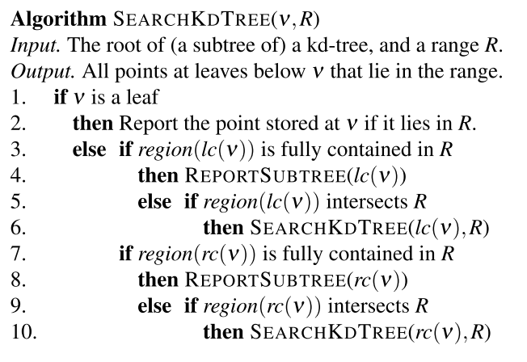

# Computational Geometry Data Structures: Range Searching

Litterature: [https://link.springer.com/chapter/10.1007/978-3-540-77974-2_5](https://link.springer.com/chapter/10.1007/978-3-540-77974-2_5)

**Queries** in a database can be interpreted geometrically

## Important Factors in Analysis

* Run time for building the data structure
* Run time for processing range searches
* Additional space that the data structure takes

## 1-Dimensional Range Searching

Let $P:=\{p_1,p_2,\dots,p_n\}$ be the given set of points on the real line.

We can solve the range searching problem with a *balanced binary search tree* $\mathcal{T}$ 

## Kd-Trees

Let $P$ be a set of $n$ points in the plane. We assume that no two points in $P$ have the same x-coordinate, and no two points have the same y-coordinate.

A 2-dimensional rectangular range query on $P$ asks for the points from $P$ lying inside a query rectangle $[x:x']\times[y:y']$

A point $p:=(p_x,p_y)$ lies inside this rectangle if and only if:

$$
p_x\in[x:x']\quad \text{and}\quad p_y\in[y:y'] \nonumber
$$

We could say that a 2-dimensional rectangular range query is composed of two 1-dimensional sub-queries.

At the root we split the set $P$ with a vertical line $\ell$ into two subsets of roughly equal size.

The splitting line is stored at the root. $P_\text{left}$ is stored in the left subtree, and $P_\text{right}$ in the right subtree.

In general, we split with a vertical line at nodes whose depth is even, and we split with a horizontal line at nodes whose depth is odd.

### Building a Kd-Tree

**Divide-and-conquer**

* Sort the points in $P$ w.r.t. their x-coordinates into array $X$
* Sort the points in $P$ w.r.t. their y-coordinates into array $Y$
* Base case:
    * If $P$ contains only one point, return a leaf with the point
* Otherwise:
    * Divide into 2 sub-problems and conquer them recursively
        * If the depth is even (split w.r.t. x-axis or a vertical line)
            * Take the median $v$ of $X$ and create a root $v_{root}$
            * Split $X$ into sorted $X_L$ and $X_R$ and split $Y$ into sorted $Y_L$ and $Y_R$
                * For any $p\in X_L$ or $p\in Y_L$,    $p.x \leq v.x$   
                * and for any $p\in X_R$ or $p\in Y_R$,    $p.x > v.x$   
            * Build recursively the left child of $v_{root}$ from $X_L$ and $Y_L$
        * If the depth is odd (split w.r.t. y-axis or a horizontal line)
            * Take the median $v$ of $Y$ and create root $v_{root}$
            * Split $X$ into sorted $X_L$ and $X_R$ and split $Y$ into sorted $Y_L$ and $Y_R$
                * For any $p\in X_L$ or $p\in Y_L$,    $p.y \leq v.y$   
                * and for any $p\in X_R$ or $p\in Y_R$,    $p.y > v.y$   
            * Build recursively the right child of $v_{root}$ from $X_R$ and $Y_R$ 

**Running time**: $\Theta(n \log n)$

### Querying a Kd-Tree

A query

It uses a subroutine REPORTSUBTREE(ν), which traverses the subtree rooted at a node ν and reports all the points stored at its leaves.

**Running time**: $O(\sqrt n + k)$

## Range Trees

