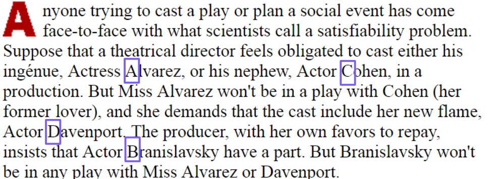
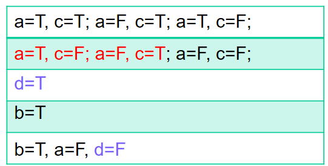

# Backtracking and Branch-and-Bound

We can use **heuristics** to speed up exponential running time, to solve NP-complete problems.

* **Backtracking** for decision problems, and
* **branch-and-bound** for optimization problems

## Satisfiability Problem

http://www.nytimes.com/library/national/science/071399sci-satisfiability-problems.html

Four actors become Boolean variables: a, b, c, d

* true: play; false: not play

Constraints

* $a\or c$
* $a \to \neg c$
* $d$
* $b$
* $b \to (\neg a \and \neg d)$

It is impossible to satisfy all constraints!

### Definition

Given a Boolean formula that is composed of

* n Boolean variables: $x_1, \dots, x_n$
* m Boolean connectives: and ($\and$), or $(\or)$, not $(\neg)$, implication $(\to)$, if and only if $(\leftrightarrow)$, and parentheses ( )

We want to see if there is a satisfying assignment for the Boolean formula

* A set of values for the variables such that makes the formula be true

### CNF-Sat

Conjunctive Normal Form (CNF) for Boolean formulas

* A **literal** is a variables or its negation
    * $x, y,\neg x, \neg y$
* Each **clause** is a disjunction of **literals**
    * **OR** of one or more literals: $x\or y$, $\neg x \or y \or x$
* CNF is a conjunctyion of **clauses**
    * **AND** of clauses $(x\or y) \and (x\or \neg y)$

Any Boolean formula can be transformed to CNF!

CNF-Sat is NP-complete

## Backtracking

We use the structure of an NP-complete problem:

* If we have a certificate, we can check
    * NP-complete problems can be verified in pol. time
* A certificate is constructed by making a number of choices
* What are these choices for CNF-Sat?
    * Assign T or F to variables

A backtracking algorithm searches through a large (possibly even exponential-size) set of possibilities in a **systematic** way.

It traverses through possible search paths to locate **solutions** or **dead ends**.

The configuration of a path consists of a pair (X, Y)

* X is the remaining sub-problem to be solved. 
* Y is the set of choices that have been made to get to this sub-problem x from the original problem instance.

**Dead end**: a configuration (X, Y) that cannot lead to a valid solution no matter how additional choices are made

* Cuts off all future searches from this configuration and **backtracks** to another configuration. 

### Example

