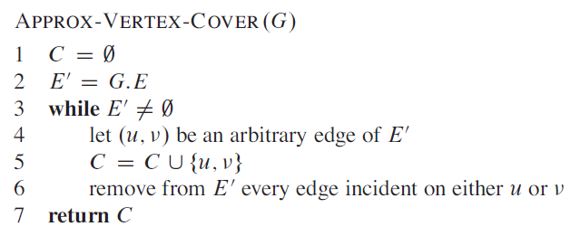
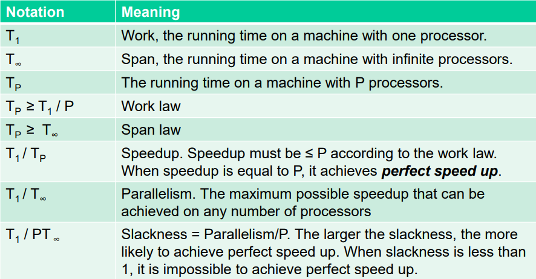

## Minimization and Maximization Algorithms

[**Based on the 2017 exam set**](../extra/exam-sets/2017-aalg-exam.pdf)

- Consider a 1.2-approximation algorithm with optimal cost $C^* = 100$
- For a **minimization** problem, the algorithm returns a value that is no larger than $C*1.2 = 100 * 1.2 = 120$
- For a **maximization** problem, the algorithm returns a value that is no smaller than $C*1.2 = 100 / 1.2 = 83.3$

We have the optimal solution $C^*$ and the approximate solution $C$. 

**To calculate the approximation ratio:**

- Minimization problem:
    - $C / C^*$
    - Example: $120 / 100 = 1.2$
- Maximization problem:
    - $C^* / C$
    - Example: $100 / 83,3 = 1.2$

## Vertex Cover Approximation

[**Based on the 2015 exam set**](../extra/exam-sets/2015-aalg-exam.pdf)

- A solution to the vertex cover problem, is a set of vertices so that each edge is defined by a least one of the vertices
    - The minimum vertex cover problem tries to calculate the least amount of vertices that covers all edges
    - An alternative explanation is police men who has to look down a number of streets, where vertices is places they can stand and edges are streets they have to keep an eye on

- There must always be an even number of vertices in the result, since the algorithm always picks a pair of vertices in line 4 and 5

## Perfect Linear Speedup

[**Based on the 2016 exam set**](../extra/exam-sets/2016-aalg-exam.pdf)

- Slackness = parallelism/number_of_processors
- Number of processor start at one and increase by one 
    - $P$ = number_of_processors
- $Slackness \geq 1$ $\Rightarrow$ possible perfect linear speedup
- Slackness <u>cannot</u> be more than the parallelism 
- If slackness < 1 the possibility of perfect linear speedup is very decreased

