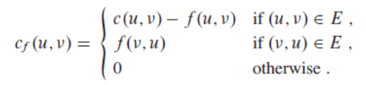
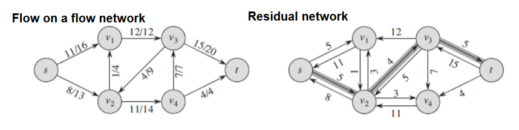

# Flow Networks

## Augmenting Path Chosen by Edmonds-Karp Algorithm

[**Based on the 2015 exam set**](../extra/exam-sets/2015-aalg-exam.pdf)

1. Draw a new graph, called the residual network, with the same vertices as the original but without any edges
2. For each set of vertices connected by an edge in the original flow network, decide from the following formula if they should be connected in the residual network

3. The algorithm chooses the path with the lowest flow in the residual network using breath first search (BFS)

- The first line in the formula expresses that the arrow should go in the **same direction** as in the original flow network
- The second line in the formula expresses that the arrow should go in the **opposite direction** as in the original flow network
- The third line in the formula expresses that non connected vertices should not be considered

- The function f denotes the flow, the first number
- The function c denotes the capacity, the last number
- Eventually, set u and v to the two vertices involved in the path
- If the result is 0 in any case, do not draw the edge in the residual network

- See the example below

