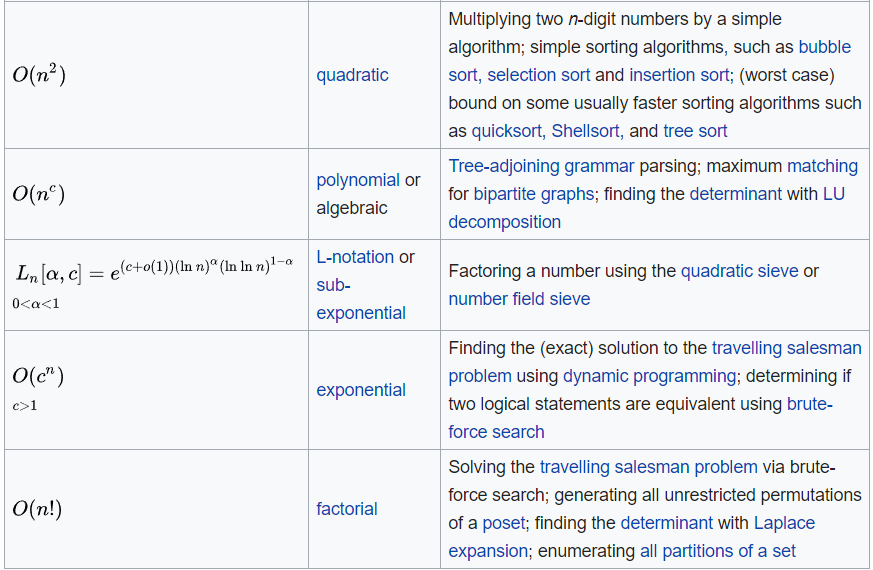
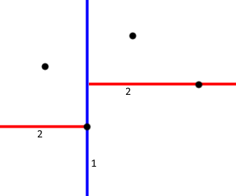
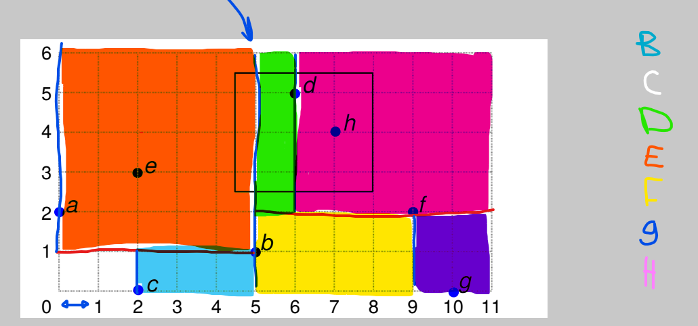

## 2D Range Tree vs KD-tree vs 1D BSTs Search Time

[**Based on the 2017 exam set**](../extra/exam-sets/2017-aalg-exam.pdf)

If

- $n$ = size of the input
- $k$ = total number of points in the output

Then

| Data Structure | 2D Query Search Time  |
| -------------- | --------------------- |
| 2D Range Tree  | $\Theta((lg(n))^2+k)$ |
| KD-tree        | $\Theta(\sqrt{n}+k)$  |
| 2 x 1D BSTs    | $\Theta(lg(n) + k)$   |

* $log^2(n) = log(n)^2$
  - The log base is unimportant in asymptotic notation eg.  $O(lg(n)) = O(log(n))$

### Big-O Cheat Sheet

From good to bad:

## Building a KD-tree with n Dimensions

[**Based on the 2016 exam set**](../extra/exam-sets/2016-aalg-exam.pdf)

- The exercise will specify the order the attributes should be split on

1. Do until no entries/tuples are left:
    1. Split on the current attribute (order specified by the exercise)
        - Splitting means sorting the attribute and taking the lower half based on their value
            - Example: $\{1, 2, 3, 4\} \Rightarrow \{1, 2\}$ and $\{3, 4\}$ 
            - Example: $\{1, 2, 3\} \Rightarrow \{1, 2\}$ and $\{3\}$
            - The lower half should contain values less than or equal to the split value
    2. Put the group of elements with the lower values in a new left node and the group of elements with the higher values in a right node
    3. Go to 1.1 and split on the next attribute specified by the exercise

- The KD tree is done when all elements/tuples have been added as a leaf node
- Each internal node describes the attribute it has split on and the value that its left subtree is less than or equal to, with regards to the nodes split attribute

### Querying a KD-tree

1. On a split node/internal node check each subtree that satisfies the query constraints
    - Example: Query; a < 10. The split node/internal node splits on a = 20, which means the left subtree must be checked, as the split node/internal node specifies that all elements/tuples in its left subtree contains a-values less than 20

## B+ tree

[**Based on the 2016 exam set**](../extra/exam-sets/2016-aalg-exam.pdf)

### Insertion

1. Find the correct place for the element
    - All elements should appear in a sorted order, based on size or alphabetical order
2. If there is room for the element in the leaf, simply insert
    - Number of elements for a leaf is specified in the exercise
3. If not, insert the element and split the node into two new nodes, each with half of the elements
    - The left node should contain less than or equal to the middle element
4. If the node is a leaf copy the rightmost element in the left node to the parent, if it is an internal node, move the element to the parent
5. If the parent node has no room, go to step 3 and handle it as a normal leaf node
6. If the root node has no room,  create a new root with a single key

### Search

- The idea is to find the node where the range start and then use the links between nodes to find all elements in the range

1. Traverse the tree recursively until the start of the range is found
2. Use the linked lists between leaves to find the end of the range, or the specific element the search is run for

## KD Tree Construction

[**Based on the 2015 exam set**](../extra/exam-sets/2015-aalg-exam.pdf)

1. Do until all points have their own box

    1. Draw a line through the point that splits all points in the current box

        - If the depth is even, split with regards to the x-axis (draw a vertical line)
        - If the depth is uneven, split with regards to the y-axis (draw a horizontal line)
        - Since depth starts even, start by splitting with a vertical line

        - The exercise will specify whether the point being split is in the left or right subtree, for example based on if it is smaller or equal

- The image above shows the order to add the lines splitting the boxes

- The image above shows how each of the points has their own box when the point being split on is in the less or equal box

