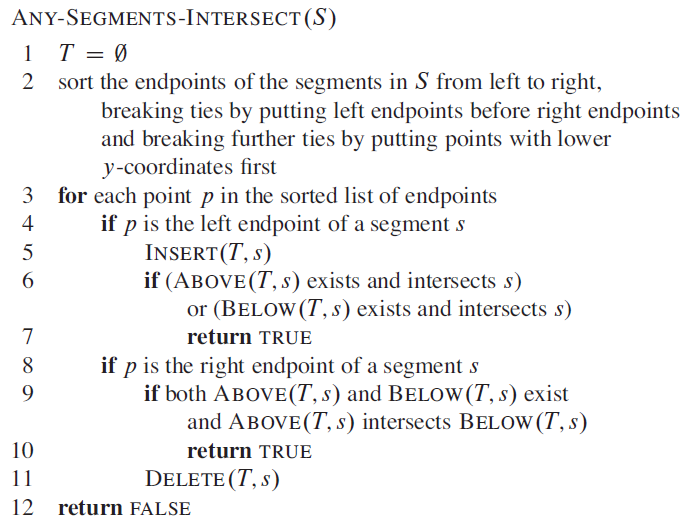

## Sweeping techniques

[**Based on the 2016 exam set**](../extra/exam-sets/2016-aalg-exam.pdf)

- The idea is to add the points to a list and check if a line is immediately above or below the line. If it is, check if they intersect. 
    - If they do, return true and terminate
- When an endpoint of a line is reached, check if there exists a line immediately above and below the endpoint, check if they intersect (the line above and the line below). Remove the endpoint from the list.
    - If they do, return true and terminate
- The goal of the algorithm is to check if ANY intersection exists. As such, it will terminate upon finding an intersection.

## Graham's vs Jarvis' march

[**Based on the 2016 exam set**](../extra/exam-sets/2016-aalg-exam.pdf)

- When the output H is asymptotically smaller than $\lg(n)$ Jarvis' march is faster
    - $H < lg(n)$: Jarvis

## Graham's scan

[**Based on the 2015 exam set**](../extra/exam-sets/2015-aalg-exam.pdf)

- All points are/should be sorted by their angle to $P_0$
    - The angle is calculated from a horizontal line going out from $P_0$ in both directions

1. Push the first 3 points onto the stack

2. Repeat for all points:

    1. While the next point, called $P_i$, lies to the right or straight ahead in regards to the top two points on the stack:

        1. Pop the top point on the stack
        2. Check again with the new two top points on the stack

        - Right and left of a point is defined by the line going through the point on top of the stack and the point before it on to the stack

    2. When making a left turn push $P_i$ on top of the stack and go to 2.1

3. If all points have been checked, the convex hull should have been finished.