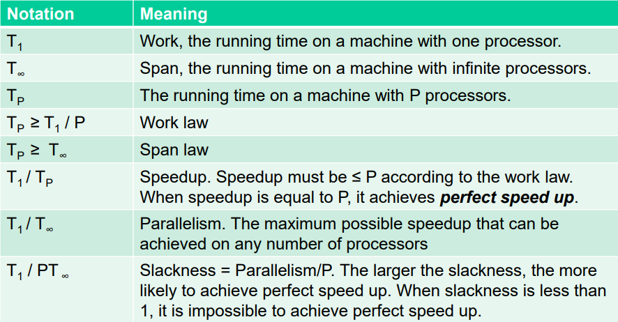

## Adjacency matrix

- Represents the original graph, when related to a graph created by the Floyd-Warshll algorithm
  - Is also equivalent to the D^(0) graph

## Predecessor matrix

- Describes the previous visited node to get the specified cost in the distance matrix.
- When used together with a distance matrix, it describes the cheapest path from i to j. The distance matrix provides the cheapest cost and the predecessor provides how to get the cheapest cost.
- Each entry P[i]\[j] represents the last node visited before j when taking the cheapest path from i to j
- k describes what number of row the algorithm has processed

## Huffman coding

- The goal is to create a tree where the leaves represents each letter and the lower frequency is always to the left

1. Count the frequency/how often each letter is found in a string
   - It is helpful to create a table
2. Do until there is only one root node:
   1. Combine the lowest frequency leaves and/or node and create a new node with their frequencies added together
      - The element with the lowest frequency is put to the left
      - The path of the leaves/nodes to the left are marked with a 0 and the right leaves/nodes with a 1

- To encode a letter with the created coding, navigate through the tree until you find the specified letter
- Remember to read the exercise because it might specify some order of clashing frequencies

## Sweeping techniques

- The idea is to add the points to a list and check if a line is immediately above or below the line. If it is, check if they intersect. 
  - If they do, return true and terminate
- When an endpoint of a line is reached, check if there exists a line immediately above and below the endpoint, check if they intersect (the line above and the line below). Remove the endpoint from the list.
  - If they do, return true and terminate
- The goal of the algorithm is to check if ANY intersection exists. As such, it will terminate upon finding an intersection.

## Graham's vs Jarvis' march

- When the output H is asymptotically smaller than $\lg(n)$ Jarvis' march is faster
  - $H < lg(n)$: Jarvis

## Building a KD-tree with n dimensions

- The exercise will specify the order the attributes should be split on

1. Do until no entries/tuples are left:
   1. Split on the current attribute (order specified by the exercise)
      - Splitting means sorting the attribute and taking the lower half based on their value
        - Example: {1, 2, 3, 4} => {1, 2} and {3, 4} 
        - Example: {1, 2, 3} => {1, 2} and {3}
        - The lower half should contain values less than or equal to the split value
   2. Put the group of elements with the lower values in a new left node and the group of elements with the higher values in a right node
   3. Go to 1.1 and split on the next attribute specified by the exercise

- The KD tree is done when all elements/tuples have been added as a leaf node
- Each internal node describes the attribute it has split on and the value that its left subtree is less than or equal to, with regards to the nodes split attribute

### Querying a KD-tree

1. On a split node/internal node check each subtree that satisfies the query constraints
   - Example: Query; a < 10. The split node/internal node splits on a = 20, which means the left subtree must be checked, as the split node/internal node specifies that all elements/tuples in its left subtree contains a-values less than 20

## B+ tree

### Insertion

1. Find the correct place for the element
   - All elements should appear in a sorted order, based on size or alphabetical order
2. If there is room for the element in the leaf, simply insert
   - Number of elements for a leaf is specified in the exercise
3. If not, insert the element and split the node into two new nodes, each with half of the elements
   - The left node should contain less than or equal to the middle element
4. If the node is a leaf copy the rightmost element in the left node to the parent, if it is an internal node, move the element to the parent
5. If the parent node has no room, go to step 3 and handle it as a normal leaf node
6. If the root node has no room,  create a new root with a single key

### Search

- The idea is to find the node where the range start and then use the links between nodes to find all elements in the range

1. Traverse the tree recursively until the start of the range is found
2. Use the linked lists between leaves to find the end of the range, or the specific element the search is run for

## Perfect linear speedup

- Slackness = parallelism/number_of_processors
- Number of processor start at one and increase by one 
  - P = number_of_processors
- Slackness >= 1 = possible perfect linear speedup
- Slackness cannot be more than the parallelism 
- If slackness < 1 the possibility of perfect linear speedup is very decreased

