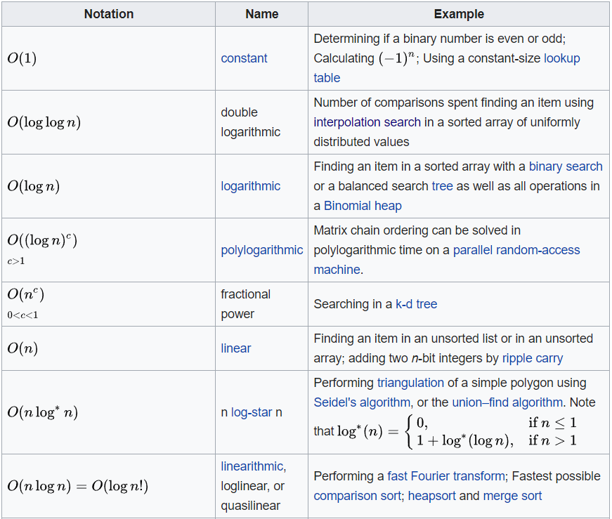
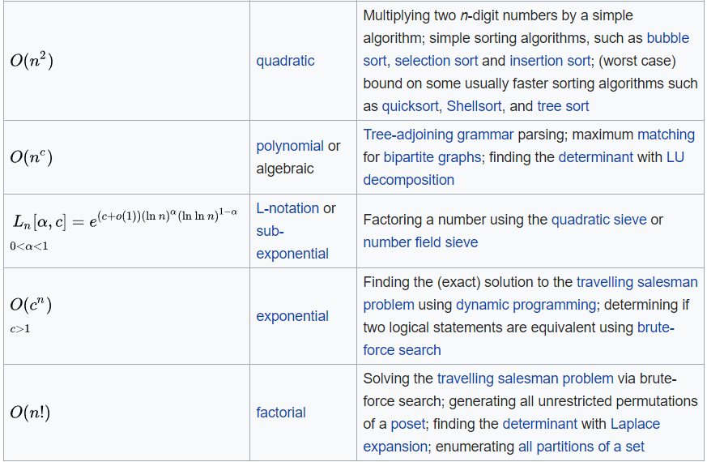

## 2D range tree vs KD-tree vs 1D BSTs search time

- 2D range tree: $\Theta(lg^2n+k)$
  - $log^2(n) = log(n)^2$
  - $lg = log$
- KD-tree: $\Theta(\sqrt{n}+k)$

- 2x 1D BSTs: $\Theta(lg(n) + k)$

- $n$ = size of the input
- $k$ = total number of points in the output

## Merge sort algorithms

- N = 1000
- M = 50
- B = 1
- n = 1000 = N
- m = M = 50

## Minimization and maximization algorithms

- Consider a 1.2-approximation algorithm with optimal cost C* = 100
- For a **minimization** problem, the algorithm returns a value that is no larger than C*1.2 = 100 * 1.2 = 120
- For a **maximization** problem, the algorithm returns a value that is no smaller than C*1.2 = 100 / 1.2 = 83.3

- We have the optimal solution C* and the approximate solution C. To calculate the approximation ratio:
- Minimization problem:
  - C / C*
  - Example: 120 / 100 = 1.2
- Maximization problem:
  - C* / C
  - Example: 100 / 83,3 = 1.2

