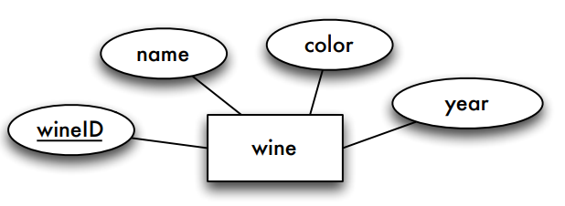
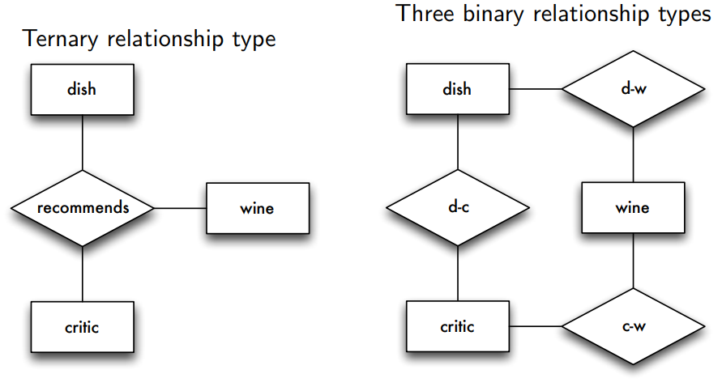
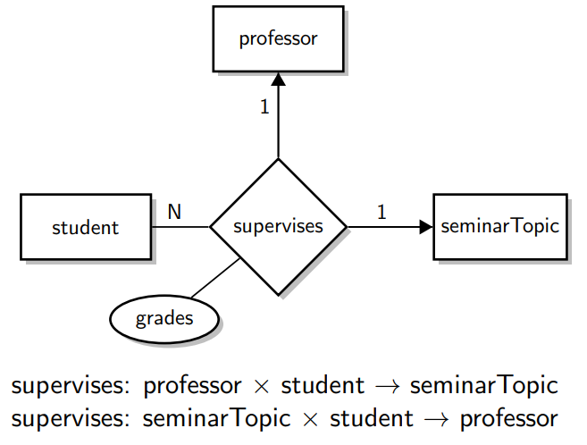

# The Entity Relationship Model

**Learning Goals**

* Create non-trivial ER diagrams
* Assess the quality of an ER diagram
* Perform and explain the mapping of ER diagrams to relations
* Use a particular ER notation properly

## Steps of Database Design

1. Requirements analysis
    * *What are we dealing with?*
2. Mapping onto a conceptual model (conceptual design)
    * *What data and relationships have to be captured?*
3. Mapping onto a data model (logical design)
    * *How to structure data in a specific model (here: the relational model)?*
4. Realization and implementation (physical design)
    * *Which adaptations and optimizations does a specific DBMS require?*

## Basics of Entity Relationship Model

### Entity and Entity Types

**Entities** are objects of the real world about which we want to store information

Entities are grouped into **entity types**

The **extension** of an entity type (**entity set**) is a particular collection of entities.

### Attributes

**Attributes** model characteristics of entities or relationships

* All entities of an entity type have the same characteristics
* Attributes are declared for entity types
* Attributes have a domain or values set

#### Single-Valued vs Multi-Valued

A person might have multiple phone numbers (or a single one)

#### Simple vs Composite

An address can be modeled as a string or composed of street and city

#### Stored vs Derived

Eg. birthday and age

### Keys

A **(super) key** consists of a subset of an entity type's attributes $E(A_1,\dots,A_m)$
$$
\{S_1,\dots,S_k\} \subseteq \{A_1, \dots, A_m\}
$$
The attributes $S_1, \dots S_k$ of the key are called **key attributes**

The key attribute's values <u>uniquely</u> identify an individual entity

#### Candidate Key

A **candidate key** corresponds to a minimal subset of attributes that fulfills the above condition

#### Primary Key

If there are multiple candidate keys, one is chosen as **primary key**

Primary key attributes are marked by underlining

### Relationships

**Relationships** describe connections between entities

Relationships between entities are grouped into **relationship types**

An association between two or more entities is called **relationship (instance)**.

A **relationship set** is a collection of relationship instances.

#### Mathematical

A relationship type $R$ between entity types $E_1, \dots, E_n$ can be considered a mathematical **relation**

**Instance** of a relationship type $R$:
$$
R \subseteq E_1 \times \dots \times E_n
$$
A particular element $(e_1,\dots,e_n)\in R$ is called an  **instance** of the relationship type with $e_i \in E_i$ for all $1 \leq i \leq n$

#### Role Names

**Role names** are optional and used to characterize a relationship type.

* Especially useful for recursive relationship types, i.e., an entity type is participating multiple times in a relationship type.

#### Attributes of Relationship Types

Relationship types can also have (descriptive) attributes.

### Summary of Basics

*student take courses*

See "animation" in [DBS3 slides p 39](https://www.moodle.aau.dk/pluginfile.php/1976337/mod_resource/content/0/DBS-ER-CSJ-2.pdf#page=39)

## Characteristics of Relationship Types

### **Degree**

* Number of participating entity types
* Mostly: binary
* Rarely: ternary
* In general: n-ary or n-way (multiway relationship types)

### **Cardinality Ratio / Cardinality Limits / Participation Constraint**

* Number of times entities are involved in relationship instances
* Cardinality ratio (Chen notation): 
    * 1:1, 1:N, N:M
* Participation constraint:
    *  partial or total
* Cardinality limits ([min,max] notation):
    * [min, max]

#### Chen Notation

(im using $\nrightarrow$ to express  )

1:1, 1:N and N:1 can be considered **partial functions** (often also a total function)

* 1:1 relationship: $R:E_1\nrightarrow E_2$ and $R^{-1}: E_2 \nrightarrow E_1$ 
* 1:N relationship: $R^{-1}: E_2 \nrightarrow E_1$
* N:1 relationship: $R:E_1\nrightarrow E_2$

also referred to as **functional relationship**

The "direction" is important!

The function always leads from the "N" entity type to the "1" entity type.

##### Graphical Notation

#### Participation Constraint

**Total**

Each entity of an entity type **must** participate in a relationship, i.e. it cannot exist without any participation ($E_2$ in the left example)

**Partial**

Each entity of an entity type **can** participate in a relationship, i.e., it can exist without any participation.

##### Graphical Notation

#### Example Relationship

#### Min-Max Notation

Special values:

* for min: 0
* for max: *

[0,*] represents no restrictions $\to$ default

The book uses a slightly different notation: 1..* instead of [1, ∗]

## Additional Concepts

### Weak Entity Types

The existence of a **weak entity** depends on the existence of a **strong entity** (aka. the identifying or owning entity) associated by an **identifying relationship**

* Total participation on the weak entity type
* Only in combination with 1:N (N:1) (or rarely also 1:1) relationship types
    * The strong entity type is always on the "1"-side
* Weak entities are uniquely identifiable in combination with the corresponding strong entity's key
* The weak entity type's key attributes are marked by underlining with a dashed line (**partial key, discriminator**)

### ISA Relationship Type

**Specialization and generalization** is expressed by the ISA relationship type (inheritance)

* Each sparkling wine entity is associated with exactly one wine entity 

    $\leadsto$ sparkling wine entities are identifiable by the functional ISA relationship

* Not every wine is also a sparkling wine

* Attributes of entity type wine are inherited by entity type sparkling wine

* The cardinalities are always
    * $ISA(E_1[1,1],E_2[0,1])$
* Each entity of entity type $E_1$ (sparkling wine ) participates exactly once, entities of entity type $E_2$ (wine) participates at most once

#### Special Characteristics

* **Overlapping specialization**
    * An entity may belong to multiple specialized entity sets
        * separate ISA symbols are used
* **Disjoint specialization**
    * An entity may belong to at most one specialized entity set
        * arrows to a shared ISA symbol in the diagram

#### Attributes 

Lower-level entity types <u>inherit</u>:

* attributes of the higher-level entity type
* participation in relationship types of the higher-level entity type

Lower-level entity types <u>can</u>:

* have attributes
* participate in relationship types that the higher-level entity does not participate in

#### Participation Constraints

**Total generalization/specialization**

* Each higher-level entity <u>must</u> belong to a lower-level entity type
    * Notation: double line

**Partial generalization/specialization (default)**

* Each higher-level <u>can</u> (may or may not) belong to a lower-level entity type

### Alternative Notations

For alternative notations see [DBS3 slides p 108](https://www.moodle.aau.dk/pluginfile.php/1976337/mod_resource/content/0/DBS-ER-CSJ-2.pdf#page=108)