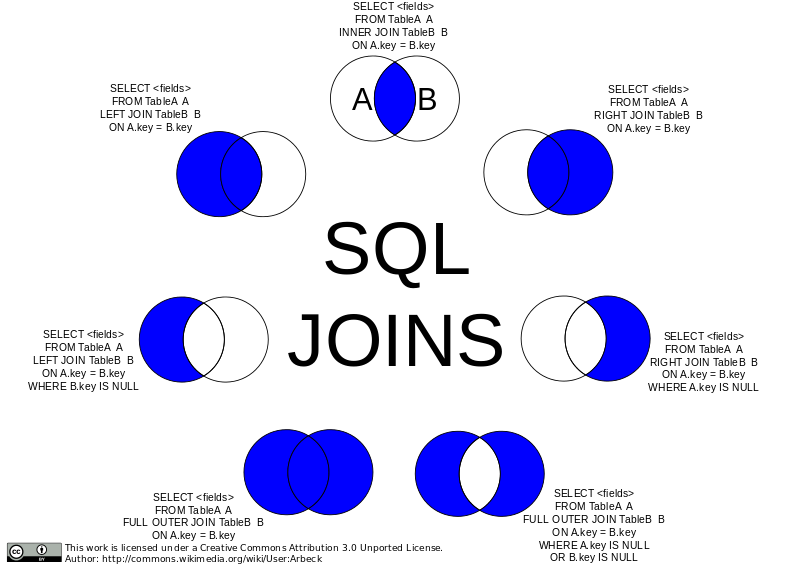

# SQL

$$
\newcommand{\relationRaw}[3]{
	\newcommand{\pk}{\underline}
	#3\mathbf{#1}#3#3:\{[\mathrm{#2}]\}
}
\newcommand{\relation}[2]{\relationRaw{#1}{#2}{}}
\newcommand{\relational}[2]{\relationRaw{#1}{#2}{&}}
\nonumber
$$

**Learning Goals**

* Explain and use the SQL data model 
* Create non-trivial database tables 
* Modify non-trivial database tables 
* Create non-trivial SQL statements


## SQL


SQL is a **declarative** query language ("**what**" not "how")

It consists of multiple parts

**Data Definition Language (DDL)**

* Create/change the schema
* create, alter, drop

**Data Manipulation Language (DML)**

* Changes to an instance
* insert, update, delete

**Data Query Language (DQL)**

* Evaluate queries on an instance
* select * from where ... 

**Transaction Control Language (TCL)**

* Controls transactions
* commit, rollback

**Data Control Language (DCL)**

* Grant/revoke access rights
* grant, revoke


## Basic Data Definitions

**Data Types**

* **character**(n), **char**(n)
* **character varying**(n), **varchar**(n)
* **integer, smallint**
* **numeric**(p,s), **decimal**(p,s), ...
    * p - precision: max number of digits in total
    * s - scale: number of digits after the comma
* **real, double**
* **blob** or **raw** for very large binary data
* **clob** for large string attributes
* **data** for dates
* **xml** for xml documents
* ...


**varchar** vs **char**

* Both are limited to a length of n
* **char** always uses n bytes
* **varchar** uses only the required place, plus length information


## Create Tables

```sql
CREATE TABLE professor(
    empidinteger UNIQUE NOT NULL,
    namevarchar(10) NOT NULL,
    rankchar(2));
```

Is equal to

```sql
CREATE TABLE professor(
    empidinteger PRIMARY KEY,
    namevarchar(10) NOT NULL,
    rankchar(2));
```

The `PRIMARY KEY` constraint includes the `NOT NULL` and `UNIQUE` constraints.


### Foreign Keys

```sql hl_lines="7"
CREATE TABLE course(
    courseID integer,
    title varchar(30) NOT NULL,
    ects integer,
    taughtby integer,
    PRIMARY KEY(courseID),
    FOREIGN KEY(taughtBy) REFERENCES professor(empID)
);
```


### Default Values

When inserting data into a table, all values that are not explicitly stated are set to **null** (standard default value).

When defining a table, we can specify another default value

```sql
CREATE TABLE wine(
	wineID		integer NOT NULL,
	name		varchar(20) NOT NULL,
	color		varchar(10) DEFAULT 'red',
	year		integer,
	vineyard	varchar(20)
);
```

Here the default value of color will be 'red'


### Sequence Number Generators

**Sequence number generators** automatically create continuous identifiers.

```sql hl_lines="1"
CREATE SEQUENCE serial START 101;

CREATE TABLE wine(
    wineID integer PRIMARY KEY DEFAULT nextval(’serial’),
    name varchar(20) NOT NULL,
    color varchar(10),
    year integer,
    vineyard varchar(20)
);
```


## Alter Tables

Initial version

```sql
CREATE TABLE professor(
    empid integer NOT NULL,
    name varchar(10) NOT NULL,
    rank char(2)
);
```

### Change Table Definitions

Add an attribute

```sql
ALTER TABLE professor
	ADD COLUMN (office integer);
```

Delete an attribute

```sql
ALTER TABLE professor
	DROP COLUMN name;
```

Change an attribute type

```sql
ALTER TABLE professor
	ALTER COLUMN name type varchar(30);
```


### Deletion of a Table

Delete a table

```sql
DROP TABLE professor;
```

Delete the content of a table

```sql
TRUNCATE TABLE professor;
```

Cannot be used if there is another table with a foreign key referencing the table that we want to delete.


## Data Insertion

Standard insertion [w3schools Insert Into](https://www.w3schools.com/sql/sql_insert.asp):

```sql
INSERT INTO table_name (column1, column2, column3, ...)
VALUES (value1, value2, value3, ...); 
```

```sql
INSERT INTO takees
	SELECT studid, courseid
	FROM student, course
	WHERE title = 'Logics';
```


## Rights Management

**DCL**

Grant access rights

```sql
GRANT select, update
    ON professor
    TO some user, another user;
```

```sql
GRANT select (empid), update (office)
    ON professor
    TO some user, another user;
```


Revoke access rights

```sql
REVOKE ALL PRIVILEGES
    ON professor
    FROM some user, another user;
```


Privileges (rights) on tables, columns,. . . : `select`, `insert`, `update`, `delete`, `rule`, `references`, `trigger`


## Query Language

Basic building block of an SQL query (SFW block)

* `SELECT <list of columns>`
    * projection list with arithmetic operators and aggregation functions
* `FROM <list of tables>`
    * list of involved tables, with optional renaming
* `WHERE <condition>`
    * selection and join conditions, nested queries


Relational algebra → SQL

* projection π → `SELECT`
* cross product × → `FROM`
* selection σ → `WHERE`


### Cross Product

If the from clause enumerates more than a single table, the cross product is computed.

```sql
SELECT *
FROM wine, producer;
```

The result is the set of **all** combinations of tuples in the involved tables!


### Duplicate Elimination

The `DISTINCT` keyword removes duplicated entries. 

```sql
SELECT name
FROM wine;
```


```sql
SELECT DISTINCT name
FROM wine;
```

Corresponds to the projection operation in relational algebra!


### Set Operations

Set operations require union compatibility: 

* same number of attributes with compatible domains.


* domains are identical 
* domains are based on characters (length does not matter) 
* domains are based on numerical values (exact type does not matter, e.g., integer and float)

Result schema: column names of the **first** table


For set operations, duplicate elimination (e.g., `UNION DISTINCT`) is the default!

```sql hl_lines="3"
(SELECT name
FROM assistant)
UNION
(SELECT name
FROM assistant);
```

```sql hl_lines="3"
(SELECT name
FROM assistant)
UNION DISTINCT
(SELECT name
FROM assistant);
```

```sql hl_lines="3"
(SELECT name
FROM assistant)
UNION ALL
(SELECT name
FROM assistant);
```

Intersection (`INTERSECT`) and set minus (`EXCEPT`) are also supported.


### Nested Queries

Subqueries are necessary for comparisons to sets of values.

* Standard comparisons in combination with quantifiers: `ALL` or `ANY`
* Special keywords to access sets: `IN` and `EXISTS`


#### Uncorrelated Subqueries

Notation:

* `attribute IN ( SFW block )`

```sql
SELECT name
FROM professor
WHERE empid IN (SELECT taughtby
					FROM course);
```

Comparison of a value to a set of values

**Negation in combination with the IN keyword**

Simulation of the difference operator
$$
\mathrm{\pi_{vineyard}(producer) - \pi_{vineyard}(wine)}
$$
corresponding SQL query

```sql
SELECT vineyard
FROM producer
WHERE vineyard NOT IN (
	sqSELECT vineyard FROM wine);
```


#### Correlated Subqueries

The subquery is **correlated** to the parent query. See the `WHERE` clause:

```sql
SELECT name
FROM professor p
WHERE EXISTS (SELECT *
                FROM course v
                WHERE v.taughtby = p.empid);
```

Computes names of professors that teach any courses.


#### Quantifiers IN vs EXISTS

`IN`

* Is the “left tuple” contained in the “right set”?
* Example: `(studid, courseid) IN (SELECT * FROM takes);`

`EXISTS`

* Is the “right set” nonempty?
* Example: `EXISTS (SELECT * FROM takes WHERE ...);`


There are more quantifiers: `ANY` and `ALL`


## Advanced SQL

Extension of the SFW block

* `FROM` clause: additional join variants
* `WHERE` clause: additional types of constraints and quantifiers
* `SELECT` clause: application of scalar operations and aggregate functions


### Joins

Join variants

* `CROSS JOIN`
* `NATURAL JOIN`
* `JOIN` or `INNER JOIN`
* `LEFT`, `RIGHT`, or `FULL OUTER JOIN`

Standard formulation:

```sql
SELECT *
FROM R1, R2
WHERE R1.A = R2.B;
```

Alternative Formulation

```sql
SELECT *
FROM R1
JOIN R2 ON R1.A = R2.B;
```

See joins visualized with [this tool](https://joins.spathon.com/)




### Aggregate Functions

How can we formulate the following queries in SQL?

* Average price of all articles on sale
* Total sales volume of all sold products

Aggregate functions compute new values for a column, e.g., the sum or the average of all values in a column.

**Aggregate functions:** 

* `AVG`, `MAX`, `MIN`, `COUNT`, `SUM`


The argument columns (except in case of `COUNT(∗)`) can optionally be accompanied by the keyword `DISTINCT` and `ALL`.

* `DISTINCT`
    * before evaluating the aggregate function, duplicates are removed
* `ALL`
    *  duplicates are considered for evaluation (**default**!)


Null values are removed before evaluation (except in case of `COUNT(∗)`).


#### Examples

Number of wines

```sql
SELECT COUNT(*) AS number
FROM wine;
```


The number of different regions that produce wine

```sql
SELECT COUNT(DISTINCT region)
FROM producer;
```

The names and years of wines that are older than the average

```sql
SELECT name, year
FROM wine
WHERE year < ( SELECT AVG(year) FROM wine);
```


#### Aggregate Functions in the WHERE Clause

Aggregate functions produce a single value $\leadsto$ usable in comparison with constants in the WHERE clause.

All vineyards producing a single wine

```sql
SELECT * FROM producer e
WHERE 1 = (SELECT COUNT(*) FROM wine w
			WHERE w.vineyard = e.vineyard);
```


#### Nesting of Aggregate Functions

Nesting of aggregate functions is **not** allowed!

<div style="color:darkred;">WRONG</div>

```sql
SELECT f1(f2(A)) AS result FROM R ...;
```

Instead

```sql
SELECT f1(temp) AS result
FROM ( SELECT f2(A) AS temp FROM R ...);
```


### Grouping

Computation of the aggregate function per group

Notation

```sql
SELECT ...
FROM ...
[WHERE ... ]
[GROUP BY columnList ]
[HAVING condition ];
```


**Computation of the aggregate function per group**

```sql
SELECT taughtBy, SUM(ects)
FROM course
GROUP BY taughtBy;
```

* All tuples with the same value for column `taughtBy` form a group
* The sum is computed for each group


#### Mistakes

* SQL generates **one result tuple per group**
* All columns referenced in the `SELECT` clause **must** either be listed in the `GROUP BY` clause or involved only in aggregate functions


#### The HAVING Clause

[Example in slides p 122](https://www.moodle.aau.dk/pluginfile.php/1981342/mod_resource/content/2/DBS-5.pdf#page=122)


### Null Values

Null values may lead to **unexpected** query results.

```sql
SELECT COUNT(semester) 
FROM student WHERE semester < 13 OR semester >= 13;
```

And

```sql
SELECT COUNT(semester) FROM student;
```

Produces the same result, because **tuples with null values in column semester are not counted**


**Arithmetic expressions**

* "Propagation" of null values
* null + 1 $\leadsto$ null
* null * 0 $\leadsto$ null

**Comparison Operations**

* SQL has a three-valued logic: `true`, `false`, and `unknown`
* If at least one argument is null, then the result is `unknown`
* `studid` = 5 $\leadsto$ `unknown` whenever `studid` is null


Logical expressions are evaluated according to the following tables


#### Null Values in Where Clause and Grouping

`WHERE` clause

* The `WHERE` clause forwards only tuples evaluated to `true`
* Tuples evaluated to `unknown` will not be part of the result

Grouping

* null is interpreted as an independent value
* Results in its own group


### Recursion

[Information in slides p. 146](https://www.moodle.aau.dk/pluginfile.php/1981342/mod_resource/content/2/DBS-5.pdf#page=146) 

Which courses need to be taken before taking course “Theory of Science”?

​	$\relation{requires}{predecessor, successor}$

​	$\relation{course}{courseid, title, ects, taughtBy}$


**Non-Recursive**

This query only finds direct predecessors: 

```sql
SELECT predecessor
FROM requires, course
WHERE successor = courseid AND
	title = ’Theory of Science’;
```

**Recursive**

```sql
WITH RECURSIVE transitiveCourse (pred, succ) AS (
	SELECT predecessor, successor
    FROM requires
    UNION 
    	SELECT DISTINCT t.pred, r.succ
    	FROM transitiveCourse t, requires r
    	WHERE t.succ = r.succ
)
SELECT *
FROM transitiveCourse
ORDER BY (pred, succ) ASC;
```


#### General Recursive SQL

```sql
WITH RECURSIVE mytable(number) AS (		
	VALUES(1)							| non-recursive part			
	UNION								| UNION
		SELECT number + 1				| recursive part
		FROM mytable					| 	only this part may reference
		WHERE number < 100				| 	mytable
)
SELECT sum(number)						| main query
FROM mytable;
```

Result: 5050


#### Avoid Infinite Recursion

* Most DBMS have a parameter that limits maximum recursion depth
* Encode it directly in the query

```sql
WITH RECURSIVE transitiveCourse (pred, succ, depth)
AS (
	SELECT predecessor, successor, 0
	FROM requires
UNION
	SELECT DISTINCT t.pred, r.successor, t.depth+1
	FROM transitiveCourse t, requires r
	WHERE t.succ = r.predecessor AND t.depth < 1
)
SELECT *
FROM transitiveCourse
ORDER BY (pred, succ) ASC;
```


### Limiting Size of Results

Using `LIMIT` is accepted in exam solutions

```sql
SELECT * FROM student LIMIT 5;
```

Other possible solutions can be seen in [DBS5 Slides p. 169](https://www.moodle.aau.dk/pluginfile.php/1981342/mod_resource/content/2/DBS-5.pdf#page=169)


## Views

Examples of views

```sql
CREATE VIEW profsAndtheirCourses AS
    SELECT c.title, p.name
    FROM professor p, course c
    WHERE p.empid = c.taughtBy;
```

```sql
SELECT * FROM profsAndtheirCourses;
```


```sql
CREATE VIEW ectsPerStud AS
    SELECT s.name, t.studid, SUM(c.ects) AS sum
    FROM student s, takes t, course c
    WHERE t.courseid = c.courseid AND s.studid = t.studid
    GROUP BY s.name, t.studid;
```

```sql
SELECT sum FROM ectsPerStud;
```


Views can be used to represent derived attributes (ER diagram).


### Altering Views

`REPLACE VIEW` expects the same columns in the same order with the same types.

```sql
CREATE OR REPLACE VIEW profsAndtheirCourses AS
    SELECT c.title, p.name
    FROM professor p, course c
    WHERE p.empid = c.taughtBy;
```

Alternative: Delete the view and recreate it afterwards, or non-standard SQL extensions, e.g., PostgresSQL’s `ALTER VIEW`

```sql
DROP VIEW ectsPerStud;
CREATE VIEW ectsPerStud AS
    SELECT s.name, t.studid, SUM(c.ects) AS sum
    FROM student s, takes t, course c
    WHERE t.courseid = c.courseid
    	AND s.studid = t.studid
    GROUP BY s.name, t.studid;
```


### Views vs Materialized Views

**(Dynamic) view**

* Represents a macro of a query
* The query result is not pre-computed but computed when used

**Materialized View**

* The query result is pre-computed
* Computation load before any queries are executed


[More on views in DBS5 slides p. 184](https://www.moodle.aau.dk/pluginfile.php/1981342/mod_resource/content/2/DBS-5.pdf#page=184)


## Integrity Constraints

* Additional instrument to avoid inconsistency.

* Try to avoid insertion of inconsistent data


### Static Integrity Constraints

Each instance of a database must fulfill all static integrity constraints.

```sql
CREATE TABLE professor ...
... empid integer NOT NULL ...
```

Restricting the domain of valid values

```sql
CREATE TABLE student ...
... CHECK semester BETWEEN 1 AND 20 ...
```

Enumeration of valid values

```sql
CREATE TABLE professor ...
... CHECK rank IN ('C2', 'C3', 'C4') ...
```

Definition of user-defined domains

```sql
CREATE DOMAIN wineColor varchar(5)
    DEFAULT ’red’
    CHECK (VALUE IN (’red’, ’white’, ’rose’));
```

```sql hl_lines="4"
CREATE TABLE wine (
	wineID int PRIMARY KEY,
    name varchar(20) NOT NULL,
    color wineColor,
	...);
```


### Dynamic Integrity Constraints

Referential integrity requires that foreign keys must always reference existing tuples or be null.

What happens if there is no professor with `empid` 007?

```sql
insert into course
	values (5100, ’Spying for Dummies’, 4, 007)
```

And how can we prevent the insertion?

#### Definition of Keys

**Candidate keys**

* `UNIQUE`
* A table can have multiple `UNIQUE` constraints
* Allows null values!

**Primary Keys**

* `PRIMARY KEY`
* At most one per table
* Implies `UNIQUE NOT NULL`

**Foreign Keys**

* `FOREIGN KEY`
* Allows null values


#### Handling Updates

Dynamic integrity constraints need to be fulfilled by each change of a database.

In response to changes of referenced data:

* Rejection of updates (default behavior)
* Propagation of updates (CASCADE)
* Set references to “unknown” (SET null)

In addition available in PostgreSQL

* Set to a default value (SET DEFAULT)


[Examples in DBS5 slides p. 204](https://www.moodle.aau.dk/pluginfile.php/1981342/mod_resource/content/2/DBS-5.pdf#page=204)


### Complex Constraints

```sql
CREATE TABLE grades (
    studid integer REFERENCES student ON DELETE CASCADE,
    courseid integer REFERENCES course,
    grade numeric(2,1) CHECK (grade BETWEEN 0.7 AND 5.0),
    PRIMARY KEY(studid, courseid)
    CONSTRAINT hasTaken
		CHECK (EXISTS (SELECT *
        	FROM takes h
			WHERE h.courseid = grades.courseid AND
				h.studid = grades.studid))
);
```

* The CHECK clause is evaluated for each update or insert
* Operation is rejected if the check is evaluated to false! True and unknown do not violate the constraint!
* Not (yet) supported by PostgreSQL:
    * ERROR: cannot use subquery in check constraint
    * Workaround by using **triggers**


## Appendix

[See Appendix in DBS5 slides p. 222](https://www.moodle.aau.dk/pluginfile.php/1981342/mod_resource/content/2/DBS-5.pdf#page=222)