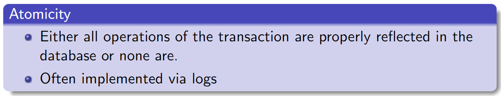
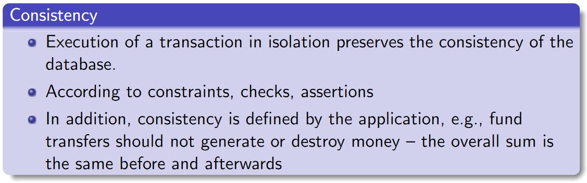
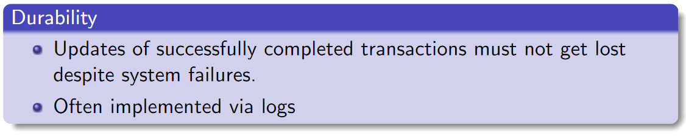
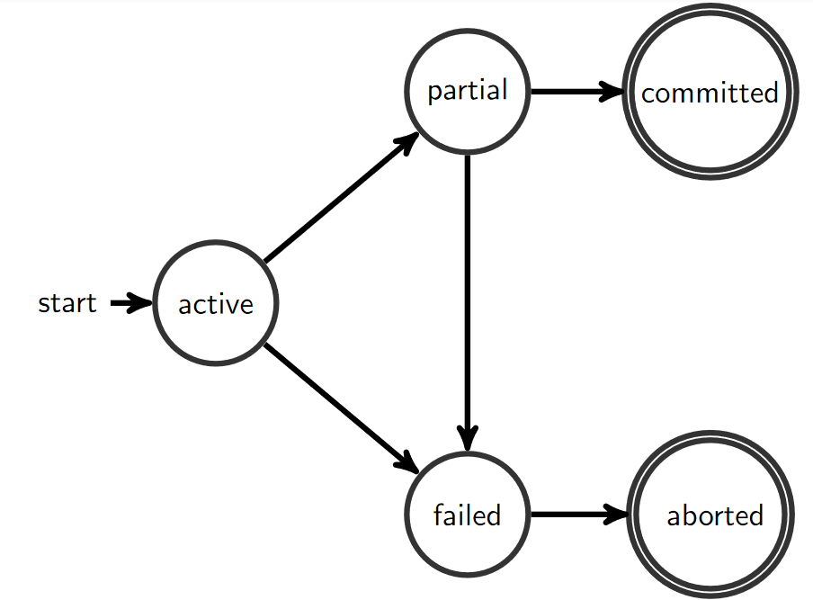
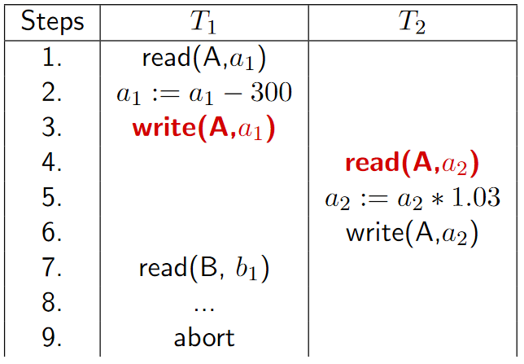
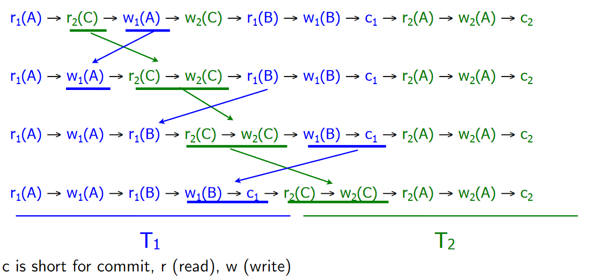
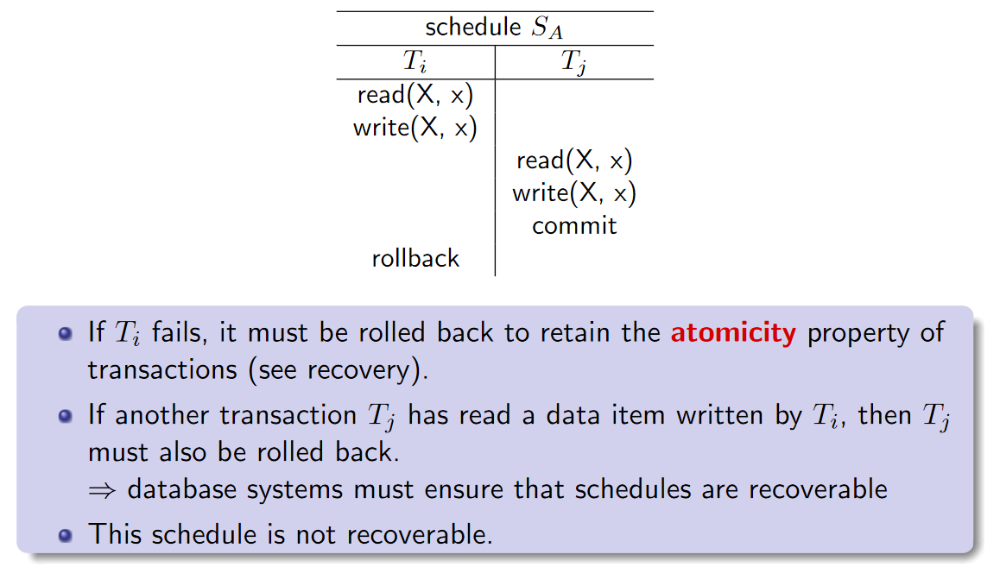
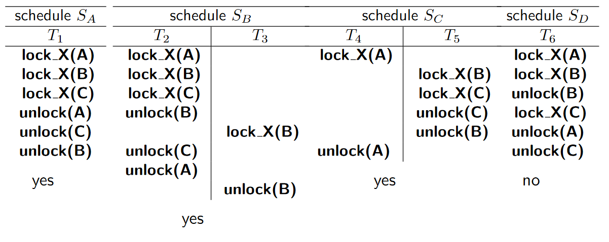

# Transactions

A **transaction** is a collection of operations that forms a **logical unit** of work, during which various data items are accessed and possibly updated 

**ACID Properties**

## Operations on Transactions

* `BEGIN` 
    * Starts a transaction
* `COMMIT`
    * Ends a transaction
* `ROLLBACK`
    * All changes are undone/discarded

**SAVEPOINT**

* `SAVEPOINT <savepoint_name>;`
    * Defines a point/state within a transaction
    * A transaction can be rolled back partially back up to the savepoint
* `ROLLBACK TO <savepoint_name>`
    * Rolls the active transaction back to the savepoint `<savepoint_name>`

## Transaction States

## Concurrency

Affects the **I** in **ACID**

**Problems**

* **Lost Updates**
    * Overwriting updates
    * 
* **Dirty Read**
    * Dependency on non-committed updates
    * 
* **Non-repeatable Read**
    * Dependency on other updates
    * T2 loses the illusion that it is alone in the database
    * 
* **Phantom Problem**
    * Dependency on new/deleted tuples
    * 

## Schedules

A **schedule** is a **sequence of operations** from one ore more transactions.
For concurrent transactions, the operations are interleaved.

**Operations**

* `read(Q,q)`
* `write(Q,q)`
* Arithmetic operations
* `commit`
* `abort`

**Serial Schedule**
The operations of the transactions are executed sequentially with no overlap in time

**Concurrent Schedule**
The operations of the transactions are executed with overlap in time

**Valid Schedule**
A schedule is valid if the result of its executions is "correct"

### Example Schedules

### Correctness

**Definition 1**
A concurrent execution of transactions must leave the database in a consistent state

**Definition 2 (D2)**
Concurrent execution of transactions must be (result) equivalent to some serial execution of the transactions

* We use **Definition 2**

**Simplifying assumptions**

* **Only reads and writes** are used to determine correctness
* This assumption is stronger than definition D2, as even fewer schedules are considered correct. 

### Conflicts

**Definition 4 (D4)**[^1]

A schedule is **conflict serializable** if it is **conflict equivalent** to a serial schedule

[^1]: Third definition D3 is view serializability, and is not covered in the course

There is a conflict if there is a read and a write on the same data unit. Also if there is a write on the same data unit.

Let I and J be consecutive instructions of a schedule S of multiple transactions

* If I and J do not conflict, we can swap their order to produce a new schedule S'

* The instructions appear in the same order in S and S', except for I and J, whose order does not matter

* S and S' are termed **conflict equivalent schedules**

#### Examples

### Conflict Graph

AKA **Precedence graph**

Directed graph

Assumption:

* A transaction will always read an item before it writes that item

Given a schedule for a set of transactions $T_1,T_2,\dots,T_n$

* The vertices of the conflict graph are the transactions identifiers
* An edge from $T_i$ to $T_j$ denotes that the two transactions are conflicting, with $T_i$ making the relevant access earlier
* Sometimes the edge is labeled with the item involved in the conflict

**Determining Serializability**

Given a schedule S and a conflict graph

* A schedule is **conflict serializable** if its conflict graph is **acyclic**
* Intuitively, a conflict between two transactions forces an execution order between them (topological sorting)

#### Example

### Relationship Among Schedules

## Recoverable and Cascadeless Schedules

**Transactions can fail!**

### Recoverable

A schedule is **recoverable** if for each pair of transactions $T_i$ and $T_j$ where $T_j$ reads data items written by  $T_i$, then $T_i$ must commit before $T_j$ commits.

### Cascading Rollbacks

A schedule is **cascadeless** if for each pair of transactions $T_i$ and $T_j$, where $T_j$ reads data items written by $T_i$, the commit operation of $T_i$ must appear before the read by $T_j$ 

* In other words, if you only read committed data

## Concurrency Control

### Lock-based Synchronization

Ensuring (conflict) serializable schedules by delaying transactions that could violate serializability.

Two types of locks can be held on a data item Q

* S (shared, read lock)
* X (exclusive, write lock)

Operations on locks:

* `lock_S(Q)`
    * set shared lock on data item Q
* `lock_X(Q)`
    * set exclusive lock on data item Q
* `unlock(Q)`
    * release lock on data item Q

### Two-Phase Locking (2PL)

Is a protocol

* First phase (growing phase):
    * Transactions **may request** locks
    * Transactions **may not release** locks
* Second phase (shrinking phase):
    * Transactions **may not** **request** locks
    * Transactions **may release** locks

When the first lock is release, the we move from first to second phase.

#### Examples

Remember that we look at transactions individually

#### Characteristics of 2PL

* Produces only serializable schedules
    * Insures conflict serializability
    * Produces a subset of all possible serializable schedules
* Does **not** prevent deadlocks
* Does **not** prevent cascading rollbacks
    * "Dirty" reads are possible (reading from non-committed transactions)

#### Variations of 2PL

**Strict 2PL**

* **Exclusive** locks are not released before the transaction commits
* Prevents "dirty reads"

**Rigorous 2PL**

* **All** locks are released after commit time
* Transactions can be serialized in the order they commit

Advantage

* No cascading rollbacks

Disadvantage

* Loss of potential concurrency

#### Lock Conversion

First phase

* Acquire an S-lock on a data item
* Acquire an X-lock on a data item
* Convert (upgrade) an S-lock to an X-lock

Second phase

* Release S-, and X-locks
* Convert (downgrade) an X-lock to an S-lock

This protocol still ensures serializability. 
It relies on the application programmer to insert the appropriate locks.

#### More Examples

#### Overview

### Deadlocks

**Solutions**

* detection an recovery
* prevention
* timeout (not covered in presentation)

#### Deadlock Detection

Create a "Wait-for graph" and check for cycles

* One node for each active transaction $T_i$
* Edge $T_i\to T_j$ if $T_i$ waits for the release of locks by $T_j$

If a deadlock is detected:

* Select an appropriate victim
* Abort the victim and release its locks

##### Example

##### Rollback Candidates

Choosing a good victim transaction

Rollback of one or more transactions that are involved in the cycle

* The latest (minimization of rollback effort)
* The one holding the most locks (maximization of released resources)

Prevent that always the same victim is chosen (starvation)

* "rollback counter"
    * if above a certain threshold: no more rollbacks to break deadlocks

#### Deadlock Prevention

**Conservative 2PL**

* 2PL as well as strict and rigorous 2PL do not prevent deadlocks
* Additional requirement:
    * All locks (shared and exclusive) are obtained right in the beginning of a transaction

### Summary: Concurrency Control

* Many concurrency control protocols have been developed
    *  Main goal: allowing only serializable, recoverable and cascadeless schedules
    * Two-phase locking (2PL)
        * Most relational DBMS's use reqorous two-phase locking
* Deadlock detection (wait-for graph) and prevention (conservative 2PL)
* Serializability vs. concurrency

