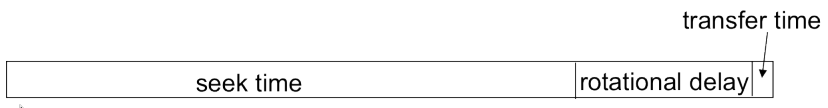
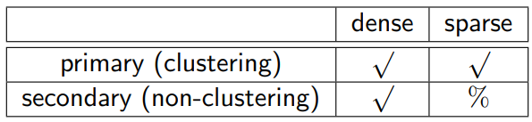

# Physical Design

**Learning Goals**

* Understand how tables are stored in files
* Understand basic indexing techniques
* Use knowledge of file/index to tune basic SQL queries

## File Organization

### Storage Hierarchy

* **Volatile storage** (cache, main memory): loses content when power is switched of
* **Non-volatile storage**: content persists even when power is switched of
* The higher the level, the faster the access

### Magnetic Hard Disk

For each disk access

* Each **track** is divided into **sectors** (smallest unit of data that can be read/written)
* A **block (page)** is a contiguous **sequence of sectors** from a single track
    * Basic unit of data transfer between disk and memory

Optimization of disk block access

* Organize blocks in the way data is accessed
* Store related information close to each other

Conceptually, relational data is stored as sequences of bits on disk.

**Functional requirements**

* Processing records sequentially
* Efficient key-value search
* Insertion/deletion of records

**Performance objectives**

* Little wasted space
* Fast response time
* High number of transactions

### Files

Storing databases on disks

* The database is stored as a collection of **files**
* Each file corresponds to a set of **records**
* A record contains a number of **fields**

Multiple records are “grouped” into **blocks (pages)**

Record size

* Fixed
* Variable

Files reside on mass storage (usually a disk)

* Fast random access
* Non-volatile storage

### Example

Blocks in a file system are not necessarily contiguous

Speed

* Speed of reading a block (an I/O):
    * $\sim 10$ msec to a non-contiguous block read
    * $\sim 1$ msec for a contiguous block read
* DBMS/OS can reorganize blocks to make them contiguous

### Fixed Size Records

<u>All records use the **same** length if they occupy the whole space or not</u>

**Read record** $i$

* Get record at location: $\mathrm{recordSize \times i}$

**Delete record** $i$

* Move records $i+1,\dots,n$ to location $i,\dots,n-1$ to close the gap

    or

* Move record $n$ to $i$

    or

* Mark the gaps and fill them with future insertions

    * Mark first gap in the file header
    * Use the gaps to point to other gaps (free-list)

### Variable Size Records

<u>Records have **different** lengths and occupy different amounts of disk space</u>

Use case: variable-lengths attributes (e.g., varchar)

Implementation alternatives

* If max. size is known:
    * Map variable size records to fixed size records
* Slotted-page-structure
    * Records stored contiguously
    * Block header contains pointers to records
    * 

### Organizing Records in a File

<u>Determine the order of records within a file</u>

**Heap file organization**

* A record can be placed anywhere in the file

**Sequential file organization**

* Records stored in sequential order by the value of the search key

**Hash file organization**

* Hash the record to a block based on a hash function and a hash key

#### Heap

* No apparent ordering on any of the columns in the table
* Search: linear scan always works
* Insert: find a free slot

#### Sequential

* Example table is stored in order of the ID column
* The ordering column does not need to be the primary key
* Search: binary search when search on the ID column
* Insert: reorganization of the file

#### Hashing

* Hash function used in this example is: $mod(ID, 3)$
* Search: use the hash function on the search key value (ID) to find the right block
* Insert: use the hash function on the search key value (ID) to find the right block and append

## Indexes

**Assumptions**

* Many rows are stored in the database
* Many queries only access a small fraction of the rows
* Must be able to modify the rows, i.e., insert, update, and delete
* Cannot take the database offline to reorganize the files used in the database

<u>Goal: access as little data as possible</u>

### Overview

**Classification**

Variations

* Single-level index
* Multi-level index

It is possible to have multiple indexes for the same relation.

### Primary Sparse Index

* Defined on a file ordered on the search key
* One index entry for each block in the file

### Secondary Dense Index

* Defined on a file not ordered on the search key
* One index entry for each record

### Overview

**Primary vs. secondary**

* = clustering vs. non-clustering
* Is the file ordered on the search key?

**Dense vs. sparse**

* A separate index entry for each record (unique search key value)?
* Yes → dense
* No → sparse

**Tradeoff**

* Dense indexes: faster location of records
* Sparse indexes: smaller indexes

### Multi-level Index

* Goal: the outer index (sparse) fits into main memory
* The number of levels can be greater than two

Limitations of index-sequential file organization

* Insertions and deletions
    * Expensive reorganization of multiple levels of ordered files

B^+^-trees

* Balanced search trees
    Number of lookups/levels is the same for all entries
* Leaving some space in each disk block

### Index Concepts Combined

A secondary sparse index does not make sense!

* Since records are not sorted on that key, we cannot predict the location of a record from the location of any other record
* Thus, secondary indexes are always dense.

**Clustering Dense**

* Index entry has a pointer to the first record

**Non-clustering Dense**

* Index entry has pointers to all the records

### B+-Tree

* n = the fanout = the number of pointers = 3 in the example above
* $\dashv$ = unused pointer
* nu = Unused search key value
* Leaf-level pointers: point to the data file
* Search: Both key lookups and range queries are well supported

#### Node Structure

Node structure used for **root**, **internal**, and **leaf** nodes

In this example, the **fanout** n is 10

* In each node: 10 (n) **pointers** $(p_i)$
* In each node: 9 (n-1) **search key** values ($k_j$)

The last pointer in leaf nodes is used to chain together the leaf nodes in search key order

#### Properties

**Balanced**

* All paths from the root node to leaf nodes have the same length

**Bushy**

* Each node has between $\lceil {n \over 2} \rceil$ and n children
* Exception: the root node has between 2 and n children
* Leaf nodes have between $\lceil {n-1\over2} \rceil $ and $n - 1$ pointers to file records and 1 pointer to the next leaf node

**Ordered**

* The key values are sorted in each node, i.e, $k_i < k_j$, if $i < j$
* The subtrees are ordered

#### Minimal B+-Tree Example

* A minimally filled B+-tree for n=3

#### B+-Tree in Practice

* Each B+-tree node has the size of one I/O block of data.
* A B+-tree node is at least 50% filled (by design)
* The B+-tree contains a rather small number of levels, usually logarithmic in the size of the main file
* The first one or two levels of the tree are stored in main memory
* “Logically” close does not imply “physically close” Typically reading a node in a B+-tree requires one random I/O
* The non-leaf nodes are a hierarchy of sparse indexes

When a primary key constraint for a table is created in a DBMS, then the uniqueness is checked by using a B+-tree.

#### B+-Tree Updates

**Insertions**

* Overflow, split
* The tree height may be increased by 1

**Deletions**

* Underflow, borrow, coalesce
* The tree height may be decreased by 1

[Multiple examples in DBS7 Slide 30- p. 54-](https://www.moodle.aau.dk/pluginfile.php/1994169/mod_resource/content/2/DBS-7.pdf#page=54)

#### B+-Trees Online

Interactive apps available on the Web

<https://goneill.co.nz/btree-demo.php>

<https://www.cs.usfca.edu/~galles/visualization/BPlusTree.html>

*third party material, not fully tested, might have a slightly different implementation (and errors)*

### Unordered Indexes (Hashing)

#### Static Hash Index

<u>Build an index based on a hash function (instead of based on a search key order)</u>

* Choose an appropriate **hash function** $h$
* Apply hash function $h$ to search key value $k$ to compute $h(k)$
* **Bucket** (disk block) for each value of $h(k)$

* **Lookup**
    * One access to the bucket directory
    * One access to the data file
* Good performance depends on a good hash function
* Bucket overflow
    * Too many different key values hash to the same bucket
    * Solution: overflow buckets and overflow chains
    * 

#### **Open vs Closed Hashing**

**Open Hashing**

* Overflow chains

**Closed Hashing**

* Fixed number of buckets
* Overflow: use one of the other buckets (linear probing, further hash functions, etc.)

#### Static Hashing

Problem for static hashing:

* Hash function and number of buckets determined during initialization

**Databases grow or shrink over time!**

* Initial number of buckets too small

    $\to$ many overflows, performance degrades

* Initial number of buckets too big

    $\to$ underflow, space is wasted

**Solutions**

* Periodic re-organization
* Dynamic hashing:
    * allows modifications dynamically

## Physical Design Tuning

**Design decisions**

* Ordered/clustering indexes vs. hashing
* Sparse vs. dense index
* Clustering vs. non-clustering indexes
* Joins and indexes

**Tuning questions**

* Are the costs of periodic reorganization acceptable?
* How frequent are insertions and deletions?
* Optimization goal: average access time or worst-case access time?
* What types of queries are expected?

### Use of Indexes

Sometimes available indexes are not used, why? 

* Catalog out of date
    optimizer may think table is small
* “Good” and “bad” query examples
    * `SELECT * FROM EMP WHERE salary/12 > 4000`
        * Operations on conditions may prevent the optimizer from realizing the index could be useful
    * `SELECT * FROM EMP WHERE salary > 48000`
        * Good
    * `SELECT * FROM EMP WHERE SUBSTR(name, 1, 1) = ’G’`
        * Functions on conditions require function-based indexes
    * `SELECT * FROM EMP WHERE name LIKE ’G%’`
        * Good
    * `SELECT * FROM EMP WHERE name = ’Smith’`
        * Good
    * `SELECT * FROM EMP WHERE salary IS NULL`
        * Requires an index on nullable values
* Nested sub-query
* Selection by negation
* Queries with `OR`