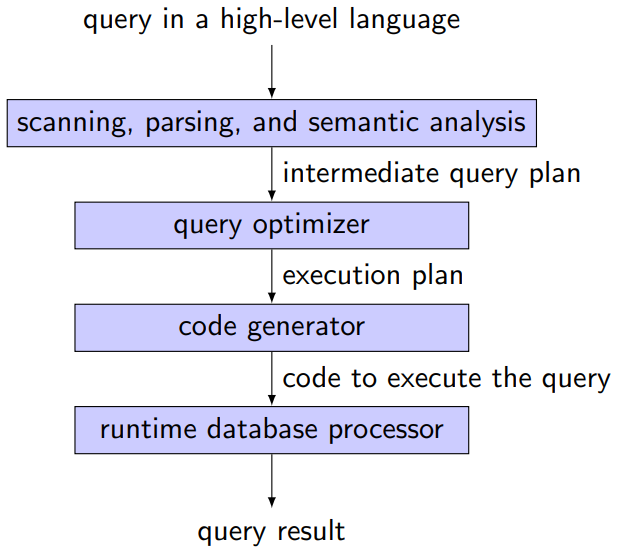
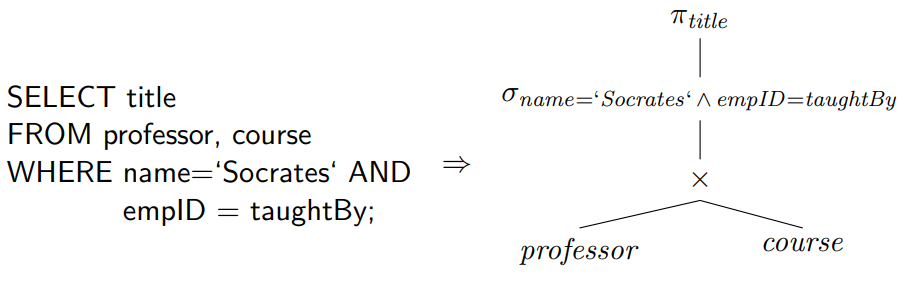
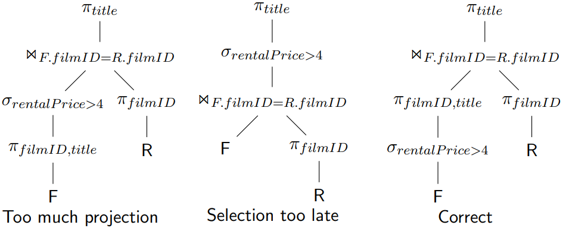

# Query Processing and Optimization

**Learning Goals**

* Understand how selection statements are executed
* Understand the basic join algorithms
* Understand the basics of heuristic (logical) query optimization
* Understand the basics of physical query optimization


## Query Processing

### Evaluation of an SQL Statement

**The clauses are specified in the following order**

* `SELECT` *column(s)*
* `FROM` *table list*
* `WHERE` *condition*
* `GROUP BY` *grouping column(s)*
* `HAVING` *group condition*
* `ORDER BY` *sort list*

**But the query is evaluated in a different order**

* Cartesian product of tables in the from clause
* Predicates in the where clause
* Grouped according to the group by clause
* Predicate in the having clause applied to (eliminate) groups
* Compute aggregation functions for each remaining group
* Projection on columns enumerated in the select clause


<u>SQL is declarative!</u>


### Steps of Query Processing




### Parsing a Query

Parsing a query into an initial query plan



* $\pi_{title}(\sigma_{name='Socrates' \and empID=taughtBy}(professor \times course))$


#### Alternative Query Plan


### Query Optimization

Alternatives

* Equivalent query execution plans
* Algorithms to compute an algebra operation
* Methods to access relations (indexes)

<u>Although the result is equivalent, execution costs might be different.</u>


***Theory meets reality***

*It is not the task of the user to write queries “efficiently”, it is the task of the query optimizer to execute them efficiently! But in reality. . . optimizers are not perfect.*


#### Query Costs

**Measures**

* Total elapsed time for answering a query **(response time)**
* Many factors contribute to response time
    * Disk access
    * CPU costs
    * Network communication
    * Query load
    * Parallel processing
* Disk access most dominant
    * Block access time: seek time, rotation time
    * Transfer time


#### Query Optimization

Logical query optimization

* Relational algebra
* Equivalence transformation
* Heuristic optimization

Physical query optimization

* Algorithms and implementations of operations
* Cost model


## Heuristic (Logical) Query Optimization 

**Logical query optimization**

* Foundation: algebraic equivalences
* Algebraic equivalences span the potential search space
* Given an initial algebraic expression: 
    * apply algebraic equivalences to derive new equivalent algebraic expressions

What is a good plan?

* Difficult to compare plans without a cost function

    $\to$ logical query optimization relies on heuristics


**<u>Main goal of logical query optimization</u>**

Reduce the size of intermediate results


### Equivalences

**Break up conjunctions in selection predicates**

$$
\sigma_{c_1 \and c_2 \and \cdots \and c_n}(R) \equiv \sigma_{c_1}(\sigma_{c_2}(\dots(\sigma_{c_n}(R))\dots))
$$

$\sigma$ **is commutative**

$$
\sigma_{c_1}(\sigma_{c_2}(R)) \equiv \sigma_{c_2} ( \sigma_{c_1}(R))
$$

$\pi$ **cascades**

If $L_1 \subseteq L_2 \subseteq \cdots \subseteq L_n$ then

$$
\pi_{L_1}(\pi_{L_2}(\dots(\pi_{L_n}(R))\dots)) \equiv \pi_{L_1}(R)
$$

**Change the order of** $\sigma$ **and** $\pi$

If the selection involves only attributes $A_1, \dots, A_n$ contained in the projection list, the order of $\sigma$ and $\pi$ can be changed

$$
\pi_{A_1, \dots, A_n}(\sigma_c(R)) \equiv \sigma_c(\pi_{A_1, \dots, A_n}(R))
$$

$\cup, \cap$ **and** $\Join$ **are commutative**

$$
R\Join_c S \equiv S\Join_c R
$$

**Change the order of ** $\sigma$ **and** $\Join$

If the selection predicate $c$ involves only attributes of relation $R$, the order of $\sigma$ and $\Join$ can be changed

$$
\sigma_c(R\Join_j S) \equiv \sigma_c(R) \Join_j S
$$

If the selection predicate $c$ is a conjunction of the form $c_1 \and c_2$ and $c_1$ involves only attributes in $R$ and $c_2$ involves only attributes in S, then we need to split $c$

$$
\sigma_c(R\Join S) \equiv \sigma_{c_1}(R) \Join_j \sigma_{c_2}(S)
$$

**Change the order of** $\pi$ **and** $\Join$

Given the projection list $L=\{A_1,\dots,A_n, B_1,\dots,B_m\}$ where 
$A_i$ represents attributes in $R$ and
$B_i$ represents attributes in $S$

If the join predicate $c$ only references attributes in $L$ the following reformulation holds

$$
\pi_L (R \Join_c S) \equiv (\pi_{A_1,\dots,A_n}(R)) \Join_c (\pi_{B_1, \dots , B_m}(S))
$$

$\Join, \cap, \cup$ **(in separate) are all associative**

I.e., with $\Phi$ representing either of these operations, the following holds

$$
(R\ \Phi\ S)\ \Phi\ T \equiv R\ \Phi\ (S\ \Phi\ T)
$$

$\sigma$ **is distributive with** $\cap, \cup, -$

I.e., with $\Phi$ representing either of these operations, the following holds

$$
\sigma_c(R\ \Phi\ S) \equiv (\sigma_c(R))\ \Phi\ (\sigma_c(S))
$$

$\pi$ **is distributive with** $\cup$

$$
\pi_c(R\cup S) \equiv (\pi_c(R))\cup (\pi_c(S))
$$

**Join and/or selection predicates can be reformulated based on De Morgan’s laws**

$$
\neg(c_1 \and c_2) \equiv (\neg c_1)\or(\neg c_2)\label{demorgan1}
$$

$$
\neg(c_1 \or c_2) \equiv (\neg c_1)\and(\neg c_2)\label{demorgan2}
$$

**Combination of Cartesian product and selection **

A Cartesian product followed by a selection whose predicate involves predicates of both involved operands can be combined to a join

$$
\sigma_\theta(R \times S) \equiv R \Join_\theta S
$$


**Remember the equivalent expressions for operators in relational algebra!**


### Phases of Logical Query Optimization

1. Break up conjunctive selection predicates
2. Push selections down
3. Introduce joins by combining selections and cross products
4. Determine join order
    **Heuristic**: execute joins with input from selections before executing other joins
5. Introduce and push down projections
    Not always useful


[Example in DBS8 slide 18 p. 35](extra/DBS8.pdf#page=35)


### Be Careful!

**Find the titles of reserved films**

```sql
SELECT DISTINCT title
FROM film F, reserved R
WHERE F.filmID = R.filmID
```


**Find the titles of expensive reserved films**

```sql
SELECT DISTINCT title
FROM film F, reserved R
WHERE F.filmID = R.filmID AND F.rentalPrice > 4
```




### Summary: Heuristic Query Optimization

**Rules of thumb**

* Perform selections as early as possible
* Perform projections as early as possible


**The optimization process**

* Generate initial query plan from SQL statement
* Transform query plan into more efficient query plan via a series of modifications, each of which hopefully reducing execution time


**Note**

* A single query plan provides all the results
* Sometimes also called rule-based query optimization