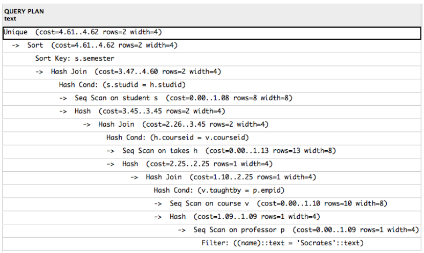

# Query Processing and Optimization

**Learning Goals**

* Understand how selection statements are executed
* Understand the basic join algorithms
* Understand the basics of heuristic (logical) query optimization
* Understand the basics of physical query optimization

$$
\newcommand{\relationRaw}[3]{
	\newcommand{\pk}{\underline}
	#3\mathbf{#1}#3#3:\{[\mathrm{#2}]\}
}
\newcommand{\relation}[2]{\relationRaw{#1}{#2}{}}
\newcommand{\relational}[2]{\relationRaw{#1}{#2}{&}}
\nonumber
$$

## Query Processing

### Evaluation of an SQL Statement

**The clauses are specified in the following order**

* `SELECT` *column(s)*
* `FROM` *table list*
* `WHERE` *condition*
* `GROUP BY` *grouping column(s)*
* `HAVING` *group condition*
* `ORDER BY` *sort list*

**But the query is evaluated in a different order**

* Cartesian product of tables in the from clause
* Predicates in the where clause
* Grouped according to the group by clause
* Predicate in the having clause applied to (eliminate) groups
* Compute aggregation functions for each remaining group
* Projection on columns enumerated in the select clause


<u>SQL is declarative!</u>


### Steps of Query Processing


### Parsing a Query

Parsing a query into an initial query plan


* $\pi_{title}(\sigma_{name='Socrates' \and empID=taughtBy}(professor \times course))$


#### Alternative Query Plan


### Query Optimization

Alternatives

* Equivalent query execution plans
* Algorithms to compute an algebra operation
* Methods to access relations (indexes)

<u>Although the result is equivalent, execution costs might be different.</u>


***Theory meets reality***

*It is not the task of the user to write queries “efficiently”, it is the task of the query optimizer to execute them efficiently! But in reality. . . optimizers are not perfect.*


#### Query Costs

**Measures**

* Total elapsed time for answering a query **(response time)**
* Many factors contribute to response time
    * Disk access
    * CPU costs
    * Network communication
    * Query load
    * Parallel processing
* Disk access most dominant
    * Block access time: seek time, rotation time
    * Transfer time


#### Query Optimization

Logical query optimization

* Relational algebra
* Equivalence transformation
* Heuristic optimization

Physical query optimization

* Algorithms and implementations of operations
* Cost model


## Heuristic (Logical) Query Optimization 

**Logical query optimization**

* Foundation: algebraic equivalences
* Algebraic equivalences span the potential search space
* Given an initial algebraic expression: 
    * apply algebraic equivalences to derive new equivalent algebraic expressions

What is a good plan?

* Difficult to compare plans without a cost function

    $\to$ logical query optimization relies on heuristics


**<u>Main goal of logical query optimization</u>**

Reduce the size of intermediate results


### Equivalences

**Break up conjunctions in selection predicates**

$$
\sigma_{c_1 \and c_2 \and \cdots \and c_n}(R) \equiv \sigma_{c_1}(\sigma_{c_2}(\dots(\sigma_{c_n}(R))\dots))
$$

$\sigma$ **is commutative**

$$
\sigma_{c_1}(\sigma_{c_2}(R)) \equiv \sigma_{c_2} ( \sigma_{c_1}(R))
$$

$\pi$ **cascades**

If $L_1 \subseteq L_2 \subseteq \cdots \subseteq L_n$ then

$$
\pi_{L_1}(\pi_{L_2}(\dots(\pi_{L_n}(R))\dots)) \equiv \pi_{L_1}(R)
$$

**Change the order of** $\sigma$ **and** $\pi$

If the selection involves only attributes $A_1, \dots, A_n$ contained in the projection list, the order of $\sigma$ and $\pi$ can be changed

$$
\pi_{A_1, \dots, A_n}(\sigma_c(R)) \equiv \sigma_c(\pi_{A_1, \dots, A_n}(R))
$$

$\cup, \cap$ **and** $\Join$ **are commutative**

$$
R\Join_c S \equiv S\Join_c R
$$

**Change the order of ** $\sigma$ **and** $\Join$

If the selection predicate $c$ involves only attributes of relation $R$, the order of $\sigma$ and $\Join$ can be changed

$$
\sigma_c(R\Join_j S) \equiv \sigma_c(R) \Join_j S
$$

If the selection predicate $c$ is a conjunction of the form $c_1 \and c_2$ and $c_1$ involves only attributes in $R$ and $c_2$ involves only attributes in S, then we need to split $c$

$$
\sigma_c(R\Join S) \equiv \sigma_{c_1}(R) \Join_j \sigma_{c_2}(S)
$$

**Change the order of** $\pi$ **and** $\Join$

Given the projection list $L=\{A_1,\dots,A_n, B_1,\dots,B_m\}$ where 
$A_i$ represents attributes in $R$ and
$B_i$ represents attributes in $S$

If the join predicate $c$ only references attributes in $L$ the following reformulation holds

$$
\pi_L (R \Join_c S) \equiv (\pi_{A_1,\dots,A_n}(R)) \Join_c (\pi_{B_1, \dots , B_m}(S))
$$

$\Join, \cap, \cup$ **(in separate) are all associative**

I.e., with $\Phi$ representing either of these operations, the following holds

$$
(R\ \Phi\ S)\ \Phi\ T \equiv R\ \Phi\ (S\ \Phi\ T)
$$

$\sigma$ **is distributive with** $\cap, \cup, -$

I.e., with $\Phi$ representing either of these operations, the following holds

$$
\sigma_c(R\ \Phi\ S) \equiv (\sigma_c(R))\ \Phi\ (\sigma_c(S))
$$

$\pi$ **is distributive with** $\cup$

$$
\pi_c(R\cup S) \equiv (\pi_c(R))\cup (\pi_c(S))
$$

**Join and/or selection predicates can be reformulated based on De Morgan’s laws**

$$
\neg(c_1 \and c_2) \equiv (\neg c_1)\or(\neg c_2)\label{demorgan1}
$$

$$
\neg(c_1 \or c_2) \equiv (\neg c_1)\and(\neg c_2)\label{demorgan2}
$$

**Combination of Cartesian product and selection **

A Cartesian product followed by a selection whose predicate involves predicates of both involved operands can be combined to a join

$$
\sigma_\theta(R \times S) \equiv R \Join_\theta S
$$


**Remember the equivalent expressions for operators in relational algebra!**


### Phases of Logical Query Optimization

1. Break up conjunctive selection predicates
2. Push selections down
3. Introduce joins by combining selections and cross products
4. Determine join order
    **Heuristic**: execute joins with input from selections before executing other joins
5. Introduce and push down projections
    Not always useful


[Example in DBS8 slide 18 p. 35](extra/DBS8.pdf#page=35)


### Be Careful!

**Find the titles of reserved films**

```sql
SELECT DISTINCT title
FROM film F, reserved R
WHERE F.filmID = R.filmID
```


**Find the titles of expensive reserved films**

```sql
SELECT DISTINCT title
FROM film F, reserved R
WHERE F.filmID = R.filmID AND F.rentalPrice > 4
```


### Summary: Heuristic Query Optimization

**Rules of thumb**

* Perform selections as early as possible
* Perform projections as early as possible


**The optimization process**

* Generate initial query plan from SQL statement
* Transform query plan into more efficient query plan via a series of modifications, each of which hopefully reducing execution time


**Note**

* A single query plan provides all the results
* Sometimes also called rule-based query optimization


## Operator Implementations

**Sample Database**

$$
\begin{align*}
\relational{customer}{customerID, name, street, city, state}\\
\relational{reserved}{customerID, filmID, resDate}\\
\relational{film}{filmID, title, kind, rentalPrice}
\end{align*}
$$

### Selection

#### Taxonomy

* Primary key, point
    * $\sigma_{filmID=2}(film)$
* Point
    * $\sigma_{title='Terminator'}(film)$
* Range
    * $\sigma_{1<rentalPrice<4}(film)$
* Conjunction (logical and)
    * $\sigma_{kind='F' \and rentalPrice=4}(film)$
* Disjunction (logical or)
    * $\sigma_{rentalPrice<4 \or kind='D'}(film)$


#### Selection Strategies - Point/Range

**Linear search**

* Expensive but always applicable

**Binary search**

* Applicable only when the file is appropriately ordered

**Primary hash index/table search**

* Single record retrieval; does not work for range queries
* Retrieval of multiple records

**Primary/clustering index search**

* Multiple records for each index item
* Implemented with single pointer to block with first associated record

**Secondary index search**

* Implemented with multiple pointers, each to a single record
* Might become expensive


#### Strategies for Conjunctive Queries

```sql
SELECT *
FROM customer
WHERE name = ’Jensen ’ AND street = ’Elm ’
	AND state = ’Arizona ’
```

* Can indexes on (name) and (street) be used? Yes
* Can an index on (name, street, state) be used? Yes
* Can an index on (name, street) be used? Yes
* Can an index on (name, street, city) be used? Yes
* Can an index on (city, name, street) be used? No


**<u>Optimization of conjunctive queries</u>**

Indexing provides good opportunities for improving performance


Use available indexes

* Ideal: composite index is applicable

* If multiple are available

    $\to$ use the most selective index, then check remaining conditions


Use intersection of record pointers (if multiple indexes applicable)

* Index lookups to fetch sets of record pointers
* Intersect record pointers to perform conjunction
* Retrieve (and check) the qualifying records


Disjunctive queries provide little opportunity for improving performance.

Database tuning and the creation of indexes is important!


### Join

Join strategies

* Nested loop join
* Index-based join
* Sort-merge join
* Hash join

Strategies work on a per block (not per record) basis

* Estimate I/Os (block retrievals)
* Use of main memory buffer

Table sizes and join selectivities influence join costs

* Query selectivity: $sel = \mathrm{\# tuples\ in\ result \over \# candidates}$
* For join, #candidates is the size of the Cartesian product


#### Nested Loop Join


[See example in DBS8 slide 36 p. 68](extra/DBS8.pdf#page=68)

[PDF on moodle](https://www.moodle.aau.dk/pluginfile.php/1999153/mod_resource/content/0/DBS-9.pdf#page=68)


#### Block Nested Loop Join

Not all blocks fit into main memory


**Parameters**

* $b_{inner}, b_{outer}:$ number of blocks
* $n_B:$ size of main memory buffer


Cost estimation (block transfers):

$$
b_{outer}+(\lceil b_{outer} / (n_B-2)\rceil) \cdot b_{inner}
$$

If we know more system parameters (block transfer, disk seeks, CPU speed,. . . ) and the size of input relations, we can estimate the time to compute the join.


**Example**

$reserved \Join customer$

* number of blocks
    * $b_{reserved}=2.000, b_{customer}=10$
* Size of main memory buffer
    * $n_B=6$


Cost:

* $reserved$ as outer
    * $2.000+\lceil (2.000/4)\rceil \cdot 10 = 7.000$
* $customer$ as outer
    * $10+\lceil (10/4)\rceil \cdot 2000 = 6.010$


#### Index-based Block Nested Loop Join

Same principle as standard nested loop join

* Outer relation
* Inner relation
* Index lookups can replace file scans on the inner relation


#### Merge Join

Exploit sorted relations


Assumption: Both input relations are sorted


[Example in DBS8 slide 42 p. 126](extra/DBS8.pdf#page=126)

[PDF on Moodle](https://www.moodle.aau.dk/pluginfile.php/1999153/mod_resource/content/0/DBS-9.pdf#page=126)


##### Cost

Parameters

* $b_1, b_2:$ number of blocks

Cost estimation (block transfer)

$$
b_1 + b_2
$$

<u>Extensions</u>

* Combination with sorting if input relations are not sorted
* Not enough main memory


#### Hash Join

Apply hash functions to the join attributes

$\to$ partition tuples into buckets


* Hash each relation on the join attributes
* Each bucket must be small enough to fit into memory
* Join corresponding buckets from each relation


**Example**


##### Algorithm

Parameters

* $b_1, b_2$: number of blocks for tables $R_1$ and $R_2$

Steps

* Partitioning table $R_1$ with $h_1$ into buckets $r_{1_i}$ (read all / write all)

    $2\times b_1$

* Partitioning table $R_2$ with $h_1$ into buckets $r_{2_i}$ (read all / write all)

    $2\times b_2$

* Build phase: 

    use $h_2$ to create an in-memory hash index on bucket $r_{1_i}$ (read all)

    $b_1$

* Probe phase

    for corresponding $r_{2_i}$, use $h_2$ to test in-memory index for matches (read all)

    $b2$

Cost estimation (block transfer)

$$
3 \times b_1 + 3 \times b_2 + \epsilon
$$

$\epsilon$: partially filled blocks


#### Cost and Applicability of Join Strategies

Nested loop join

* Can be used for all join types
* Can be quite expensive

Merge join

* Files need to be sorted on the join attributes

    Sorting can be done for the purpose of the join

* Can use indexes

Hash join

* Good hash functions are essential
* Performance best if smallest relation fits into main memory


## Cost-based (Physical) Query Optimization

**Objective**

For a given query, find the most efficient query execution plan


### Physical query optimization

* Generate alternative query execution plans
* Choose algorithms and access paths
* Compute costs
* Choose cheapest query execution plan

**Prerequisite**

* Cost model
* Statistics on the input to each operation
    * Statistics on leaf relations: stored in system catalog
    * Statistics on intermediate relations must be estimated (cardinalities)


### Selectivity and Cardinality

**Statistics per Relation**

For relation $r$

* Number of tuples (records): $n_r$

* Tuple size in relation $r$: $l_r$

* Load factor (fill factor), percentage of space used in each block

* Blocking factor (number of records per block)

* Relation size in blocks: $b_r$

* Relation organization

    Heap, hash, indexes, clustered

* Number of overflow blocks


**Statistics per Attribute**

For attribute $A$ in relation $r$

* Size and type

* Number of distinct values for attribute A:$V(A,r)$

    The same as the size of $\pi_A(r)$

* Selection cardinality $S(A,r)$

    The same as the size of $\sigma_{A=a}(r)$ for an arbitrary value $a$

* Probability distribution over the values

    Alternative: assume uniform distribution


<u>Statistics need to be updated when the table is updated!</u>


**Statistics per Index**

* Base relation
* Indexed attribute(s)
* Organization, eg. B+-tree, hash
* Clustering index?
* On key attribute(s)?
* Sparse or dense?
* Number of levels (if appropriate)
* Number of leaf-level index blocks


### Cost Estimation Example

[See example in DBS8 slide 53 p. 160](extra/DBS8.pdf#page=160)

[PDF on Moodle](https://www.moodle.aau.dk/pluginfile.php/1999153/mod_resource/content/0/DBS-9.pdf#page=160)


### Cost Model

Cost models consider more aspects than only disk access

* CPU time
* Communication time
* Main memory usage
* ...

For this purpose, we need to estimate input/output sizes of each operator

* Statistics on leaf relations: stored in system catalog
* Statistics on intermediate relations must be estimated (cardinalities)


Additional aspects

* Spanning search space (dynamic programming, exhaustive search, ... )
* Bushy vs. left-deep join trees (parallelism vs. pipelining)
* Multiquery optimization (shared scans, ... )
* ...


### Heuristic vs Cost-Based Query Optimization


### PostgreSQL

`EXPLAIN`

* Display the execution plan that the PostgreSQL planner generates for the supplied statement

```sql hl_lines="1"
EXPLAIN SELECT DISTINCT s.semester
FROM student s, takes h,
	course v, professor p
WHERE p.name=‘Socrates‘ AND
    v.taughtBy = p.empID AND
    v.courseID = h.courseID AND
    h.studID = s.studID;
```




`EXPLAIN ANALYZE`

* The additional ANALYZE option causes the statement to be actually executed, not only planned

`ANALYZE`

* ANALYZE collects statistics about the contents of tables in the database


#### Sequential Scans vs Indexes

If an index is “useful” or not depends on

* How much data is relevant to the query
* Size of the relation
* Properties of the index (clustered, multiple columns, ... )
* What algorithm needs the data as input
* ...


<u>Until query optimization is perfected, the main task of database administrators will remain query tuning (creating indexes, etc.).</u>

