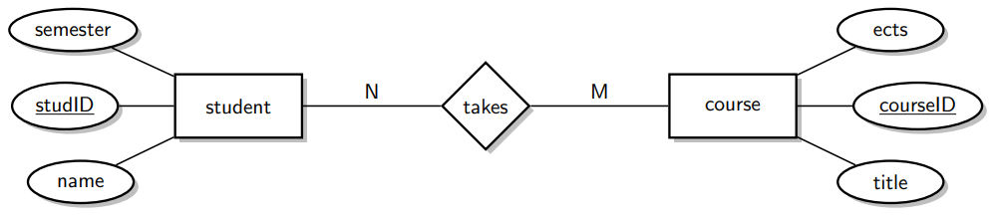
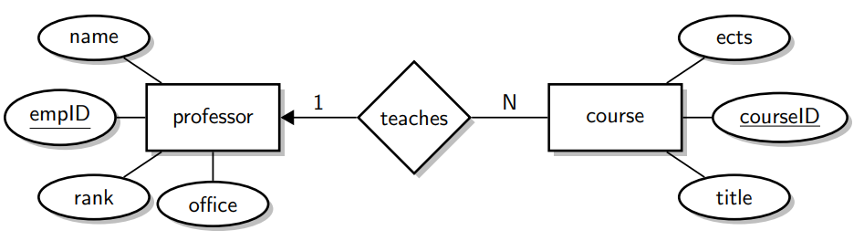
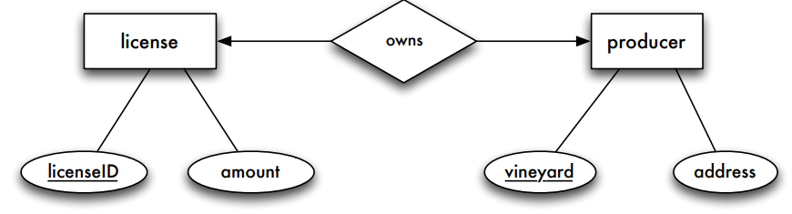
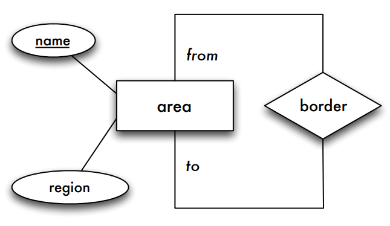
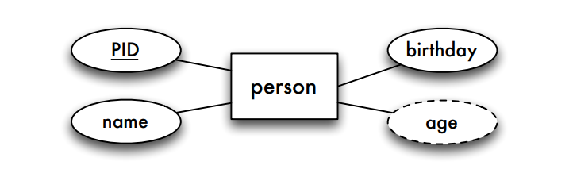
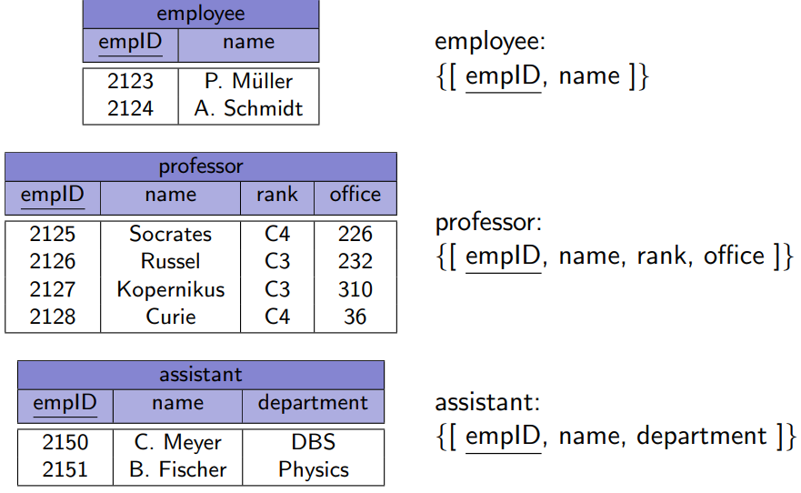
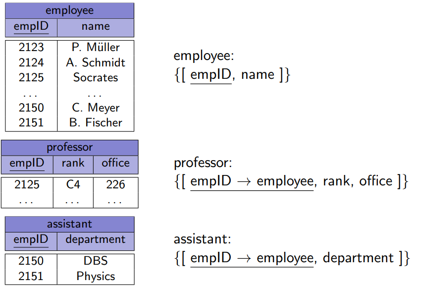

# Mapping ER to Relations

$$
\newcommand{\relationRaw}[3]{
	\newcommand{\pk}{\underline}
	#3\mathbf{#1}#3#3:\{[\mathrm{#2}]\}
}
\newcommand{\relation}[2]{\relationRaw{#1}{#2}{}}
\newcommand{\relational}[2]{\relationRaw{#1}{#2}{&}}
\nonumber
$$

- Entities correspond to nouns, relationships to verbs
- Each statement in the requirement specification should be reflected somewhere in the ER schema
- Each ER diagram (ERD) should be located somewhere in the requirement specification
- Conceptual design often reveals inconsistencies and ambiguities in the requirement specification, which must first be resolved.

## Overview of the steps

1. Regular entity type
    * Create a relation, consider special attribute types
2. Weak entity type
    * Create a relation

3. 1:1 binary relationship type 
    * Extend a relation with foreign key
4. 1:N binary relationship type 
    * Extend a relation with foreign key
5. N:M relationship type
    * Create a relation
6. N-ary relationship type
    * Create a relation

## Basic Approach

* For each entity type $\to$ relation
* Name of the entity type $\to$ name of the relation
* Attributes of the entity type $\to$ Attributes of the relation
* Primary key of the entity type $\to$ Primary key of the relation

We do not care about the order of attributes **in this context!**

## Mapping of N:M Relationship Types

**Basic Approach**

* New relation with all attributes of the relationship type
* Add the primary key attributes of all involved entity types
* Primary keys of involved entity types together become the key of the new relation

$$
\bold{takes}:\{[\underline{\text{studID} \to \text{student}}, \underline{\text{courseID} \to \text{course}}]\}
$$

Key attributes "imported" from involved entity types (relations) are called **foreign keys**

## Mapping of 1:N Relationship Types

**Basic Approach**

* New relation with all attributes of the relationship type
* Add the primary key attributes of all involved entity types
* Primary key of the "N"-side becomes the key in the new relation

**Initial**

$$
\begin{align*}
&\bold{course} &&:\{[\underline{\text{courseID}}, \text{title}, \text{ects}]\}\\
&\bold{professor} &&:\{[\underline{\text{empID}}, \text{name}, \text{rank},\text{office}]\}\\
&\bold{teaches} &&: \{[\underline{\text{courseID}\to \text{course}}, \text{empID} \to \text{professor}]\}
\end{align*}
$$

**Improved by Merging**
$$
\begin{align*}
&\bold{course} &&:\{[\underline{\text{courseID}}, \text{title}, \text{ects}, \color{darkred}{\text{taughtBy} \to \text{professor}}]\}\\
&\bold{professor} &&:\{[\underline{\text{empID}}, \text{name}, \text{rank},\text{office}]\}\\
\end{align*}
$$

Relations with the same key can be combined, **but  only these and no others!**

If the **participation** is **not total**, merging requires null values for the foreign key. In such cases, it might be preferable for some applications to have a separate relation.

## Mapping of 1:1 Relationship Types

* New relation with all attributes of the relationship type
* Add primary key attributes of all involved entity types
* Primary key of any of the involved entity types can become the key in the new relation

**Initial**

$$
\begin{align*}
\relational{license}{\underline{licenseID}, amount}\\
\relational{producer}{\underline{vineyard}, address}\\
\relational{owns}{\underline{licenseID \to license}, vineyard \to producer}\text{ or}\\
\relational{owns}{licenseID \to license, \underline{vineyard \to producer}}
\end{align*}
$$

**Improvement**

$$
\begin{align*}
\relational{license}{\underline{licenseID}, amount, ownedBy \to producer}\\
\relational{producer}{\pk{vineyard}, address}
\end{align*}
$$

**Or**

$$
\begin{align*}
\relational{license}{\underline{licenseID}, amount}\\
\relational{producer}{\pk{vineyard}, address, ownsLicense \to license}
\end{align*}
$$

It is best to extend a relation of an entity type with **total participation**

## Foreign Keys

### Foreign Keys

A **foreign key** is an attribute (or a combination of attributes) of a relation that references the primary key (or candidate key) of another relation

**Example**

* $\relation{course}{\pk{courseID}, title, ects, \color{darkred}{taughtBy \to professor}}$
* $\relation{professor}{\pk{empID}, name, rank, office}$

Here $\mathrm{taughtBy}$ is a foreign key referencing relation professor

**Alternative Notation**

* $\relation{course}{\pk{courseID}, title, ects, \color{darkred}{taughtBy}}$
* $\relation{professor}{\pk{empID}, name, rank, office}$

Foreign key: $\mathrm{course.taughtBy \to professor.empID}$

Notation for composite keys: $\{R.A_1, R.A_2\} \to \{S.B_1, S.B_2\}$

## Weak Entity Types

Entities of a weak entity type are

* existentially dependent on a strong entity type
* uniquely identifiable in combination with the strong entity type's key

Mapping:

* New relation with all attributes of the relationship type
* Add primary key attributes of all involved entity types
* Foreign key of the "N"-side becomes the key in the new relation

**Initially**

* $\relation{wine}{color,\pk{name}}$
* $\relation{vintage}{\pk{name\to wine, year}, residualSweetness}$
* $\relation{belongsTo}{\pk{name \to wine, year \to vintage}}$

**Merged**

Weak entity types and their identifying relationship types can **always** be merged

* $\relation{wine}{color,\pk{name}}$
* $\relation{vintage}{\pk{name\to wine, year}, residualSweetness}$

More complex example in [DBS3 slides p 157](https://www.moodle.aau.dk/pluginfile.php/1976337/mod_resource/content/0/DBS-ER-CSJ-2.pdf#page=157)

## Recursive Relationship Types

Mapping just like standard N:M relationship types and renaming of foreign keys

* $\relation{area}{\pk{name}, region}$
* $\relation{border}{\pk{from\to area, to \to area}}$

## Recursive Functional Relationship Types

Mapping just like standard 1:N relationship types and merging

* $\relation{critic}{\pk{name}, organization, mentor \to critic}$

## N-ary Relationship Types

**Entity Types**

* All participating entity types are mapped according to the standard rules
* $\relation{critic}{\pk{name}, organization}$
* $\relation{dish}{\pk{description}, sideOrder}$
* $\relation{wine}{color, \pk{WName}, year, residualSweetness}$

**N-ary Relationship Types (N:M:P)**

* $\relation{recommends}{\pk{WName \to wine, description \to dish, name \to critic}}$

## N:M:1 Relationship Type

**Relations**

* $\relation{student}{\pk{studID}, name, semester}$
* $\relation{course}{\pk{courseID}, title, ects}$
* $\relation{professor}{\pk{empID}, name, rank, office}$
* $\relation{grades}{\pk{studID\to student, courseID\to course},empID \to professor, grade}$

A student + course only exists once in this relation, since the professor is the (1). Therefore, the professor is not part of the primary key.

## Multi-Valued Attributes

**Relations**

* $\relation{person}{\pk{PID}, name}$
* $\relation{phoneNumber}{\pk{PID \to person, number}}$

## Composite Attributes

Include the component attributes in the relation

* $\relation{person}{\pk{PID}, name, street, city}$

## Derived Attributes

Ignored during mapping to relations, can be added later by using views

## Relational Modeling of Generalization

### Alternative 1 - Main Classes

A particular entity is mapped to **a single tuple** in a single relation (to its main class)

* $\relation{eployee}{\pk{empID}, name}$
* $\relation{professor}{\pk{empID}, name, rank, office}$
* $\relation{assistant}{\pk{empID}, name, department}$

### Alternative 2 - Partitioning

**Parts of** a particular entity are mapped to multiple relations, the key is duplicated

* $\relation{eployee}{\pk{empID}, name}$
* $\relation{professor}{\pk{empID \to employee}, rank, office}$
* $\relation{assistant}{\pk{empID\to employee}, department}$

### Alternative 3 - Full Redundancy

A particular entity is stored **redundantly** in the relations with all its inherited attributes

* $\relation{eployee}{\pk{empID}, name}$
* $\relation{professor}{\pk{empID}, name, rank, office}$
* $\relation{assistant}{\pk{empID}, name, department}$

### Alternative 4 - Single Relation

All entities are stored in **a single relation**. An additional attribute encodes the membership in a particular entity type.

* $\relation{employee}{\pk{empID}, name, {\color{darkred}{type}}, rank, office, department}$

