# Introduction

> A distributed system is one in which the failure of a computer you didn’t even know existed can render your own computer unusable.
>
> \- Leslie Lamport

What is a distributed system?

* A **distributed system** is one where hardware and software components in/on **networked computers** communicate and coordinate their activity only by **passing messages**.

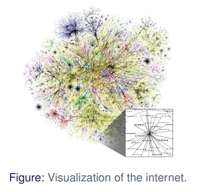

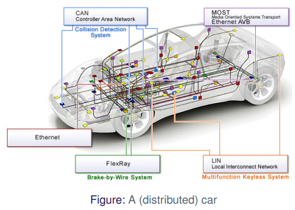

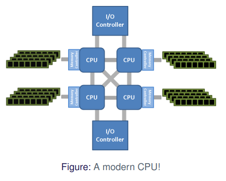

## Consequences

* **Concurrency**
    * Deadlocks and livelocks
    * Non-determinism

* **No shared state**
    * Pass messages to synchronize
    * May not agree on time
* **Everything can fail**
    * Devices
    * Network
        *  Security!
        * Man-in-the-middle
        * Byzantine Failures
    * Integrity of data

### Non-determinism

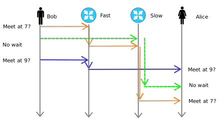

**Figure: ** Properties of the network can lead to confusion for Alice

###  Pass messages to synchronize

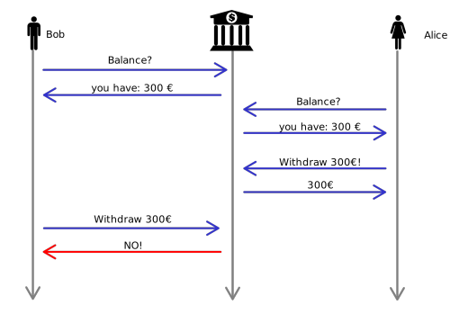

**Figure**: Lack of shared state can lead to unexpected behavior from the perspective of Bob.

### May not agree on time

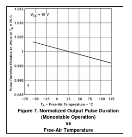

**Figure**: Measuring time is hard.(Texas Instruments xx555PrecisionTimers)

### Network failure

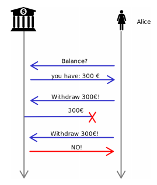

**Figure**: Failure of the network can lead to unexpected behavior from the perspective of Alice.

## Reasons for Distribution

* **Domain**
    * Physical limits
    * Logical limits
* **Redundancy**
    * Available
    * Robust
* **Performance**
    * Economics
    * Scalability

### Domain

* The internet
* Wireless Mesh networks
* Industrial systems
* Ledgers (BitCoin, Ether)

### Redundancy

* 99.9% uptime
* Backup
* Database
* Banking

#### Independent Failure

**Dependent**

* One fail = system fail
* $uptime = (1-p)^n$

**Independent**

* All fail = system fail
* $uptime = 1-p^n$

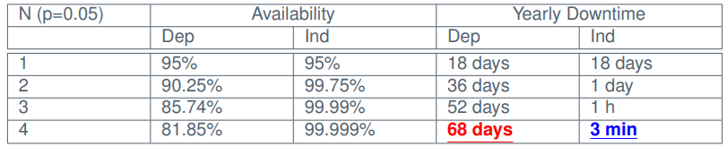

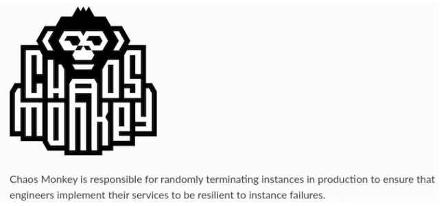

**Figure**: A Netflix approach to fault tolerance.

### Performance

* Video streaming
* Cloud computing
* Supercomputers
    * Weather forecast
    * Machine learning
* Many inexpensive vs few expensive and specialized

#### Amdahl's Law

$$
speedup = \frac {1} {1-p + \frac {p} {n}}
$$

* $p$ = fraction of parallel work
* $n$ = number of processors

**Minimize sequential part**

##### Example - F-Klub Accounting

* Each person does accounting for a month
* After all months are computed
    * Compute sum of year (1 person)
* 1 hour per sum computed

**1 Person**

* $1+12=13 \text{ Hours}$ 

**12 Person**

* $1+1=2 \text{ Hours}$ 

**Speedup**

* ${13 \over 2} = 6.5 \times Speedup$

##### Speeding up is hard

* Communication Overhead
* Locking and synchronization

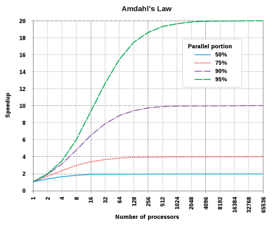

#### Scalability Examples

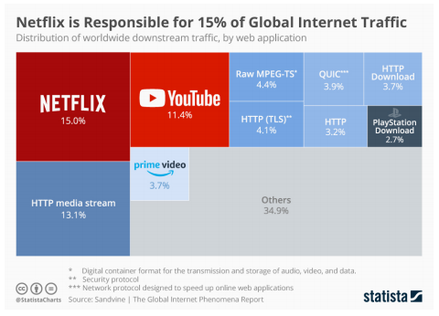

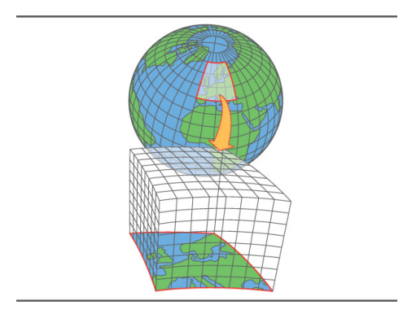

