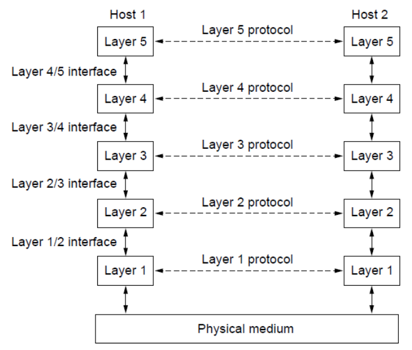
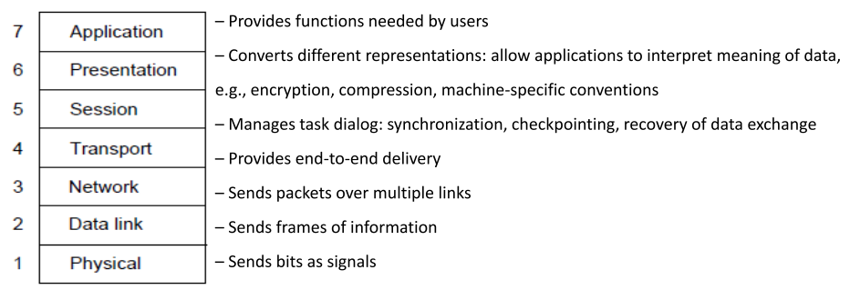
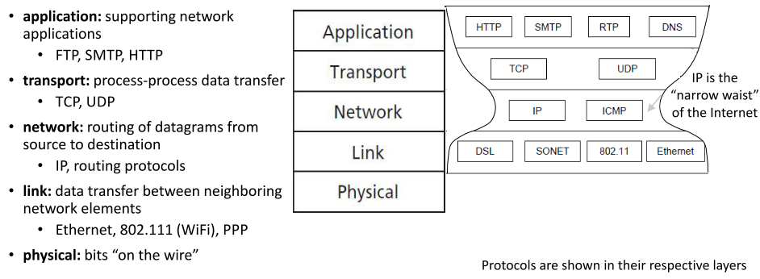
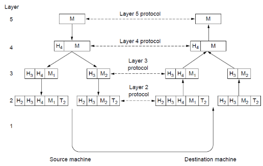
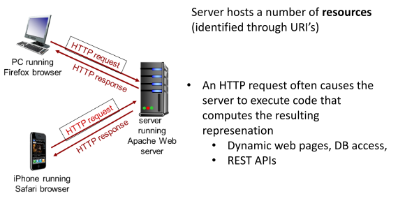
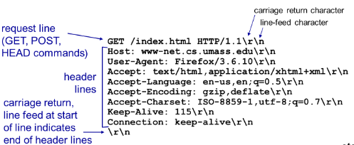
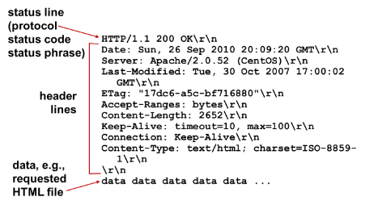
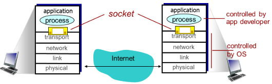
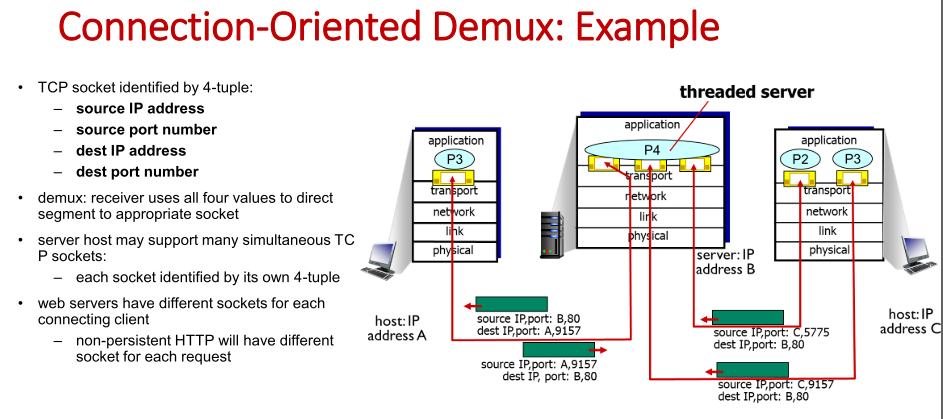

# OS and Networking Fundamentals

## Processes

A **process** is a running program (an instance of a program).

* One of the most profound ideas in computer science
* Not the same as “program” or “processor”

### Running Processes

> Proces = A running program = A private ”address space”+ one or more ”execution threads”.

* Ordinary user program

## Internet

### Internet Protocol Stack

Protocol Layers

* Protocol layering is the main structuring method used to divide up network functionality.
* Make abstractions that hide specific complexities/problems of the underlying system
* A protocol is a set of rules that describe how messages are exchanged and formatted
    * Each protocol instance talks virtually to its **peer**
    * Each layer communicates only by using the one below
    * Lower layer **services** are accessed by an **interface**
    * At bottom, messages are carried by the medium

### Why Layering?

* To deal with complex systems
* Explicit structure allows identification, relationship of complex system's pieces
    * Layered reference model for discussion
* Modularization eases maintenance, updating of system
    * change of implementation of layer’s service transparent to rest of system
    * IPv4 to IPv6 change does not affect hardware layer

### OSI Reference Model

A principled, international standard, seven layer model to connect different systems

CN5E by Tanenbaum & Wetherall, © Pearson EducationPrentice Hall and D. Wetherall, 2011

### TCP/IP Reference Model

What we are using today (?)

A four layer model derived from experimentation; omits some OSI layers and uses the IP as the network layer

### Critique of OSI & TCP/IP

OSI

* (+) Very influential model with clear concepts
* (-) Models, protocols and adoption all bogged down by politics and complexity

TCP/IP

* (+) Very successful protocols that worked well and thrived
* (-) Weak model derived after the fact from protocols

### Encapsulation

* Control flow goes down the protocol layers at the sender, and up at the receiver
* Header-payload model
* Each lower layer adds its own **header** (with control information) to the message to transmit and removes it on receive
    * “Enveloping”
* Layers may also split and join messages, etc: Segmentation and re-assembly

### An Application Layer Protocol - HTTP

**HTTP**: hypertext transfer protocol

* Web’s application layer protocol
* client/server model
    * **client:** browser that requests, receives, (using HTTP protocol) and "displays" Web objects
    * **server:** Web server sends (using HTTP protocol) objects in response to requests
* client initiates TCP connection (creates socket) to server, port 80

#### HTTP Messages

**Client Message**

**Server Response**

#### Non-Persistent HTTP: Response Time

Slide pdf 57

### Transport Layer Protocols

* provide logical communication between **app processes** running on different hosts
* transport protocols run in end systems
    * send side: breaks app messages into segments, passes to network layer
    * rcv side: reassembles segments into messages, passes to app layer
* more than one transport protocol available to apps
    * Internet: TCP and UDP

**Transmission control protocol (TCP)**

* Connection Oriented
* Reliable*), in-order delivery, byte-stream
    * congestion control: throttle sender when network overloaded
    * flow control: sender won’t overwhelm receiver
    * connection setup

(Reliable=if neither sender nor receiver fails during transmissions, and if network failures doesn’t persist (too long), data is eventually delivered!)

**User datagram Protocol (UDP)**

* Connectionless, unreliable,
    * no-frills extension of “best-effort” IP
    * Message-loss
    * Messages delivered out-of-order
* Streaming multimedia apps (loss tolerant, rate sensitive), DN S, SNMP

services not available:

* delay guarantees

#### Sockets

* The main API for programming network applications
* process sends/receives messages to/from its socket
* socket analogous to door
    * sending process shoves message out door
    * sending process relies on transport infrastructure on other side of door to deliver message to socket at receiving process

