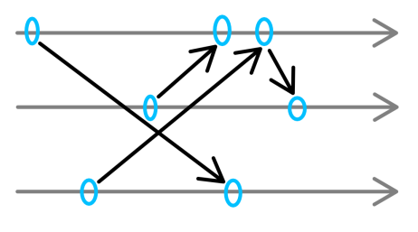
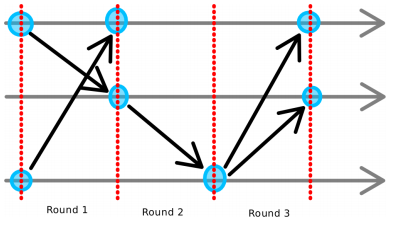
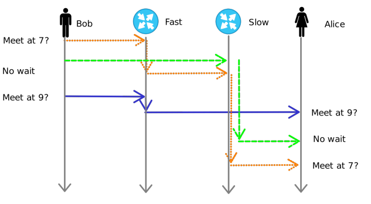
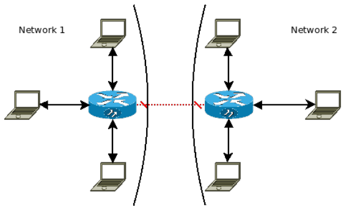
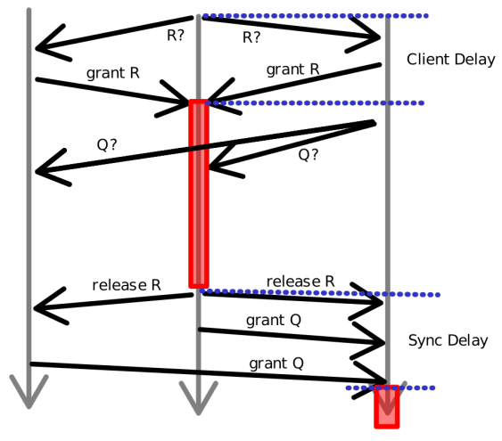
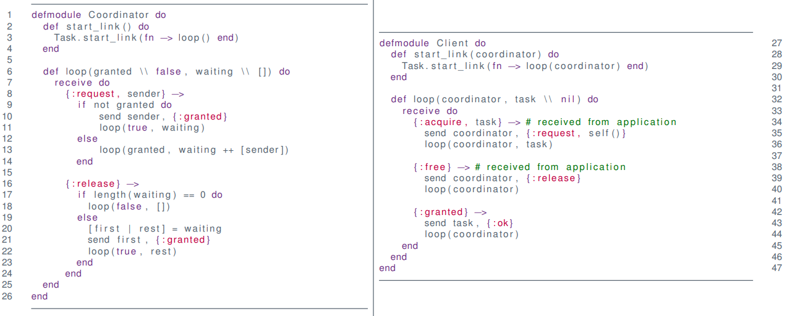
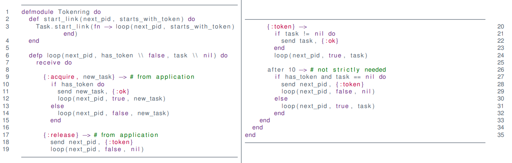

# Mutual Exclusion (Mutex)

**Mutual exclusion** algorithms ensures that **one and only one** process can access a shared resource at any given time.

**Examples**

* Printing
* Using Coffee Machine
* Writing a file
* Changing an actuator
    * Arm of robot
* Wireless communication
* Wired communication


## System Model

What is a (computer science) process?

A process $p=(S,s_i, M, \to)$ in a set of processes $p\in P$ has

* a set of states $S$
* an initial state $s_i\in S$
* a set of messages $M$
    * including the empty message $\epsilon \in M$
* and a transition function $\to \subseteq S \times M \mapsto S \times 2^{P\times M}$


### Example

```erlang
defmodule Pinger do
  def start_link() do
    Task.start_link(fn -> loop() end)
  end
    
  defp loop(output_ping \\ false) do
  	recieve do
      {:ping} ->
      	if output_ping do
      	  IO.puts("ping")
        else
          IO.puts("pong")
        end
        loop(!output_ping)
    end
  end
end
```

* $S=\{loop(output\_ping = true), loop(output\_ping = false)\}$
* $s_i=\{(output\_ping = false\}$
* $M=\{:ping\}$
* $\to\ = recieve$


### Events

* Computation is fast
* Communication is slow


**Measure of Performance**

Time is counted in number of messages/events


### Network Models

**Asynchronous**

* Arbitrary delays
* Unknown processing time



**Synchronous**

* Known delays
    * or hard limits of them
* Known drift




Figure: Properties of the network can lead to confusion for Alice




### Assumptions

* Processes have **Crash Failures**
    * Stays dead
* Direct Communication
    * Transparent routing
    * No forwarding
* Reliable Communication
    * Synchronous
        * Delivery within fixed timeframe
    * Asynchronous
        * Delivery at at some point
        * Underlying protocol handles re-transmission etc.
    * Partitions are fixed eventually




## Mutex Algorithms

### **Requirements**

1. Safety
    * at most one is given access
2. Liveness
    * Requests for access are (eventually) granted
3. Ordering/Fairness
    * A request $A$ **happened-before** request $B$
        $\Rightarrow$ grant $A$ before $B$


### Properties

* Fault tolerance
    * What happens when a process crashes?
* Performance
    * Message Complexity
        * How many messages to get mutex?
        * How many to release? 
    *  Client Delay
        * Time from a request $R$ to a grant of $R$
    * Synchronization Delay
        * Time from a release of $R$ to a grant of the next request $Q$




### Centralized Algorithm

* Assume one external coordinator
    * Coordinator has ordered queue
* Ask coordinator for access


#### Code




#### Properties

**Requirements**

* Safe: Yes
* Liveness: Yes
* Ordering: No!

**Properties**

* Client Delay
    * Entry: 2 (request + grant)
    * Exit: 1
* Synchronization Delay
    * 2 (release + grant)
* Bandwidth: 3

**Fault Tolerance**

* Deadlock if Coordinator fails 
* Deadlock if mutex-holder fails


### Token Ring Algorithm

**Idea**

* Send token around in a ring
    * Assumes ordering of processes
* Forward token to "next" if not using mutex
* Enter mutex if token is acquired


#### Code



#### Properties

**Requirements** 

* Safe: Yes
* Liveness: Yes
* Ordering: No (order by ring)

**Properties**

* Client Delay
    * Entry: $n/2$ avg, $n − 1$ worst case
    * Exit: 1
* Synchronization Delay
    * $n/2$ avg, $n-1$ worst case
* Bandwidth: $\infty$

**Fault Tolerance**

* Deadlock if any process fail
* Can be recovered if crash can be detected reliably
* 

