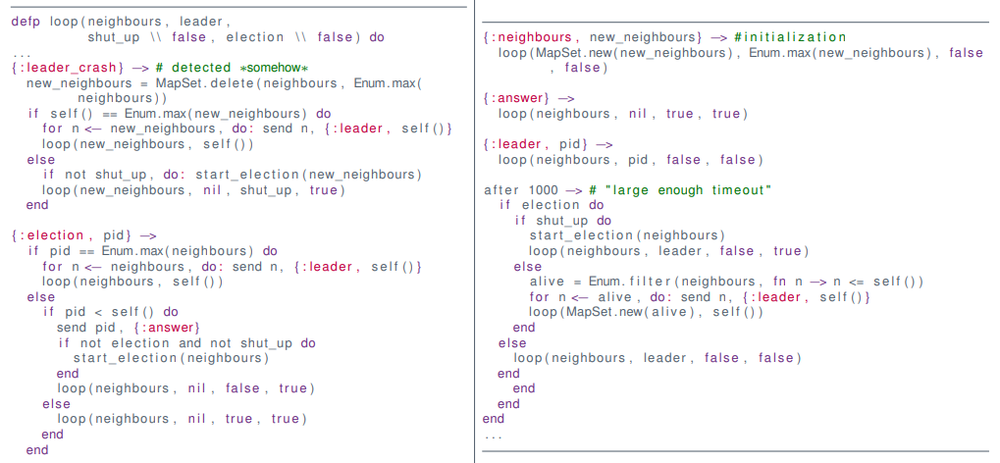

# Mutual Exclusion (Mutex) and Election

**Mutual exclusion** algorithms ensures that **one and only one** process can access a shared resource at any given time.

**Examples**

* Printing
* Using Coffee Machine
* Writing a file
* Changing an actuator
    * Arm of robot
* Wireless communication
* Wired communication


## System Model

What is a (computer science) process?

A process $p=(S,s_i, M, \to)$ in a set of processes $p\in P$ has

* a set of states $S$
* an initial state $s_i\in S$
* a set of messages $M$
    * including the empty message $\epsilon \in M$
* and a transition function $\to \subseteq S \times M \mapsto S \times 2^{P\times M}$


### Example

```elixir
defmodule Pinger do
  def start_link() do
    Task.start_link(fn -> loop() end)
  end
    
  defp loop(output_ping \\ false) do
  	recieve do
      {:ping} ->
      	if output_ping do
      	  IO.puts("ping")
        else
          IO.puts("pong")
        end
        loop(!output_ping)
    end
  end
end
```

* $S=\{loop(output\_ping = true), loop(output\_ping = false)\}$
* $s_i=\{(output\_ping = false\}$
* $M=\{:ping\}$
* $\to\ = recieve$


### Events

* Computation is fast
* Communication is slow


**Measure of Performance**

Time is counted in number of messages/events


### Network Models

**Asynchronous**

* Arbitrary delays
* Unknown processing time


**Synchronous**

* Known delays
    * or hard limits of them
* Known drift


**Figure**: Properties of the network can lead to confusion for Alice

### Assumptions

* Processe have **Crash Failures**
    * Stays dead
* Direct Communication
    * Transparent routing
    * No forwarding
* Reliable Communication
    * Synchronous
        * Delivery within fixed timeframe
    * Asynchronous
        * Delivery at at some point
        * Underlying protocol handles re-transmission etc.
    * Partitions are fixed eventually


## Mutex Algorithms

### **Requirements**

1. **Safety**
    * at most one is given access
2. **Liveness**
    * Requests for access are (eventually) granted
3. **Ordering/Fairness**
    * A request $A$ **happened-before** request $B$
        $\Rightarrow$ grant $A$ before $B$


### Properties

* Fault tolerance
    * What happens when a process crashes?
* Performance
    * Message Complexity
        * How many messages to get mutex?
        * How many to release? 
    *  Client Delay
        * Time from a request $R$ to a grant of $R$
    * Synchronization Delay
        * Time from a release of $R$ to a grant of the next request $Q$


### Centralized Algorithm

* Assume one external coordinator
    * Coordinator has ordered queue
* Ask coordinator for access


#### Code


#### Properties

**Requirements**

* Safe: Yes
* Liveness: Yes
* Ordering: No!

**Properties**

* Client Delay
    * Entry: 2 (request + grant)
    * Exit: 1
* Synchronization Delay
    * 2 (release + grant)
* Bandwidth: 3

**Fault Tolerance**

* Deadlock if Coordinator fails 
* Deadlock if mutex-holder fails


### Token Ring Algorithm

**Idea**

* Send token around in a ring
    * Assumes ordering of processes
* Forward token to "next" if not using mutex
* Enter mutex if token is acquired


#### Code


#### Properties

**Requirements** 

* Safe: Yes
* Liveness: Yes
* Ordering: No (order by ring)

**Properties**

* Client Delay
    * Entry: $n/2$ avg, $n − 1$ worst case
    * Exit: 1
* Synchronization Delay
    * $n/2$ avg, $n-1$ worst case
* Bandwidth: $\infty$

**Fault Tolerance**

* Deadlock if any process fail
* Can be recovered if crash can be detected reliably


### Ricard and Agrawala's Algorithm

**Idea**

* Order events!
    * Extension of shared priority queue (Lamport '78)
* Basic algorithm
    * Request all for access
    * Wait for all to grant

**Secret Ingredient**

* Lamport clocks


#### Lamport Clocks

* Counter number of messages/events
* Annotate messages with clock
* Increment local before send
* "Correct" local clock on receive, then increment
    * $\max(A,B)+1$


#### Protocol Pseudo Code

```pseudocode
On initialization
	state := RELEASED
	
To get mutex
	state := WANTED												# 
	Multicast request to every process		#	defer other request here
	T := request's timestamp							#
	wait until (len(replies received) = (N - 1))
	state := HELD
	
On request <T_i, p_i> at p_j (i != j)
	if (state = HELD or (state = WANTED and (T,p_j) < (T_i, p_i)))
	then
		queue request from p_i without reply
  else
  	reply immediately to p_i
  end if
  
To exit mutex
	state := RELEASED
	reply to any queued requests
```


#### Elixir Code


#### Properties

**Requirements**

* Safe: Yes
* Liveness: Yes
* Ordering: Yes

**Properties**

* Client delay:
    * Entry: 1 (multicast) + 1
    * Exit: 1 (multicast) + 1
* Synchronization delay
    * 1
* Bandwidth: $2(n-1)$ if no hardware multicast

**Fault Tolerance**

* Deadlock if any process fails


### Maekawas Algorithm

**Idea**

* only communicate with a subset (Voting Set $V$)
* pick $V$ cleverly
* Basic algorithm
    * Ask everybody in $V$ for access
    * Wait for all to grant


* Voting set of $p_{14}= \{p_2, p_8, p_{13}, p_{14}, p_{15}, p_{16}, p_{17}, p_{18}, p_{20}, p_{26}, p_{32}\}$

* Voting set of $p_{29} = \{p_5, p_{11}, p_{17}, p_{23}, p_{25}, p_{26}, p_{27}, p_{28}, p_{29}, p_{30}, p_{35}\}$

Notice

* Non-trivial to compute optimal sets


#### Voting Set

Let $P=\{p_0, \dots, p_n\}$ be a set of processes, then $V_i \subseteq P$ is a voting set for $p_i \in P$ if

* any $p_i \in P$ has a $V_i$, and
    * $p_i \in V_i$,
        * **Every process has a voting set and is member of its own voting set**
* for all $i,j$ we have $V_i \cap V_j \neq \empty$
    * **At least one shared process between two voting sets**
* for any $i$ we have $|V_i| = K$,
    * **All voting sets have the same size**
* for any $i$ we have $|\{V_k \mid p_i \in V_k\}| = M$
    * **All processes are members of the same number of voting sets**
* $M=K$ and $K \geq \sqrt{n-1}$


#### Code


#### Problem

* **Deadlock** can happen with three processes!
* Can be solved by using **Lamport Clocks**


#### Properties

**Requirements**

* Safe: Yes
* Liveness: Yes
* Ordering: Yes

**Properties**

* Client delay
    * Entry: 2 (multicast)
    * Exit: 1 (multicast)
* Synchronization delay
    * 2, *any two voting sets overlap*
* Bandwidth: $3 \sqrt n$ if no hardware multicast

**Fault tolerance**

* Deadlock in voting-set if process crashes


### Overview

| Algorithm  | Messages Entry/Exit | Sync Delay  | Problems                            |
| ---------- | ------------------- | ----------- | ----------------------------------- |
| Central    | $3$                 | $2$         | Coord. Crash, Client Crash w. mutex |
| Token ring | $1...\infty$        | avg $n / 2$ | Lost token, Crash of process        |
| R & A      | $2(n-1)$            | $1$         | Crash of any process                |
| Maekava    | $3 \sqrt n$         | $2$         | Crash in voting-set = deadlock      |


### Summary

* Crashes are bad
* Mitigation is non-trivial
* Detection is hard too


## Heartbeat

**For synchronized systems**

* Assume transmission delay $D$
* Send "beat" every $T$ seconds
* Declared dead if not observed in last $T+D$ seconds

**For asynchronized systems**

* Guess a $D$
* Send "beat" every $T$ seconds
* Declared dead if not observed in last $T+D$ seconds
    * $D$ too small $\Longrightarrow$ Inaccurate
        * alive reported dead
    * $D$ too large $\Longrightarrow$ Incomplete
        * dead reported alive (zombies!)
* We can only suspect a crash!


## Leader Election

**Leader election** algorithms ensure that one, and **only one** process is elected as the **leader** in the event of **lack of a leader**.

### Examples

* Algorithms with coordinator
    * Mutex?
* Distributed replication
* DNS-servers in case of network partition
* Failover mechanism for crashes
*  Parliaments?


### Requirements

Let $P=\{p_1, \dots, p_n\}$ be a set of processes and let $L(p_i) \in P \cup \{\bot\}$ be the leader as seen from a process $p_i$

1. Safety
    * either $L(p_i) = \bot$ or $L(p_i) = p_j$
        * $p_j$ is largest non-crashed process (in terms of $j$)
2. Liveness
    * All process participate, and either
        * a process crashes, or
        * $L(p_i) \neq \bot$

**Note**

Processes can crash during the election


### Assumptions

* Processes stay dead
* Crashes are reliably detected
* Identifiers are unique


### Chang Roberts

#### Idea

* Pass token of largest ID in a ring
* Basic algorithm in election
    * Forward ID to "next" if higher than own
    * Forward own ID to "next" otherwise
    * Only one active election


#### Code


#### Properties

* Safe
* Live
* $3N -1$ messages per election

**Crashes?**

* Can be overcome if reliably detected


### Bully Algorithm

#### Idea

* Bully election requests into silence
* Priority by ID
* Basic algorithm in election
    * Send "shut up" to lower ID's
    * Request election requests to higher ID's
    * Highest alive ID broadcasts itself

**Note**

* Depends on Synchronous Behavior! 


#### Code




#### Properties

* Safe and Live, assuming
    * Unique ID's
    * Failure detection is reliable
* Best-case: $N-2$ messages per election
* Worst-case: $O(N^2)$ messages
* Election-time: 2 rounds
    * assuming hardware multicast


#### Beware

Safety is broken if

* too tight deadline,
* process ID's reappear, or
* system is not synchronous

I.e. does not work in Elixir: Requires

* synchronous system**, and
* **ordering of messages**


