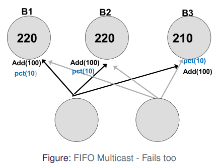

# Multicast

A **multicast** is **one-to-many** communication between a single process and a specific **group** of processes such that **all members** of the group receive the message

**Examples**

* Algorithms with failover/replication/redundancy 
    * DNS 
    * Databases
    * Caches
    * Banks! 
* One-to-many
    * Streaming of TV/Radio
    * Industrial Systems
* Many-to-many
    * Skype
    * Teams
    * . . .

**Big Question:**

How do we guarantee that everyone gets the same information? And what do we mean by **same**?

**Assumptions**

* We assume closed groups
    * No communication from and to outside the group
* We assume static groups
    * Nobody is joining group in the middle of transmission
* Not discussing multiple groups
    * Problems if groups overlaps / shared members

## IP Multicast

* Use IGMP (Internet Group Management Protocol)
* Get IP of group
    * IPv4: 224.0.0.0 - 239.255.255.255 (-224.0.0.255 for permanent)
    * IPv6: FF00::/8
* Build on UDP over IP
* Careful of firewalls/NAT

### Hardware Support

Without hardware we have to send 3 messages

With hardware the router takes care of the message sending

#### With Hardware Support Example

#### Without Hardware Support Example

### Problems

UDP has no guarantees

* No re-transmission
    * no reception guaranteed
    * one attempt only
* No ordering
    * Messages are delivered in arbitrary order

UDP can drop packages:

### Requirements

Assuming

* Reliable 1:1 communication
* Sender might crash
    * If it crashes it stays dead
* No order
    * Would work fine in asynchronous setting

Guarantee

* If a message is sent, it is **delivered** exactly once
* Messages are eventually **delivered** to non-crashed processes

### Delivery

### Basic Multicast

`:send`

* iterate through the group and send them the message

`:message`

* sends the message to the application

Sender can fail while sending messages to group

* If it crashes midway, some processes will not receive the message while others do

Reliable send => ACK implosion

* If a lot of processes send back acknowledgment, I "DDOS" myself

### Reliable Multicast

Satisfy these 3 properties

* Integrity
    * No "identity theft"
    * implicit here
* Validity
    * A process delivers to itself (or it crashes)
* Agreement
    * All deliver or none deliver

`b_multicast` is the basic multipart algorithm from above

Everyone broadcasts the message in the "2nd round", but does not re-transmit if it comes from itself (26)

Integrity: Yes!

Validity: Yes!

Agreement: Yes!

1 multicast = $O(N^2)$ packages in the network

### UDP Fix: Steal ideas from TCP

* Use sequence numbers
    * to detect duplicates
    * to track lost messages
* Use "hold-back"-construction
    * wait for re-transmission
    * replication of messages
* Keep track of sequence numbers of others
* "gossip" sequence numbers
    * whenever a process sends a message
    * every process knows how many messages the other processes has sent

### Hold--back Queue

The delivery queue is handled by Elixir in the code

### Reliable Multicast

Integrity: Yes (IP also does checksum)

Validity: Yes

Agreement: ... eventually

Two problems (exercise)

No drops, good ordering = $O(N)$ messages!

### Ordered Multicast

FIFO Ordered

* Messages from $p_n$ are received at $p_k$ in order send by $p_n$
    * Like speaking

Total ordered

* All messages are received in same order at $p_n$ and $p_k$

Casually Ordered

* if $p_n$ receives $m1$ before $m2$, then $m1$ **happened before** $m2$

#### Examples

Imagine a bank.

Can lead to wrong states

Use FIFO to fix this problem

If we introduce another process, it can fail again

Introduces total order

Total order can also go wrong

<u>Reliable IP-Multicast is FIFO</u>

### Totally Ordered Multicast

Idea

* do as FIFO but only one sequence number
* each message has a unique id/hash
* agree globally on "next" message
    1. use global sequencer or
    2. use negotiation (ISIS)

#### Sequencer

* Sequencer is bottlenek
* Single point of failure

* Package loss = deadlock of process
* Solution: reliable underlying multicast

#### ISIS

Idea: Negotiate next ID

1. Process $p$ broadcasts message $m$
2. Every other process $q$ responds to $p$ with proposal
3. $p$ picks largest proposed value, broadcasts

The trick: 

* Track "largest proposed value" and "largest agreed value" at each process

Good:

* Reliable crash-detection = robust
    * Sequence nubmers are monotonically increasing
    * Nobody will deliver "early"

Bad

* every broadcast requires negotiation (3 rounds)
    * sequencer has 2 rounds

### Casually Ordered Multicast

Idea

* order events by **happened-before** relationship
* use "vectored and quircky" lamport-clocks (Vector Clocks)
* track only "send" as an event

#### Vector Clocks

Not-quite-Lamport clocks, and they are vectors

* keep track of "last known time" of other processes
* "gossip" about "last known time" during communication

!!! todo
    finish notes [pdf page 47-](https://www.moodle.aau.dk/pluginfile.php/2129891/mod_resource/content/1/04.1-Multicast.pdf#page=47)

