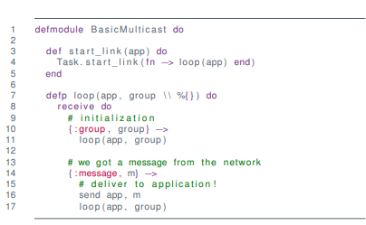
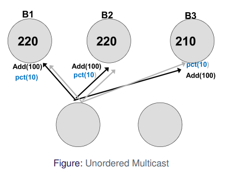
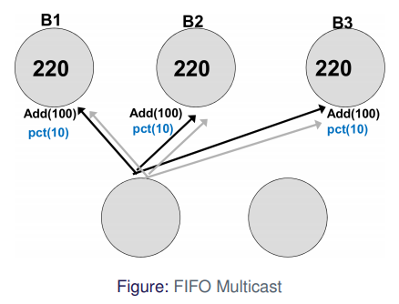
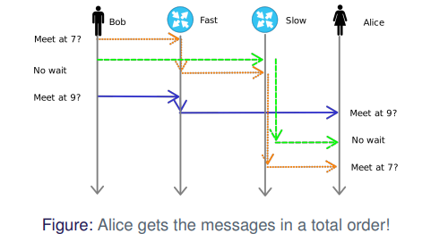

# Multicast

A **multicast** is **one-to-many** communication between a single process and a specific **group** of processes such that **all members** of the group receive the message


**Examples**

* Algorithms with failover/replication/redundancy 
    * DNS 
    * Databases
    * Caches
    * Banks! 
* One-to-many
    * Streaming of TV/Radio
    * Industrial Systems
* Many-to-many
    * Skype
    * Teams
    * . . .


**Big Question:**

How do we guarantee that everyone gets the same information?

And what do we mean by **same**?


**Assumptions**

* We assume closed groups
    * No communication from and to outside the group
* We assume static groups
    * Nobody is joining group in the middle of transmission
* Not discussing multiple groups
    * Problems if groups overlaps / shared members


## IP Multicast

* Use IGMP (Internet Group Management Protocol)
* Get IP of group
    * IPv4: 224.0.0.0 - 239.255.255.255 (-224.0.0.255 for permanent)
    * IPv6: FF00::/8
* Build on UDP over IP
* Careful of firewalls/NAT


### Hardware Support

Without hardware we have to send 3 messages

With hardware the router takes care of the message sending


#### With Hardware Support Example


#### Without Hardware Support Example


### Problems

UDP has no guarantees

* No re-transmission
    * no reception guaranteed
    * one attempt only
* No ordering
    * Messages are delivered in arbitrary order


UDP can drop packages:


### Requirements

**Assuming**

* Reliable 1:1 communication
* Sender might crash
    * If it crashes it stays dead
* No order
    * Would work fine in asynchronous setting


**Guarantee**

* If a message is sent, it is **delivered** exactly once
* Messages are eventually **delivered** to non-crashed processes


### Delivery


### Basic Multicast





`:send`

* iterate through the group and send them the message

`:message`

* sends the message to the application


Sender can fail while sending messages to group

* If it crashes midway, some processes will not receive the message while others do

Reliable send => ACK implosion

* If a lot of processes send back acknowledgment, I "DDOS" myself


### Reliable Multicast

Satisfy these 3 properties

* Integrity
    * No "identity theft"
    * implicit here
* Validity
    * A process delivers to itself (or it crashes)
* Agreement
    * All deliver or none deliver


`b_multicast` is the basic multipart algorithm from above

Everyone broadcasts the message in the "2nd round", but does not re-transmit if it comes from itself (26)


Integrity: Yes!

Validity: Yes!

Agreement: Yes!

1 multicast = $O(N^2)$ packages in the network


### UDP Fix: Steal ideas from TCP

* Use sequence numbers
    * to detect duplicates
    * to track lost messages
* Use "hold-back"-construction
    * wait for re-transmission
    * replication of messages
* Keep track of sequence numbers of others
* "gossip" sequence numbers
    * whenever a process sends a message
    * every process knows how many messages the other processes has sent


### Hold-back Queue


The delivery queue is handled by Elixir in the code

* Keep messages that have a higher sequence number than $R+1$ where $R$ is the latest message received
* It requests missing messages by sending negative acknowledgements

### Reliable Multicast over IP

[Slides from Brian Nielsen](http://people.cs.aau.dk/~bnielsen/DS-E08/material/mcast.pdf)

* Each process maintains sequence numbers
    * $S^p_g$ -- next message to be sent
    * $R^q_g$ (for all $q \in g$) -- latest message received from $q$ 
* On R-multicast of $m$ to group $g$
    * attach $S^p_g$ and all pairs $<q, R^q_g>$
* R-deliver in process $q$ happens iff $S_m = R^p_g +1$ 
    * if $S_m < R^p_g +1 $ -- process $q$ has seen the message before
    * if $S_m > R^p_g +1$ or if $R_m > R^p_g$ for some pair $<q, R_m>$ in message -- a message has been lost


Data structures at process $p$:

* $S_g^p$ -- sending sequence number
* $R^{q}_{g}$ -- sequence number of the latest message $p$ delivered from $q$ (for each $q$)

On initialization:

* $S_g^p = 0$
* $\bold R_g^q = -1$ for all $q \in g$

For process $p$ to R-multicast message $m$ to group $g$

* IP-multicast ($g$, $<m, S_g^p, <\bold R_g>>$)
* $S_g^p$++

On IP-deliver ($<m, S, <\bold R>>$) at $q$ from $p$

* save $m$
* if $S = R_g^p + 1$ then
    * R-deliver($m$)
    * $R_g^p$ ++
    * check hold-back queue
* else if $S > R_g^p + 1$ then
    * store $m$ in hold-back queue
    * request missing messages
    * endif
* endif
* if $\exists p.r_g^p \in \bold R$ and $r_g^p > R_g^p$ then request missing messages -- endif


#### Elixir Code

```elixir
defmodule IPReliableMulticast do
	...
	defp loop(app, group \\ [], hb_q \\ %{}, seq \\ 0, r_seq \\ %{}) do
		recieve do
			{:group, group} ->
				new_r_seq = for n <- group, do: { n, -1 }
				loop(app, group, hb_q, seq, Enum.into(new_r_seq, %{}))  # insert new_r_seq into %{}
      
      # we got a message from application
      {:send, m} ->
      	udp_multicast group, {:message, self(), m, seq, r_seq}
      	loop(app, group, hb_q, seq + 1, r_seq)
      	
      # we are asked to respond (negative ack)
      {:nack, num, pid, sender} ->
      	tcp_send sender, {:message, pid, hb_q[{pid, num}], num, r_seq} # get message from hold-back queue
      	
      # we got message from the network
      {:message, sender, m, s_seq, s_r_seq} ->
      	new_hb_q = Map.put(hb_q, {sender, s_seq}, m) # insert m into hold-back queue
      	new_r_seq = try_deliver(app, sender, new_hb_q, r_seq, m, s_seq)
      	send_nack(sender, new_r_seq, s_r_seq)
      	loop(app, group, new_hb_q, seq, new_r_seq)
      	
    defp try_deliver(app, sender, r_seq, hb_q, m, s_seq) do
    	if s_seq == r_seq[sender]+1 do # if the sequence number is one more than received
    		# next message from sender, tell app
    		send app, m
    		n_r_seq = Map.put(r_seq, sender, s_seq) # update received sequence number from sender
    		# check hold-back queue
    		if Map.has_key?(hb_q, {sender, s_seq + 1}) do
    			try_deliver(app, sender, n_r_seq, hb_q, hb_q[{sender, s_seq +1}], s_seq + 1)
        else
        	# done with hold-back
        	{hb_q, n_r_seq} # return
        end
      else
      	# handled elsewhere
      	{ rb_q, r_seq } # return
     	end
    end
    
    defp send_nack(sender, r_seq, other_r_seq) do
    	for {pid, seq} <- other_r_seq do
    		if r_seq[pid] < seq do
    			for m_id <- r_seq[pid]..seq do
    				send sender, {:nack, m_id, pid, self()}
    			end
    		end
    	end
    end
  end
end
```


Integrity: Yes (IP also does checksum)

Validity: Yes

Agreement: ... eventually

Two problems (exercise)

No drops, good ordering = $O(N)$ messages!


### Ordered Multicast

**FIFO Ordered**

* Messages from $p_n$ are received at $p_k$ in order send by $p_n$
    * Like speaking

**Total ordered**

* All messages are received in same order at $p_n$ and $p_k$

**Casually Ordered**

* if $p_n$ receives $m_1$ before $m_2$, then $m_1$ **happened before** $m_2$


#### Examples

Imagine a bank.

Can lead to wrong states



Use **FIFO** to fix this problem



If we introduce another process, it can fail again


Introduces **total order**


Total order can also go wrong




<u>Reliable IP-Multicast is FIFO</u>

* We respect sequence numbers of sender!


### Totally Ordered Multicast

Idea

* do as FIFO but only one sequence number
* each message has a unique id/hash
* agree globally on "next" message
    1. use global sequencer or
    2. use negotiation (ISIS)


#### Sequencer

```elixir
defmodule TOSEQMulticast do
  ...
    defp loop(app, group \\ %{}, hb_q \\ %{}, l_seq \\ 0, g_seq \\ -1, seq_map \\ %{}) do
      receive do
        # for setting our neighbours
        {:group, group} ->
          loop(app, group, hb_q, l_seq, g_seq, seq_map)
        
        # message from application
        {:send, m} ->
          # remember to make unique message ID!
          id = {self(), l_seq}
          b_multicast(group, {:message, m, id, self()})
          loop(app, group, hb_q, l_seq + 1, g_seq, seq_map)
          
        # got message from network
        {:message, m, id} ->
          n_hb_q = Map.put(hb_q, id, m) # put message in HB queue
          n_g_seq = try_deliver(app, group, n_hb_q, l_seq, n_g_seq, seq_map)
          loop(app, group, n_hb_q, l_seq, n_g_seq, seq_map)
        
        # order from sequencer
        {:order, id, order} ->
          n_seq_map = Map.put(seq_map, order, id) # update sequence map
          n_g_seq = try_deliver(app, group, hb_q, l_seq, n_g_seq, n_seq_map)
          loop(app, group, hb_q, l_seq, n_g_seq, n_seq_map)
          
      defp try_deliver(app, hb_q, g_seq, seq_map) do
        if seq_map[g_seq + 1] != nil and hb_q[seq_map[g_seq + 1]] != nil do
          send app, hb_q[seq_map[g_seq + 1]]
          try_deliver(app, hb_q, g_seq + 1, seq_map)
        else
          g_seq # return
        end
      end
    end
  end
end

defmodule Sequencer do
  ...
  defp loop(group \\ [], seq \\ 0) do
    receive do
      # for setting our neighbors
      {:group, group} -> 
        loop(group, seq)
      
      # got message from network
      {:message, _m, id} ->
        b_multicast(group, {:order, id, seq})
        loop(group, seq + 1)
    end
  end
end
```


Problems

* Sequencer is bottleneck
* Single point of failure

Bonus

* What breaks w. IP-multicast instead of B-multicast?

* Package loss = deadlock of process
* Solution: reliable underlying multicast


#### ISIS

Idea: Negotiate next ID

1. Process $p$ broadcasts message $m$
2. Every other process $q$ responds to $p$ with proposal
3. $p$ picks largest proposed value, broadcasts

The trick: 

* Track "largest proposed value" and "largest agreed value" at each process


Good:

* Reliable crash-detection = robust
    * Sequence numbers are monotonically increasing
    * Nobody will deliver "early"

Bad

* every broadcast requires negotiation (3 rounds)
    * sequencer has 2 rounds


### Casually Ordered Multicast

Idea

* order events by **happened-before** relationship
* use "vectored and quircky" lamport-clocks (Vector Clocks)
* track only "send" as an event


#### Vector Clocks


Not-quite-Lamport clocks, and they are vectors

* keep track of "last known time" of other processes
* "gossip" about "last known time" during communication


Let $V_i$ be the vector of process $p_i \in \{p_0, \dots, p_n\}$ then

* initially $V_i[j] = 0$ for all $j \in 0\dots n$,
* before event $V_i'[i] = V_i'[i] +1$,
* attach $V$ to any message sent,
* on receive of $V'$ we let $V''[j] = \max(V[j], V'[i])$ for $j \in 0 \dots n$


Given two vectors $V$ and $W$,

* $V=W$ if all values match
    * for all $j \in 0...n,\quad V[j] = W[j]$
* $V \leq W$ if all values in $V$ are less than or equal those in $W$,
    * for all $j \in 0...n,\quad V[j] \leq W[j]$
* $V \leq W$ if all values in $V$ are less than or equal to $W$ **and** $W \neq V$
    * $V \leq W$ and $V \neq W$

!!! example
    [Example in slides 36](https://www.moodle.aau.dk/pluginfile.php/2129891/mod_resource/content/1/04.1-Multicast.pdf#page=48)


#### Algorithm


**Notice**

* Casual order implies FIFO
* Casual order does **not** imply Total
* Good: No extra communication for order!
* Can be combined with total
* Reliable if using R-multicast instead of B-multicast