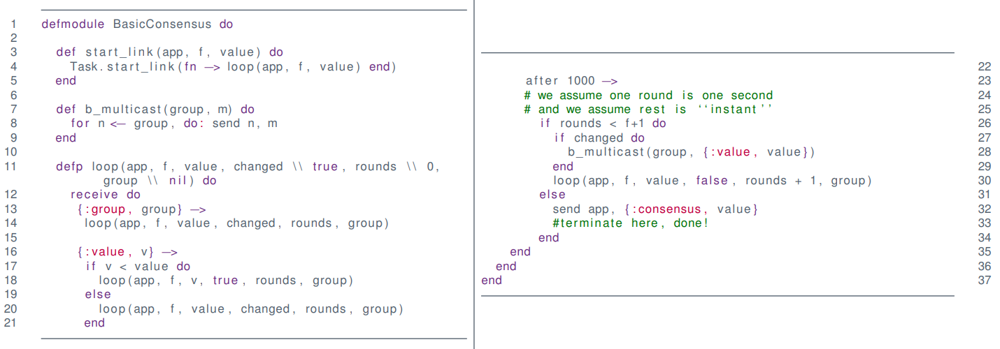

# Consensus

What is consensus?

* The ability for a **group of processes** to **agree on one, and only one** value

**Practical applications**

* Redundancy
    * Space and aeronautics
    * Industrial systems
* Replication
    * Distributed file systems
    * Ledger technology (e.g. blockchain)

**Big questions**

* When do we agree on what we agree on?
* What do we agree on?

**Why**

* Generalized consensus
* If we have consensus, everything is easy
* Feasibility depends on system model

## Impossibility

### Multicast

**No Failures, Easy**

1. B-multicast to everyone
2. Wait till N messages are received
3. Decide (e.g. minimum, majority, ...)

**Failures?**

Wee need:

* Mechanism for failure detection
    * Difficult/impossible for async systems
        * Impossible to detect if dead or slow
* Mechanism for failure handling

### The Two Army Problem

Both read armies has to attack at the same time

* They can send a message, but the blue army can intercept

Can we design a protocol to make sure that both armies attack at 6.

If left army sends a message to right, they would not know if the message has been received.

### Impossibility of Consensus in Async Systems

**Informally**

* Communication can be "blocked" indefinitely

**Reliable TO (Totally Ordered) Multicast is also impossible in async systems**

* Same problem

**Quiz**

* Assume we have a magic, reliable TO Multicast, can we derive a consensus algorithm?
    * Everyone takes the first message delivered.
        * Since its totally ordered everyone gets messages in the same order

## System Model

* Synchronous Systems
* Reliable Communication
* Fault models
    * Crashes
    * Byzantine
        * Arbitrary
        * Evil
* No signed messages!
    * There can be "Identity theft"

### Requirements

Given $p_i \in \{p_0,\dots,p_n\}$ and a corresponding decision-variable $d_i\in D \cup \{⊥\}$

* $⊥ \not \in D$

* **Termination**
    * Eventually a correct proccess sets its decision variable $d_i$
* **Agreement**
    * The decision values of all correct processes are the same
* **Integrity**
    * If all correct processes propose the same value, then any correct process in the decided state decide on that value
* **Weak Integrity**
    * The agreed value must be one proposed by a correct process

**Decided State**

We say that $p_i$ is decided if $d_i \not = ⊥$

* Some systems work in rounds,
* Most things are not truly async
    * "Indefinitely" rarely happens

**Goal**

* f-crash-resilient synchronous consensus algorithm

**f-resilient**

* The algorithm is f-resilient if f processes may fail

### Algorithm

**Theorem**

*Any optimal f-resilient consensus-algorithm requires f+1 rounds*

* Proof by pigeon hole principle
    * At least one correct round
    * Remember R-multicast

* Unclear when correct round is

* Weak consensus
    * We can agree on a value that was not proposed on a correct process
        * Not weak integrity

### Byzantine Error

What is processes do not crash-fail but interact unpredictably?

#### Examples

* Single Event Upset: A flipped bit
* Single Event Latchup: Hardware error

They use 4 different computes running the same software on the space shuttle, and then voting on consensus.

**Not only a space issue**

* "Error-Correcting code memory" (ECC)
* Bitflips on planes
* Nuclear power plants
* ...

Systems can "fall asleep" and later continue from where they left off

#### Byzantine Consensus

**Requirements**

* ...
* Byzantine integrity**
    * If all non-faulty processes start with the same value, then all non-faulty processes diced on that value

**Goal**

* f-byzantine-resilient synchronous consensus algorithm

**Bad news**

* Impossible for $f \geq {n \over 3}$

**Good news**

* Possible otherwise

#### Byzantine Non-Consensus

* If B is evil and gives different orders to A and C
* If C is evil and lies about order from B
* A cannot detect the traitor

$\uparrow \downarrow$ Proof that if 1/3 is faulty you cannot arrive at consensus

#### Byzantine Consensus Algorithm

$f = 1$

* Works only for $f=1$
    * Can be generalized
    * $O(n^{f+1})$ messages
        * $O(n^2)$ messages, growing exponentially in size
* Integrity is violated!

#### Kings Algorithm

* We introduces a "leader"/tiebreaker

!!!todo
    Finish notes [slides 20-](https://www.moodle.aau.dk/pluginfile.php/2133486/mod_resource/content/1/05.1-Consensus.pdf)