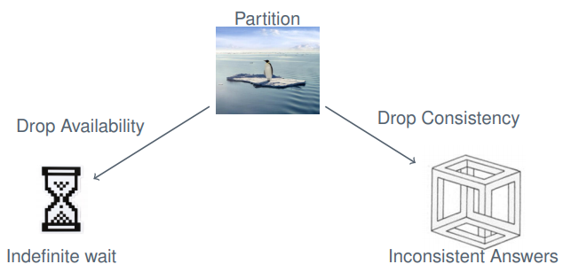
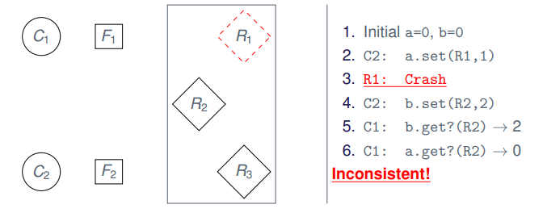

# Replication and Consistency

## Goals of Replication

Fault Tolerance

* Transparent to user
* Tolerates node/network failures

High availability

* Service is rarely interrupted

Performance

* Limits of horizontal scaling
* Overcome geographic/network limits

### Tolerance and Availability

 

### Performance

* Edge servers around the internet

### Caching

Caching is also replication

* Local browser cache
* Prefetching for Netflix
    * fault tolerance
        * if you loose network for a second, the video keeps playing
* DNS registry

### Problems

* Consensus
    * ... or **consistency**
* Overhead in communication
* Failure detection and handling

## CAP Theorem

It is **impossible** for a distributed computer system to simultaneously provide **Consistency**, **Availability** and **Partition Tolerance**.

A distributed system **can satisfy any two** of these guarantees at the same time but **not all three**.

### The Choice

**But**: If we relax our requirements we can overcome this impossibility

### Examples

CP Systems

* Financial sector
* Simulation (weather forecast)
* CERN

AP Systems

* Social Networks
* Streaming services
* Search Engines
* Emails

CA Systems

* Single server systems
* Stable Elixir setups

**Application Dictates**

Core/critical services are often CP

### Assumptions

* Async systems
* Reliable communication
* Crash-fail
* Atomic operation 
* Objects are "state machines"
    * no random
    * no timer
    * no external events

**Notation**

`o.m(v)` apply modifier `m` to object `o` with value `v`

`myAccount.deposit(1000)`

### Requirements

* Transparent for user
* Consistent in replicated objects

**Ideal**

Indistinguishable from single copy behavior

### Operations

**Generalized workflow**

1. Request
2. Coordination
3. Execution
4. Agreement
5. Response

Interesting when we have multiple requests at the same time

### Fault Tolerance

**Goal**

* f-resilient replication
* No downtime
* Transparent to clients

**Notice**

Transparent to clients is not yet formally defined

## Consistency Models

**Strong consistency**

* In real-time, after update A, everybody will see the modification done by A when reading

**Weak Consistency**

* What is the ordering, disregarding real-time?
* "reasonably consistent"

### Inconsistency

[Example on sildes 16-](https://www.moodle.aau.dk/pluginfile.php/2136991/mod_resource/content/1/06.1-Replication.pdf#page=31)

### Desired Temporal Consistencies

* If I write a value, I will see that (or a newer value) on a subsequent read
* If I read twice, the value returned on the second read is at least as new as from the first read
* If data is related (questions and answers), I expect this to be reflected in a consistent manner
    * ... no constraints on unrelated data!

### Linearizability (Lamport)

$\bold {C_i}$ **operations**

* $o_1^i, o_2^i, \dots, o_n^i$ for some operation $o \in O$

**Timestamp**

* Let $T(o^i_n)$ be the timestamp of $o^i_n$.

**Linearizability**

* An interleaving $\dots, o^i_5, o^j_{100}, o^i_6, \dots$ (with $i \neq j$) is linearizable if
    * arrive at a (single) correct copy of the object (from specification)
    * the order is consistent with real time
        * $T(o^i_5) \leq T(o^j_{100}) \leq T(o^i_6)$

#### Problems

**Implementation**

* Sync hardware clock on multiple machines
* Guess maximal network delay $D$
    * keep operation in hold-back queue until age $D$
    * keep hold-back queue sorted

**Drawbacks**

* No accurate clock synchronization algorithm
    * Reasonably accurate versions exists (depends on $D$)
* No hard deadline in async setting

### Interleavings

### Sequential Consistency (Lamport)

$\bold {C_i}$ **operations**

* $o_1^i, o_2^i, \dots , o_n^i$ for some operation $o \in O$

**Sequential Consistency**

* An interleaving $\dots, o^i_a, o^j_b, o^i_c, \dots$ (with $i \neq j$) is sequentially consistent if
    * arrive at a (single) correct copy of the object (from specification)
    * the order respects casuality of $C_i$
        * $a < c$, i.e. from $C_i, o^i_a$ was sent before $o^i_c$

Example on [slides 23](https://www.moodle.aau.dk/pluginfile.php/2136991/mod_resource/content/1/06.1-Replication.pdf#page=44)

### Replication Architectures for Fault Tolerance

**Read-only replication**

* Immutable files
* Cache-servers

**Passive replication (primary/secondary)**

* High consistency
* Banks?

**Active replication**

* Fast failover mechanism
    * Everyone can take over if one fails
* Workload distribution
* Everybody is working on equal terms

#### Passive Replication

* "just follow primary"
* Up to $n-1$ crashes
* No byzantine failures
* Linearizable (with regards to clock of primary)
* Large overhead of failure
    * why?

**Note**

Sacrifice linearizability => offload reads to backups!

#### Active Replication

* Sequentially consistent
* RTO multicast
    * impossible in async
    * expensive otherwise
* "state-machine" objects required
* Handles byzantine nodes
    * assuming signed messages $(n/2)-1$ failures
* Failover is cheap
    * Just exclude failed from group
    * "same procedure"
* Read can be trivially distributed

## Availability

**Availability VS Fault Tolerance**

* We care less about consistency
* Higher uptime = better
* Faster response times

**Example**

* Read-only: caches
* Most web-scaled services
    * Youtube, Facebook, Stackoverflow

## Gossip Architecture

**Operations**

* Read
    * no state change
* Write (update)
    * can change state of object

**Relaxed Consistency**

* $R$'s apply operations "eventually" with specific order
* Client may receive outdated data
    * though newer than clients current data

**Reads**

* Casual ordering

**Writes**

* Choice of clients
    * **Causal order**
    * Total + Causal order (relative to relations)
    * Immediate ordering

### Idea

**Vector clocks, vector clocks everywhere**

Track “number of unique updates $R_i$ has seen of object from some frontend” as a vector.

* Each entry in vector-clock corresponds to $R_i$
    * $R_i$ updates own index in vector on update from some $F_i$
    * Keep messages from future in hold-back queue
    * Avoid duplicates
* Frontend keep track of "last known" timestamp
    * Frontend label their reads/writes with last-known timestamp
    * Receive new timestamp updates from $R_i$ (or via gossip)

### Phases

1. **Request:** $F$s forwards to a single $R$ (or more)
2. **Coordination**: Queue request until order is respected
3. **Execution**: Execute in correct order
4. **Agreement:** we can do one of:
    * Wait for gossip
    * Request missing data
5. **Response**
    * Read: await coordination
    * Write: immediately

### Frontend View

[slides 34](https://www.moodle.aau.dk/pluginfile.php/2136991/mod_resource/content/1/06.1-Replication.pdf#page=61)

### Replication Managers View

[slides 35](https://www.moodle.aau.dk/pluginfile.php/2136991/mod_resource/content/1/06.1-Replication.pdf#page=64)

[slides 36](https://www.moodle.aau.dk/pluginfile.php/2136991/mod_resource/content/1/06.1-Replication.pdf#page=69)

### Details

**Frequency of gossip**

* Minutes, hours or days
* Depend on the requirement of application
    * think of git, how often are we committing?

**Topology**

* Random
* Deterministic: investigate known clocks
* Topological: Mesh, circle, tree
* Geographical
    * you gossip to machines geographically close to you

### Discussion

* Works even with network partition
    * but may need conflict resolution
* More $R$'s = more gossip
* Larger delays between gossip
    * larger consistency gaps
    * higher latency
* Good when conflicting updates are rare