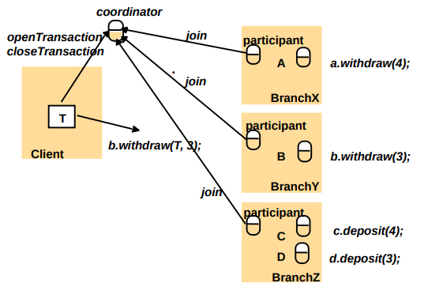
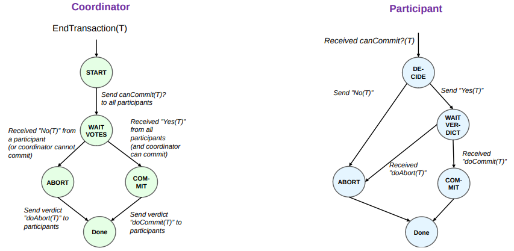
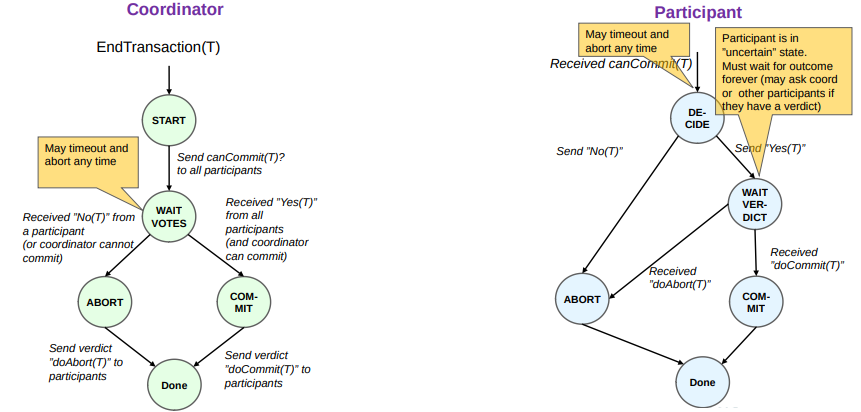
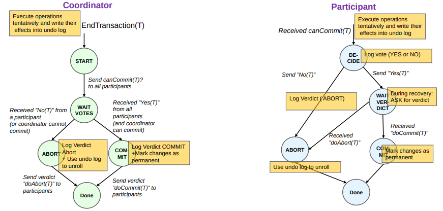
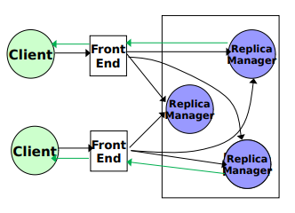
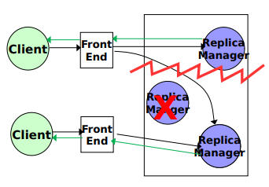
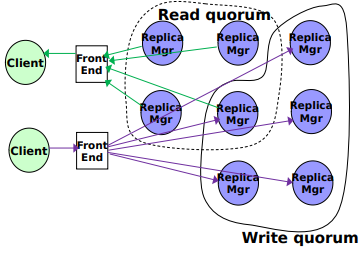

# Transactions

Transaction = A series of operations that must be executed with ACID properties

**ACID**

* **Atomicity** – to outside world, transaction happens indivisibly
* **Consistency** – transaction preserves system invariants
* **Isolated** – transactions do not interfere with each other
* **Durable** – once a transaction “commits,” the changes are permanent

In “conventional” Databases: Protect against concurrency and crash failures of a single DB server 

Distributed Transaction: The operations are targeted at different severs.

Book trip=TRANSACTION(Book Flight; Book Car; Book Hotel)

* Distributed: Involves 3 different services


## A Distributed Banking Transaction

```pseudocode
T = openTransaction
	a.withdraw(4)
	c.deposit(4)
	b.withdraw(3)
	d.deposit(3)
closeTransaction
```



* Client opens a transaction: contacts a server that appoints a Coordinator (often itself)
* Transactions are given a globally unique ID that is appended to every operation
* Client sends operations to servers that **tentatively** executes them
    * *(tentatively: with hesitancy or uncertainty)*
* When client closes the transaction: Servers coordinate to decide to globally “ACID’LY” commit or abort 


## One-phase Commit Protocol

* First cut: The coordinator unilaterally communicates either commit or abort, 
* Repeat until all participants (servers) all acknowledge
    * Doesn’t work when a participant crashes before receiving this message (partial transaction results that were in memory are lost).
    * Does not allow participant to abort the transaction, e.g., under error conditions or concurrency control.


## Two-phase Commit Protocol

### Assumptions

* Both coordinator and participant may abort
* Crash-stop failures, but we may use stable storage and let new processes recover the state, and resume the role of the failed process
* Stable storage contains a combination of
    * Check-points
    * Re-do and un-do log files
* Asynchronous system


### Protocol



#### Timouts



#### Persistent storage




### Crashes

* If coordinator crash:
    * If participant has not yet voted (or has aborted) then it aborts locally
    * If participant voted ”YES”: It must await outcome 
        * If all participants are uncertain: keep waiting until coordinator is recovered **("BLOCKING")**
            * Coordinator may be replaced if its log file is available 
            * Or at least one other participant knows the verdict
* If participant crash
    * Coordinator aborts
    * Ignores tardy votes
* Does not solve consensus
    * Either possibly wait forever
    * Mask failure by recovery and stable storage (a recovering process == a very slow process)


## Data Replication with Transactions

### Read-Any-Write-All Protocol



* Read
    * Perform read at any one of the replicas
* Write
    * Perform on *all* of the replicas
* Sequential consistency
* Cannot cope with even a single crash (by definition)

### Available-Copies Protocol



* Read
    * Perform on any one of the replicas
* Write
    * Perform on *all available* replicas
* Better availability
* Network partitions may give inconsistency in two sub-divided network groups.
    * Consensus Approach: Updates require majority


### Quorum-Based Protocols

Two quora:

1. $R$ and $W$ intersect, i.e. $\#R + \#W >n$
2. Writes need majority, i.e. $\#W > n/2$



Read-any-write-all as special case: $R=1, W = n$

* Read

    * Retrieve the read quorum
    * Select the one with the latest version.
        * Note $\# R + \# W > n$
    * Perform a read on it

* Write

    * Retrieve the write quorum
    * Find the latest version and increment it
    * Perform a write on the entire write quorum

* If a sufficient number of replicas from read/write quorum fails, the operation must be aborted.

    