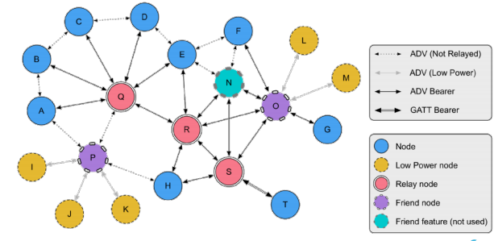
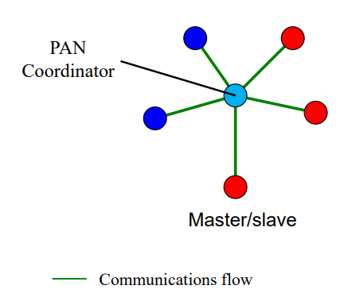

# Wireless Sensor Networks and Internet of Things

## Standardized WSN Protocols

* Traditional WiFi + IP too resource intensive for WSN
* **802.15.1** (Bluetooth: cable replacement)
    * 1 PAN coordinator + up to 7 slaves
    * Version 1.0 ... 4.x now 5.0
    * BLE aka Bluetooth SMART
    * Bluetooth Mesh

### IEEE 802.15.4

* **802.15.4** designed for wireless personal area networks (home automation, cars, remote metering,…)
    * Monitoring and Control
    * Ease of installation but no mobility
    * Low power 
        * protocol assumes nodes sleep most of the time
    * Low transmission rates (< 250 kbps)
    * Low range (< 75m max)
* 802.15.4 defines Physical and MAC layer. What to run on top of it?

#### MAC Overview

* Full Function Device ($\color{darkblue}\text{FFD}$)
    * Any topology
    * Network coordinator capable
    * Talks to any other device
* Reduced Function Device $\color{darkred} \text{RFD}$
    * Limited to star topology
    * Cannot become a network coordinator
    * Talks only to a network coordinator
    * Very simple implementation

#### MAC Topology

#### CSMA-CA

* Carrier-Sense Multiple Access Collision Avoidance
* Backoff if carrier occupied
* WiFi: Use RTS/CTS

#### Optional Superframe Structure

### ZigBee

* Defines Network layer on top of 802.15.4
* Developed by the Zigbee alliance
* Nodes can join network, get 16 bit address
* Routing algorithm for tree (and star) and mesh topologies
* Route discovery based on distance vector algorithm
* 128-bit AES encryption
* Also provides an application layer framework for applications

> <http://www.chiaraburatti.org/uploads/teaching/ZigBee-Libro.pdf>

### 6LoWPAN

* *“Why invent a new protocol when we already have IP?”*
    * Developers are familiar with IP
    * 16-bit addresses (ZigBee) not enough for IoT
* Developed by IEFT: 6LowPan: IPv6 over 802.15.4

* Stacked headers
    * Basic header for small packets sent point-to-point or in star networks: 4 bytes (!)
        * 802.15.4 MAC addresses are 64bit long (in the MAC frame)
        * In IPv6, the lower 64bit (of 128 bits) can be the MAC’s address
        * $\to$ No need to repeat address in 6LowPan header (compressed header)
    * Optional Fragmentation header for large packets
    * Optional Mesh Networking header for mesh networks

### LoRa - Long Range

* Long-range, low-power and low-througput
* LoRa: PHY layer, developed by Semtech
* LoRaWAN MAC layer defined by LoRaAlliance
* Range
    * 2-5 km in urban environments
    * \> 15 km in open space
* Throughput: 0.3 kbps to 50 kbps
* LoRaWAN MAC accepts Spreading Factor (SF) of PHY to balance data rate / range / lifetime

### SigFox

* Very long range (few km in cities, up to 40km in rural areas with directional antennas)
* Signal can reach underground objects
* Sigfox deploys its antennas with the help of local telcos around the world
    * Thus Sigfox itself takes care of coverage
    * Device owners pay a subscription (1 Euro per device per year)

* Send
    * up to 140 messages per day, limit of 6 msgs/hour
    * Each message can be up to 12 bytes
* Receive
    * up to 4 downlink msgs per day, each of which can carry payload of 8 bytes
* Thus
    * SigFox is for applications that send only small and infrequent bursts of data and receive close to nothing, like alarms and meters.

### NB-IoT - Narrowband Internet of Things

* Narrowband Internet of Things (NB-IoT) is a secure, reliable, and efficient type of Low-Power Wide-Area (LPWA) Technology that was standardized by 3GPP and uses licensed spectrum. 
* low power consumption
* low device cost
* low connectivity cost
* massive connections (tens of thousands of devices per base station)
* long range (about 5 km in dense urban areas and about 50 km in rural area)
* good signal penetration (can reach elevators inside buildings as well as basement and underground car parks)

### Comparison 

<https://www.polymorph.co.za/iot-connectivity-comparison-gsm-vs-lora-vs-sigfox-vs-nb-iot/>

## Routing in IoT / WSN

* Why routing?
* Tree routing
* Directed Diffusion
* Dynamic Source Routing
* Ad Hoc On-Demand Distance Vector Routing

### What is Routing

* Low power wireless links can be too short to reach destination in one hop
* Need to traverse multiple links to reach destination

* Routing = selecting (best) path for network traffic from source to destination
* Lots of criteria (metrics) to device what is best path
    * Delivery delay
    * Link load
    * Router load
    * ...
* In WSN we have more metrics
    * Energy consumption
    * Battery level of a node
    * Loss probability
    * ...

### Traditional Routing

* A **routing protocol** sets up a **routing table** in routers

* A node makes a **local** choice depending on **global** topology
* What if node cannot know the global topology?

### ZigBee

* As described, Zigbee defines Network layer & Application layer framework on top of 802.15.4.

802.15.4 devices can be:

* Full function device (FFD)
    * PAN coordinator capable
    * Talks to any other device
    * Can act as router
* Reduced function device (RFD)
    * Cannot become a PAN coordinator
    * Talks only to a PAN coordinator
    * Very simple implementation

#### ZigBee Network Layer Overview

When considering the network layer / ZigBee:

* Three kinds of devices
    * Coordinator (unique in network)
    * Router
    * End device
* Three kinds of networks
    * Star
    * Tree
    * Mesh

* RFD **must** be an end device

#### Address Assignment

* In ZigBee, network addresses are assigned to devices by a distributed address assignment scheme
* ZigBee coordinator defines three network parameters
    * maximum number of children ($C_m$) of a ZigBee router
    * maximum number of child routes $R_m$ of a parent node
    * depth of the network $L_m$
* A parent device utilizes $C_m, R_m$ and $L_m$ to compute a parameter $C_{skip}$
    * used to compute size of its children's address pools

$$
C_{skip}(d) = \left \{ \begin{array}{}
1+ C_m \cdot (L_m - d - 1), & \text{if } R_m = 1 \\
\frac {1+ C_m - R_m - C_m \cdot R_m^{L_m-d-1}} {1- R_m}, & \text{otherwise}
\end{array}\right.
$$

* If a parent node at depth $d$ has an address $A_{parent}$
    * the *n*th child router is assigned to address $A_{parent}+(n-1) \times C_{skip}(d) +1$
    * *n*th child end device is assigned to address $A_{parent} + R_m \times C_{skip}(d)+n$

#### ZigBee Routing Protocols

* In a star network
    * No routing
* In a tree network
    * **Tree routing**
        * utilize the address assignment to obtain the routing paths
* In a mesh network, two options
    * **Tree routing**
    * AODV, described later

#### ZigBee Tree Routing

* When a device receives a packet, checks if the destination is itself or one of its child devices
    * If so, accept the packet or forward it to a child
    * Otherwise, relay it along the tree 

* Example
    * 38 $\to$ 45
    * 38 $\to$ 92

### Directed Diffusion

* *"How many vehicles are there in the South West quadrant?"*
    * 
* How can we find the sensors that have the relevant information?
* Which routes should the queries and the responses take?

#### 1 - Forward an Exploratory Interest

* Forwarding: broadcast (Flooding)
* Do not forward already resent interests
* Interests are soft state: they time out unless refreshed by the sink
* Gradient = state information for the reverse links (toward the sink)

#### 2 - Send Exploratory Data Back

* Nodes with the right type of data generate event instances with the highest frequency indicated among all its gradients
* Data sent unicast on every gradient
* Nodes ignore data without matching entry in the interest cache
* Nodes check their data cache to prevent loops

#### 3 - Positive Enforcement

* Once the sink has received the exploratory data
    * send the original interest with the "real" frequency to the neighbor it (first) received the data from
* When a node receives an interest from existing gradient
    * if request rate is higher than inflow, re-enforce a neighbor
    * Select "good" neighbor (e.g. Lowest latency)

#### Result

* A path from the sink to the source (and back) has been reinforced
    * Sources sends data in intervals of 10ms on this path
    * It is the path with shortest delay
* Completely **local** decisions! No global state
* Also works with multiple sources and multiple sinks

#### Simulation Result

* ns-2 simulation of 50-250 node networks with constant average node density, 5 sources, 5 sinks
* 802.11 MAC Layer
* Compare directed diffusion to
    * flooding
    * omniscient multicast (shortest-path)
* Key metrics
    * Average dissipated energy
        * per node energy dissipation / number of events seen by sinks
    * Average packet delay
        * latency of event transmission to reception at sink
    * Distinct event delivery
        * number of distinct events received / number of events originally sent

#### Average Dissipated Energy

* Flooding is poor because of multiple paths from source to sink
* Diffusion is better than OM because duplicate data messages are suppressed

#### Average Delay

* Flooding has high latency due to MAC collisions
* Diffusion finds lowest-delay path (=shortest path)

### Dynamic Source Routing (DSR)

* When node S wants to send a packet to node D, but does not know a route to D, node S initiates a route discovery
* Source node S floods Route Request (RREQ)
* Each node appends own identifier when forwarding RREQ

#### Route Discovery in DSR

[Example in slides (pdf. p. 21)](https://www.moodle.aau.dk/pluginfile.php/2137406/mod_resource/content/2/ds7_2_routing.pdf#page=21)

$\Downarrow$

* Destination D on receiving the first RREQ, sends a **Route Reply (RREP)**
* RREP is sent on a route obtained by **reversing** the route appended to received RREQ
* RREP **includes the route** from S to D on which RREQ was received by node D

#### Route Reply in DSR

#### Routing in DSR

* Node S on receiving RREP, caches the route included in the RREP
* When node S sends a data packet to D, the entire route is included in the packet header
    * hence the name **source routing**
* Intermediate nodes use the **source route** included in a packet to determine to whom a packet should be forwarded

#### Data Delivery in DSR

#### DSR Advantages and Disadvantages

* (**pro**) Routes maintained only between nodes who need to communicate
* (**pro**) A single route discovery may yield many routes to the destination
* (**con**) Packet header size grows with route length due to source routing
* (**con**) Flood of route requests may potentially reach all nodes in the network
* (**con**) Potential collisions between route requests propagated by neighboring nodes
    * insertion of random delays before forwarding RREQ
* (**con**) Increased contention if too many route replies come back due to nodes replying using their local cache
    * Route Reply **Storm** problem

### Ad Hoc On-Demand Distance Vector Routing

* DSR includes source routes in packet headers
* Resulting large headers can sometimes degrade performance
    * particularly when data contents of a packet are small
* AODV improves on DSR by maintaining routing tables at the nodes, so that data packets do not have to contain routes
* AODV retains the desirable feature of DSR that routes are maintained only between nodes which need to communicate

#### AODV

* **Route Requests (RREQ)** are forwarded in a manner similar to DSR
* When a node re-broadcasts a Route Request, it sets up a reverse path pointing towards the source
    * AODV assumes symmetric (bi-directional) links
* When the intended destination receives a Route Request, it replies by sending a **Route Reply (RREP)**
* Route Reply travels along the reverse path set-up when Route Request is forwarded

#### Route Request in AODV

[Examples in slides (pdf. p. 34)](https://www.moodle.aau.dk/pluginfile.php/2137406/mod_resource/content/2/ds7_2_routing.pdf#page=34)

$\Downarrow$

#### Forward Path Setup in AODV

#### Route Request and Route Reply

* Route Request (RREQ) includes the last known **sequence number** for the destination
* An intermediate node may also send a Route Reply (RREP) provided that it knows a **more recent path** than the one previously known to sender
* Intermediate nodes that forward the RREP, also record the next hop to destination
* A routing table entry maintaining a **reverse path** is purged after a timeout interval
* A routing table entry maintaining a **forward path** is purged if not used for a ***active_route_timeout*** interval

#### AODV Summary

* Routes need not be included in packet headers
* Nodes maintain routing tables containing entries only for routes that are in active use
* At most one next-hop per destination maintained at each node
    * DSR may maintain several routes for a single destination
* Sequence numbers are used to avoid old/broken routes
* Sequence numbers prevent formation of routing loops
* Unused routes expire even if topology does not change