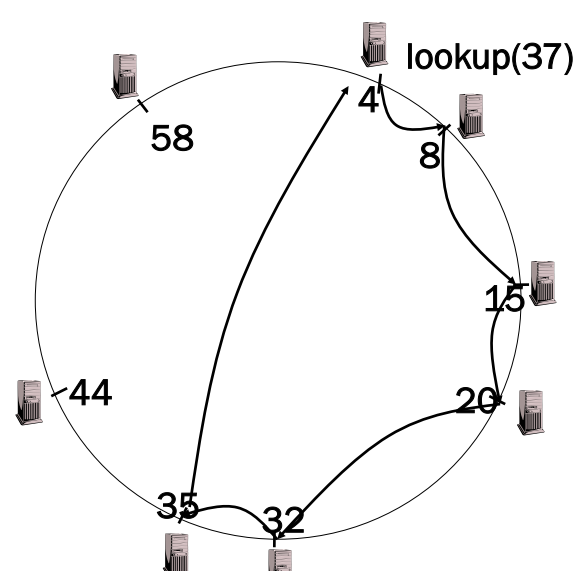

# Peer to Peer

## Overlay Networks

* Set of nodes and links (network)
* Built over an underlying network (e.g. the internet)


The overlay network here is **A B C D** and **E**

* We don't care if one connection e.g. B - D has a relay node inbetween


### Why

* Adds a layer to the stack to provide something the underlying network does not have without chaning the underlying network
    * A service (integrated into the network) e.g. multimedia content distribution
    * A routing protocol e.g. over ad-hoc network
    * Other e.g. multicast integrated into the network, enhanced security
* Could we do everything inthe application layer?
    * Yes, but it is a mess (?)


### Types of overlay

| Motivation                     | Type                          | Description                                                  |
| ------------------------------ | ----------------------------- | ------------------------------------------------------------ |
| Tailored for application needs | Distributed hash tables       | Prominent class of overlay network. Offers a service mapping from keys to values across a potentially large number of nodes in a completely decentralized manner (similar to a standard hash table but in a networked environment). |
|                                | Peer-to-peer file sharing     | Overlay structures that focus on constructing tailored addressing and routing mechanisms to support the cooperative discovery and use (for example, download) of files. |
|                                | Content distribution networks | Provides replication, caching and placement strategies to improve performance for content delivery to web users; can offer real-time performance for video streaming. |
| Tailored for network style     | Wireless ad hoc networks      | Provides customized routing protocols for wireless ad hoc networks, including (i) proactive schemes to construct a routing topology over underlying nodes, and (ii) reactive schemes that establish routes on demand typically supported by flooding. |
|                                | Disruption-tolerant networks  | Overlays designed to operate in hostile environments that suffer significant node or link failure and potentially high delays. |
| Offering additional features   | Multicast                     | Provides access to multicast services where multicast routers are not available. |
|                                | Resilience                    | Focused on improvement in robustness and availability of Internet paths. |
|                                | Security                      | Overlay networks that offer enhanced security over the underling IP network, including virtual private networks. |

### Example: Pre-Microsoft Skype


## Limitation of the Client/Server Paradigm

* A server offers a service
* The client finds out the address of the server
* The client **starts** communication with the server
* ... business logic ...

**Issues**

* Scalability
    * As the number of users increases, there is a higher demand for computing power, storage space, and bandwidth associated with the server-side
* Reliability
    * The whole network will depend on the highly loaded server to function properly


## Peer-to-peer Paradigm

* A peer must find the other peer
* Both peers can initiate communication
* ... business logic ...

**Advantages**

* The system is based on the direct communication between peers
* No reliance on centralized services or resources
* The system can survive extreme changes in network composition
* This model is highly scalable
* Able to benefit from consumer technology
    * Instead of having servers

### Limitations and Challenges

**Issues**

* on/off behavior, participants churn
    * peers servicing other peers can get out of the network
* need to join
    * bootstrap
* need to discover other peers
* easier to misunderstand communication rules when implementing peers
* incentivize participation and reciprocation
    * you have to have many peers

**Needs protocols to**

* Finding peers on the network
* Finding what services a peer provides
* Obtaining status information from a peer
* Invoking a service on a peer
* Creating, joining, and leaving peer groups
* Creating data connections to peers
* Relaying messages for other peers

### Formalizing P2P

A peer to peer system is a set of autonomous entities (**peers**) able to auto-organize and sharing a set of distributed resources in a computer network. The system exploits such resources to give a service in a complete or partial decentralized way

* A peer is a node on a P2P network that forms the fundamental processing unit of any P2P solution
* Each peer has a unique Peer ID
* Each peer belongs to one or several Peer Groups
* Each peer can communicate with other peers in its group and also those in other groups


### Types of P2P Applications

Usually, p2p applications divided into three main categories:

* Distributed computing
* File sharing
* Collaborative applications

Different purposes $\Rightarrow$ different set of requirements

* **Distributed computing** applications typically require the decomposition of larger problem into smaller parallel problems
* **File sharing** applications require efficient search across wide area networks
* **Collaborative applications** require update mechanisms to provide consistency in multi-user environment


#### P2P File Sharing

Common Primitives

* **Join**: how do I begin participating?
* **Publish**: how do I advertise my file?
* **Search**: how to find a file/service?
* **Fetch:** how do I retrieve a file/use service? 


### Centralized P2P Networks

P2P file sharing killer application: Old Napster

* Free music over the Internet

Key idea: share the content, storage *and* bandwidth of individual (home) users


**Main Challenge**

* Find where a particular file is stored

Other challenges

* Scale: up to hundred of thousands or millions of machines
* Dynamicity: machines can come and go any time


#### Napster Solution

* Assume a centralized index system that maps files (songs) to machines that are alive

* How to find a file:
    * Query the index system $\to$ return a machine that stores the required file
        * Ideally this is the closest/least-loaded machine
    * FTP the file
* Advantages
    * Simplicity
    * Easy to implement sophisticated search engines on top of the index system
* Disadvantages
    * Robustness since there is a central point of failure
    * Scalability since there is a central bottleneck


##### Algorithm


##### Search Operation

* The client sends keywords to search with
* The server searches its list with the keywords
* The server returns a list of hosts - `<ip_address, portnum>` tuples - to client
* The client pings each host in the list to find transfer rates
* The client fetches file from best host


##### Issues

* Centralized server a source of congestion
* Centralized server single point of failure
* No security: plaintext messages and passwords
* napster.com declared to be responsible for users’ copyright violation
    * "Indirect infringement"


### Unstructured P2P Networks - Gnutella

* Peers form an overlay network
* Query Flooding:
    * **Join**: on startup, client contacts a few other nodes (learn from bootstrap-node); these become its “neighbors”
    * **Publish**: no need
    * **Search**: ask “neighbors”, who ask their neighbors, and so on... when/if found, reply to sender.
    * **Fetch**: get the file directly from peer


#### Search


Advantages:

* Totally decentralized
* Highly robust

Disadvantages:

* Not scalable (need to contact all peers to perform a deterministic search)
* The entire network can be swamped with request
    * Each request needs a TTL (limited scope flooding)


#### Avoiding Excessive Traffic

* Query forwarded to all neighbors except peer from which received
* Each Query (identified by DescriptorID) forwarded only once
    * To avoid duplicate transmissions, each peer maintains a list of recently received messages
    * Duplicates with same DescriptorID and Payload descriptor (msg type, e.g., Query) are dropped
* QueryHit routed back only to peer from which Query received with same DescriptorID
* QueryHit with DescriptorID for which Query not seen is dropped


#### Download

* Requester chooses "best" QueryHit responder

    * Initiates HTTP request directly to responder's IP+PORT

    * ```http
        GET /get/<File Index>/<File Name>/HTTP/1.0\r\n
        	Connection: Keep-Alive\r\n
        	Range: bytes=0-\r\n
        	User-Agent: Gnutella\r\n
        	\r\n
        ```

* Usage of HTTP since it is widely used, and widely accepted by firewalls

* **range** field in the GET request to support partial file transfers.


#### Comparison - Napster v Gnutella

**Napster**

* Pros
    * Simple
    * Search scope is $O(1)$
* Cons
    * Server maintains $O(N)$ State
    * Server performance bottleneck
    * Single point of failure

**Gnutella**

* Pros
    * Simple
    * Fully de-centralized
    * Search cost distributed
* Cons
    * Search scope is $O(N)$
    * Search time is $O(???)$
    * Large number of freeloaders


#### "New" Gnutella Protocol

* Protocol originally called FastTrack
* Implemented initially in Kazaa, KazaaLite, Grokster
    * Then also in Gnutella


* Like Gnutella, but with some peers designated as supernodes
    * Takes advantage of “healthier” participants in the system
    * Contain a Napster-like directory of files


* “Smart” Query Flooding:
    * **Join**: on startup, client contacts a “supernode”; may at some point become one itself
    * **Publish**: send list of offered files to supernode
    * **Search**: send query to supernode, supernodes flood query amongst themselves
    * **Fetch**: get the file directly from peer(s); can fetch simultaneously from multiple peers


#### Discussion

* A supernode stores a directory listing a subset of nearby (`<filename,peer pointer>`), similar to Napster servers
* Supernode membership changes over time
* Any peer can become (and stay) a supernode, provided it has earned enough **reputation**
    * Reputation of a user affected by length of periods of connectivity and total number of uploads
* More sophisticated Reputation schemes invented, based on economics


Pros

* Tries to balance between search overhead and space needs
* Tries to take into account node heterogeneity:
    * Bandwidth
    * Host Computational Resources

Cons

* Still no real guarantees on search scope or search time


### Structured P2P Networks

API based on unique GUID associated to data

* `put(GUID, data)`
    * `data` stored in replicas at all nodes responsible for the object identified by `GUID`
* `remove(GUID)`
    * Deletes all references to GUID and the associated data
* `value = get(GUID)`
    * data associated with GUID is retrieved from one of the responsible nodes

Alternate vision:

* `publish(GUID)`
    * GUID computed from the object
* `unpublished(GUID)`
    * Makes the object corresponding to GUID inaccessible
* `sendToObj(msg, GUID, [n])`
    * Invocation message is sent to an object
        * E.g: request to download a TCP connection for data transfer, sent to n replicas of the object


#### Identifier to Node Mapping


#### Lookup

* Each node maintains its successor
* Route packet (ID, data) to the node responsible for ID using successor pointers




#### Robustness of the Network

* Each node A periodically sends a stabilize() message to its successor B
* Upon receiving a stabilize() message, node B
    * returns its predecessor B’=pred(B) to A by sending a notify(B’) message
* Upon receiving notify(B’) from B,
    * if B’ is between A and B, A updates its successor to B’
    * otherwise, A does nothing


#### Joining Operation

##### Init

* Node with id=50 joins the ring
* Node 50 needs to know at least one node already in the system
    * Assume known node is 15


##### Find Successor

* Node 50: send join(50) to node 15
* Node 44: returns node 58, since it is responsible for GUID 50
* Node 50 updates its successor to 58


##### Stabilize() Successor

* Node 50: send stabilize() to node 58
* Node 58:
    * update predecessor to 50
    * send notify() back to its new predecessor (50)


##### Predecessor Finds You

* Sooner or later, node 44 sends a stabilize message to its successor, node 58
* Node 58 reply with a notify message
* Node 44 updates its successor to 50


!!!todo
    finish from slides 39-