# Cluster Data Storage

## Google Application

* Search engine
* Cloud Applications: Gmail, Gdrive, messaging (Google Talk), Calendar, Docs, Maps, Earth, YouTube, …
* PaaS


## Original Search Engine


## Applications / Workload

* Offline batch jobs
    * Large datasets (PBs), bulk reads/writes (MB chunks)
    * Short outages acceptable
    * Web indexing, log processing, satellite imagery, etc.
* Online applications
    * Smaller datasets (TBs), small reads/writes (KBs)
    * Outages immediately visible to users, low latency vital
    * Web search, GMail, Google Docs, etc.
* Many areas:
    * Information retrieval
    * Machine learning
    * Image/video processing
    * Natural language processing
    * Machine translation
    * ...


## Cluster Architecture


<http://www.google.com/about/datacenters/index.html> 
<https://www.youtube.com/watch?v=XZmGGAbHqa0>

* Groups of clusters stored in different places in the world


### Normal Events in Large Clusters

Typical first year for a new cluster:

* ~0.5 **overheating** (power down most machines in <5 mins, ~1-2 days to recover)
* ~1 **PDU failure** (~500-1000 machines suddenly disappear, ~6 hours to come back)
* ~1 **rack-move** (plenty of warning, ~500-1000 machines powered down, ~6 hours)
* ~1 **network rewiring** (rolling ~5% of machines down over 2-day span)
* ~20 **rack failures** (40-80 machines instantly disappear, 1-6 hours to get back)
* ~5 **racks go wonky** (40-80 machines see 50% packet loss)
* ~8 **network maintenances** (4 might cause ~30-minute random connectivity losses)
* ~12 **router reloads** (takes out DNS and external vips for a couple minutes)
* ~3 **router failures** (have to immediately pull traffic for an hour)
* ~dozens of minor 30-second blips for dns
* ~1000 individual **machine failures (eg DRAM)**
* ~thousands of **hard drive failures**


* slow disks, bad memory, mis-configured machines, flaky machines, etc.
* Long distance links: wild dogs, sharks, drunken hunters, etc.

Large variety of Software bugs, crashes


### Original Cluster Philosophy

* Use software techniques for fault tolerance
* Use replication and parallelism for throughput and availability
* Buy HW with best price/performance ratio, not absolute performance
* “Unreliable”, low-performance commodity HW
    * $\Rightarrow$ minimize cost (incl. depreciation, operation costs) per query


## Google Infrastructure


## Cluster Services


> Jeff Dean (Google)


### Google's Borg

* Borg: Google’s cluster manager
    * runs >100k jobs, >1k different applications, across 10k machines
* Goal: high resource utilization, fast recovery time
    * uses admission control
    * efficient task-packing and over-commitment
    * scheduling policies that reduce the probability of correlated failures
    * machine sharing with process-level performance isolation


## GFS - A Distributed Filesystem

### Design Assumptions

* Component failures are normal
* Few very large files
* Optimized towards Google Workload (processing of bulk-data):
    * Large **sequential reads**, few small random reads
    * Frequent **(concurrent) append**, rare concurrent random writes; multiple producers/single consumers of data to same file
    * **High sustained throughput** more important than latency
* Non-POSIX API:
    * create, delete, open, close, read, write
    * snapshot: fast copy of a file or a directory tree
    * record append: multiple clients append data to the same file
        * guaranteed consistency
        * location of append not decided by the client

### Architecture


### Passive Replication - Write


1. Ask master who is primary (leasing) for chunk x
2. the identity of the primary and the locations of the other (secondary) replicas.
3. The client pushes the data to all the replicas in a forwarding chain
4. Once all the replicas have acknowledged receiving the data, the client sends a write request to the primary.
5. The primary forwards the write request to all secondary replicas. Each secondary replica applies mutations in the same serial number order assigned by the primary.
6. The secondaries all reply to the primary indicating that they have completed the operation.
7. The primary replies to the client.
    * Any errors encountered at any of the replicas are reported to the client (a subset of replica’s modified)
    * Client retries
    * File may be inconsistent


### Consistency Model

* File namespace mutations (e.g. file creation) are atomic (handled by master)

* A file region is

    * *“Consistent”* if all clients see same data (from all replicas)
    * *“Defined”* if consistent and clients see writes in their entirety

* Append: record is appended atomically *at least once somewhere*

    

* Applications can handle inconsistent regions


### Replica Management (Master)

* Replica placement
    * Spread replicas over different racks to optimize availability and bandwidth, but at an increased cost of writes (inter-rack-communication)
* New Chunk allocation:
    * consider disk utilization, number of recent allocations to same disk, and placement across racks
* Re-replication
    * When too many replica’s are unavailable
    * Higher priority when replication factor is low
* Re-balancing
    * to ensure uniform load and disk utilization
* Garbage Collection
    * delete chunks with outdated version number, deleted files


### Fault Tolerance of Master

* Master state (Operations-log and its check-points) is replicated and maintained in stable storage
* Relatively easy/fast recovery
* Shadow masters (read-only) provide read-only access
* External failure detection mechanism detects master failure, selects a new master, and restarts it.


### Performance (2003)

* Micro-benchmark: performance test of basic functionality / selected aspects (in a reduced controlled setting)
* 1 master (2 shadow replicas), 16 chunk servers, 16 clients, 100Mbps network cards (12.5 MB/S) ,1 Gbps link between switches (125 MB/s)

Example results (anno 2003):


Behavior in real-life workload, real-life setup:


* A for R&D
* B is a production cluster


* A’s network limit is 750 MB/s
* B’s network limit is 1300 MB/s


Chunk Recovery

* When a chunk server fails or is killed, some chunks are under-replicated (not enough replica)
* 1 (out of 3) chunk server with 15000 chunks (600 GB) killed
    * Restored in ~23 minutes
* 2 (out of 3) killed
    * Restored to 2x replication in 2 minutes
    * Prioritization kicks in


### Conclusions

* Apparently successful DFS
    * For commodity clusters
    * Dedicated to Google's workload
* Key infrastructure enabling many of their services
* Interesting replica management system, but few details / policies provided

**Since 2012: Colossus file system**

* “Hölzle calls Colossus "similar to GFS – but done better after ten years of experience.“
* <https://www.wired.com/2012/07/google-colossus/>
* <https://cloud.google.com/files/storage_architecture_and_challenges.pdf>


## Chubby - A Distributed Lock Service

* **A coarse-grained lock service and file-system**
* Lock service: allows clients to synchronize their activities
* Coarse = for hours or days, and
* Reliable (but low-volume) storage

Example: Master Election

* Nodes try to get a lock
* The nodes who wins writes result into a small file

Filesystem: Is a well-known mechanism and interface for the programmers


**Chubby**

* Intended for “loosely-coupled distributed systems”
    * Nodes run independently - at unpredictable speed
    * Nodes may crash – difficult to detect, and recover
    * Messages may be lost, delayed, reordered, but not corrupted
* A *coarse-grained lock service*
    * *Highly fault tolerant (consistent)*
    * *Availability*
    * *Scalability*
    * *Throughput and performance less important (coarse!)*


### Examples of Use

* GFS: Elect a master
* BigTable: master election, client discovery, table service locking
* Well-known location to bootstrap larger systems
* Name Service
* Partition workloads
* Synchronization, but not fine grained locking


### Architecture

Typically

* 1 cell per data center
* Serves 90000+ processors
* N=5

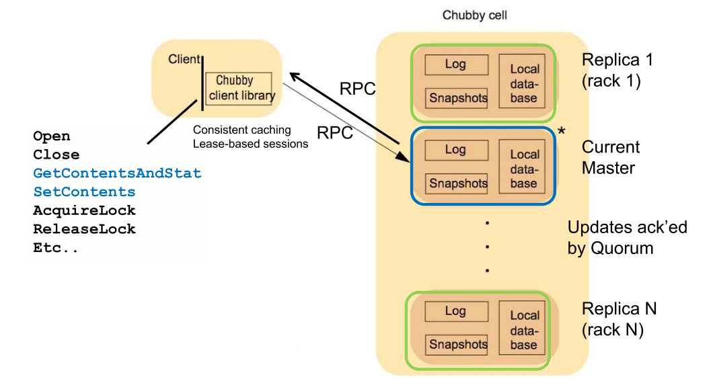


### Locks and Files

* Filesystem like interface:

```pseudocode
fh=Open(“/ls/exampleCell/gfs/master”)
success=tryAcquire(fh)
if(success)
	write(fh,myID)
```

* Either Exclusive-Write lock or Shared-Read lock
* Subdirectories and (non-inherited) ACLs supported, but not links
* Locks are advisory (you can ignore the lock)
* “Whole-file” R/W


### Client to Master Communication

* All read/write requests go through the master
* Communication via RPC (through the library)
* The other replicas only get updates from the master
* How the client finds the master:
    * Send master location request to all replicas in DNS
    * Non-masters redirect to master
* Client sends all requests to master until negative answer
* Master notifies clients if files modified, created, deleted, lock status changes (push
* Master notifies clients if files modified, created, deleted, lock status changes (push; saves bandwidth compared to constant polling)
    * Master is stateful


### Read and Write

* Reads are handled by the master
* Write: Successful if majority of replicas acknowledge receipt of update
    * Usual Prepare – Promise – Accept – Accepted (Paxos)

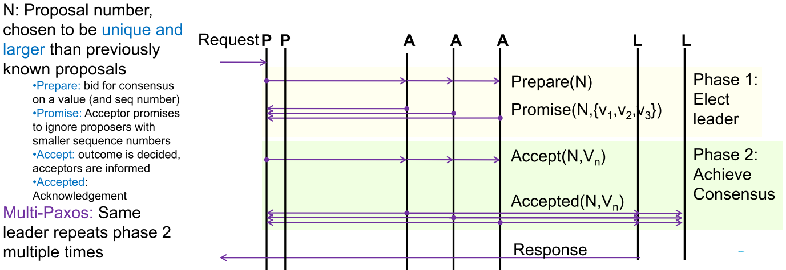


### Client Sessions

* **Sessions** maintained between client and server
* Client Failure
    * Master promises service for “lease time”
    * Clients make **“Keep-alive”** RPCs to maintain session; master returns extended lease time (eg. 12 sec)
    * If session is lost, server releases any client-held handles.
* Master failure
    * If client does not get a renewed lease, session is in jeopardy
        * Clear local cache
        * Wait for “grace period” (about 45 seconds)
        * Continue attempt to contact (possibly new) master
    * Successful attempt => ok; jeopardy over
    * Failed attempt => session assumed lost


### Cache Consistency

* Clients cache all file content to reduce read traffic
* Strict consistency
    1. A file-modification is blocked until all caches are invalidated
    2. Invalidation messages are piggybacked on keep-alive messages
    3. Clients flush cache, and acknowledges (piggybacked on lease-renewal)


### Master Re-Election

* If replicas lose contact with master, they wait for grace period (shorter: 4 - 6 seconds)

* On timeout, hold new election
* The new master updates the DNS, gets a recent copy of the database, etc.
* But how do the replicas agree on one (!) new master?
* Paxos algorithm
    * Also used to propagate write updates to the replicas


### Conclusions

* An “easy-to-use” file and locking service
* Integration of well-known (but advanced) techniques
* Rarely used code for fail-over contained “a rich collection of interesting bugs”
* Extensive verification/testing necessary


Google testing motto:

* If it ain’t broke, you are not trying hard enough!


## BigTable - A High-Performance Storage System

Database used by Google

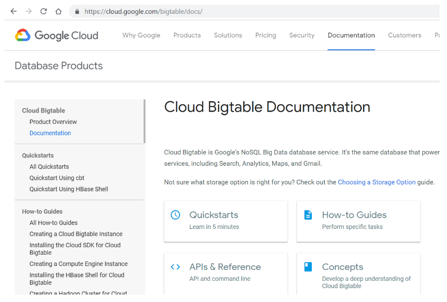

* Distributed storage system: PBs, across 1000s of servers
* Row/Column abstraction for storing data
* Distributed Persistent multi-level sorted map

(Keys are normally 10-100 bytes, max 64 KB)

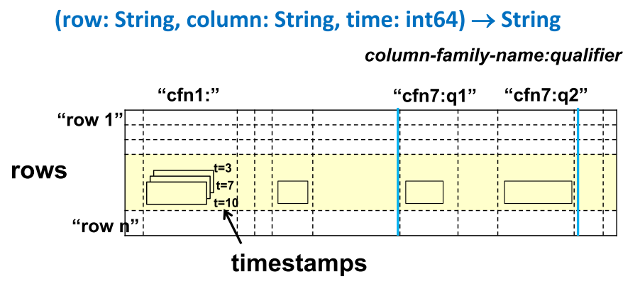

(Qualifiers are used to address individual column within family)


### Example: "Web-table"

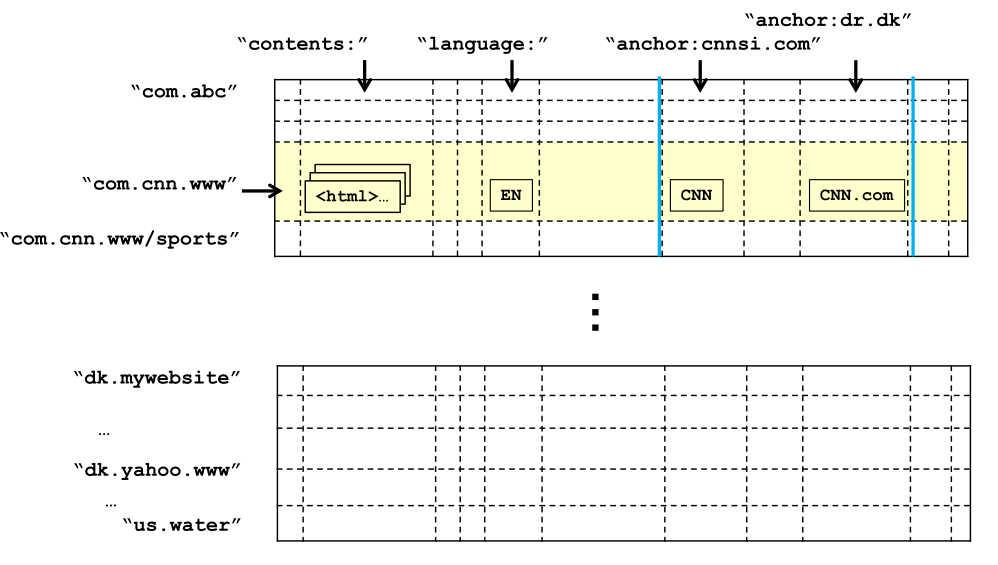

Rows are lexicographically sorted: 

* Webtable domain names are reversed so we group related pages. 
* Efficient domain analysis: related information likely stored in same tablet!

All row accesses are atomic!


### BigTable Applications (2006)

Example: Google Analytics stores information on raw clicks associated with users in one table and summarizes analyzed information in a second table.

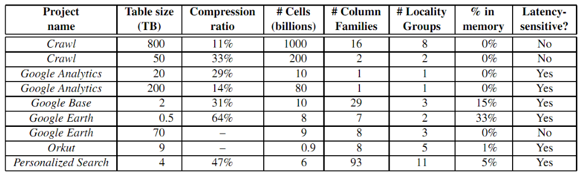

* Analytics: row = user session (sitename, starttime)
* Earth: row = geographical segment, column family = sources of data
* Personalized Search: row = userid, column family = type of action (search, webaccess)


### Tablets

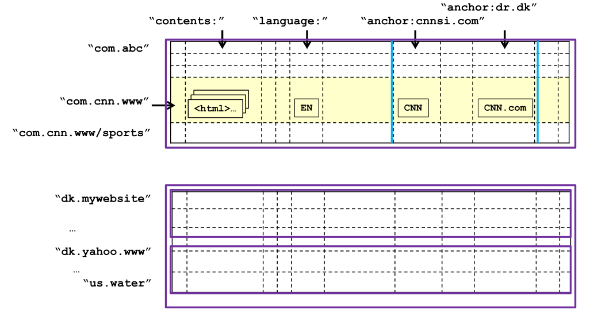

* Tablet = consecutive set of rows
* Size ~ 200MB
* Tablets can be split/merged if too large/small
* Each tablet is served by one Tablet Server (similar to a GFS chunkserver)
* Stored in “Sorted Strings Table” SSTables (indexed keyvalue maps) file format in GFS
    * immutable
* Row access is atomic


### System Structure

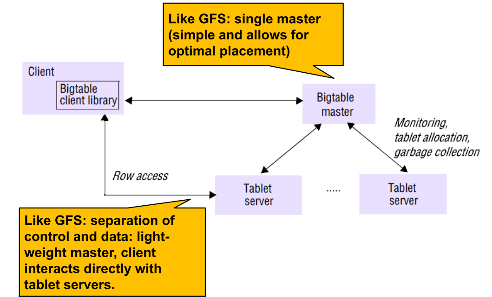

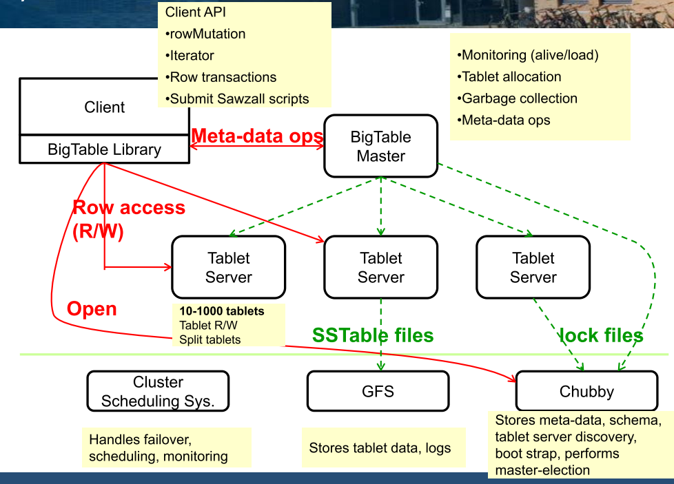

* Main goal of the BigTable infrastructure: (1) manage tablets and access and change associated data…
* … and (2) map tablet structure into the underlying file system.
* BigTable Master is stateless: all data in Chubby!
* Live set of servers detected via Chubby.
* BigTable Master: 
    * Tablet assignment: one server at a time.
* Tablet Server
    * Tablet localization: Tablets stored in a B+Tree: B-tree (range of keys in each level), where stored at the leaves (only)


### Tablet Localization

System maintains B+ tree index (in BigTable!) 

Clients searches index 

Clients cache tablet locations

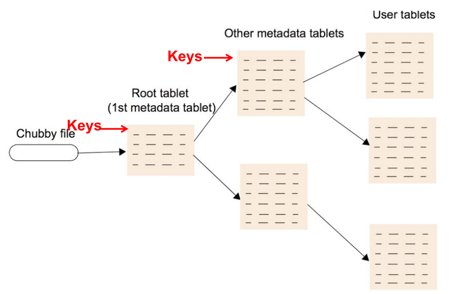

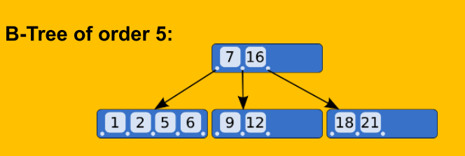

Eg. 128MB (2^27^) Meta-data tablets (1kB=2^10^ per key) in 2 index levels addresses 2^34^ tablets (of each 128Mb= 2^61^ B)


### Tablet Serving

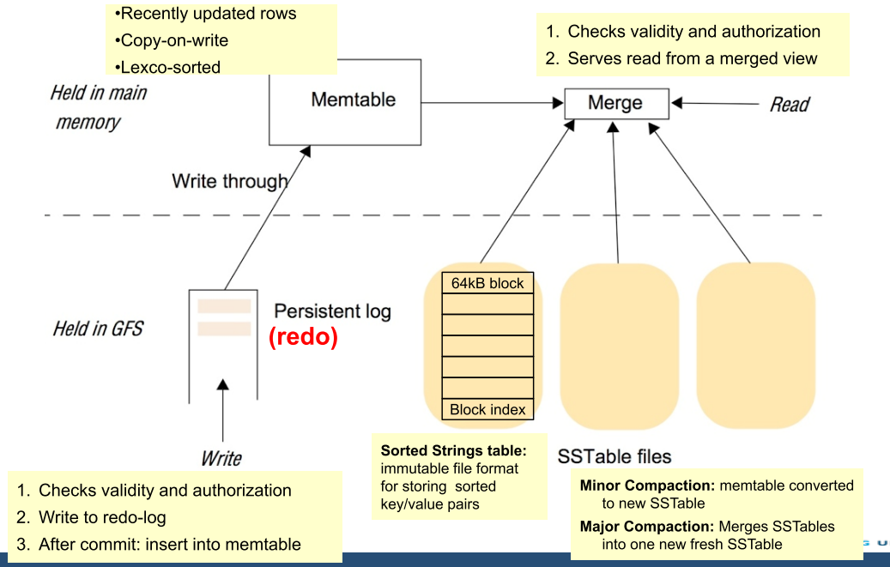


### BigTable Features

* **Single-row transactions**: easy to do read/modify/write operations
* **Locality groups:** segregate columns into different SSTables
* **In-memory columns:** random access to small items
* **Suite of compression techniques:** per locality group
* **Bloom filters:** avoid seeks for non-existent data
    * Probabilistic set membership test: is item in set?
        * Answer: “definitely not” no need to look up!
        * Answer: “maybe in set”.
* **Garbage Collection** of (immutable) SSTable Files


### Performance

Anno 2006 [Chang et al - TOCS 26(2)]

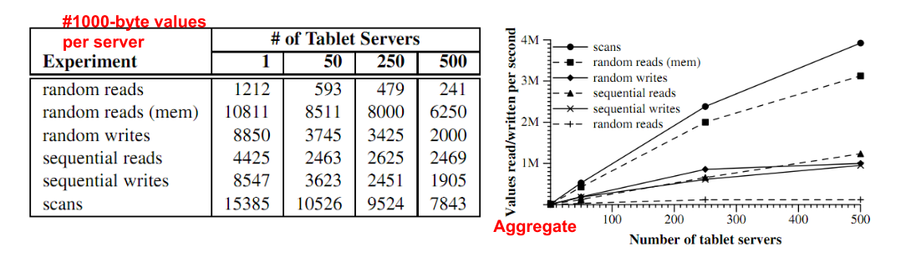

* “Mem” = locality group marked to be placed in-memory
* Random reads are slow because much data transferred from GFS, but little utilized, 1200 reads/s ~75MB/S
    * Random reads are slow: cannot exploit locality, much data from GFS not used.
    * Reads in memory much faster.
* Sequential read: better: same block hit 64 times
    * Sequential reads faster: entire block used!
* Scans: use API for scanning over all values in a row range
* Good scalability for most operations, but not linear due to load imbalance


### Status (2009)

* Continuous development
    * Scaling, robustness
    * Replication: eventual consistency replication across data centers (user facing services)
* ~500 BigTable clusters
* Largest cluster:
    * 70+ PB data; sustained: 10M ops/sec; 30+ GB/s I/O


## Summary

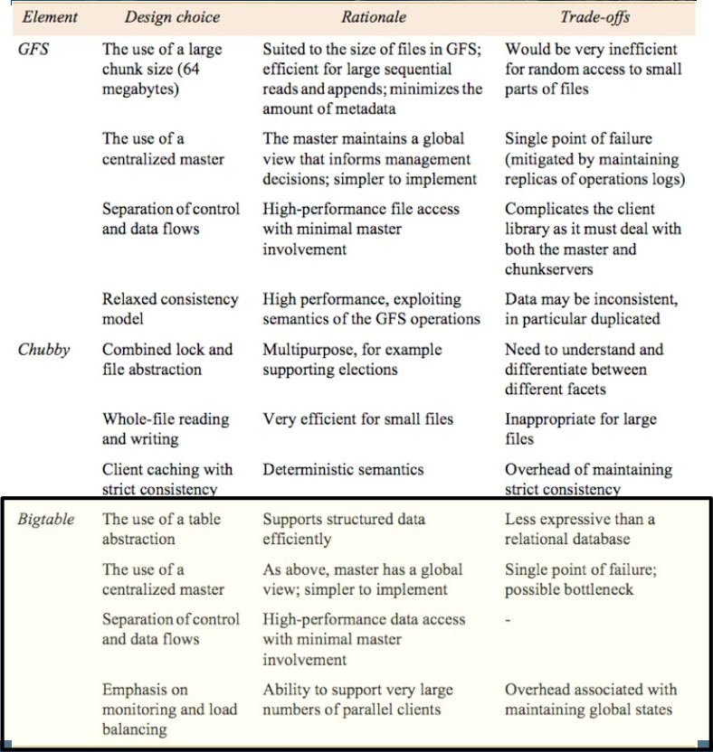

