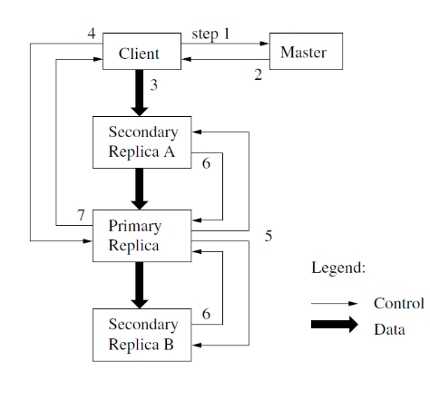

# Cluster Data Storage - Googles Infrastructure

## Google Application

* Search engine
* Cloud Applications: Gmail, Gdrive, messaging (Google Talk), Calendar, Docs, Maps, Earth, YouTube, …
* PaaS

## Original Search Engine

## Applications / Workload

* Offline batch jobs
    * Large datasets (PBs), bulk reads/writes (MB chunks)
    * Short outages acceptable
    * Web indexing, log processing, satellite imagery, etc.
* Online applications
    * Smaller datasets (TBs), small reads/writes (KBs)
    * Outages immediately visible to users, low latency vital
    * Web search, GMail, Google Docs, etc.
* Many areas:
    * Information retrieval
    * Machine learning
    * Image/video processing
    * Natural language processing
    * Machine translation
    * ...

## Cluster Architecture

<http://www.google.com/about/datacenters/index.html> 
<https://www.youtube.com/watch?v=XZmGGAbHqa0>

* Groups of clusters stored in different places in the world

### Normal Events in Large Clusters

Typical first year for a new cluster:

* ~0.5 **overheating** (power down most machines in <5 mins, ~1-2 days to recover)
* ~1 **PDU failure** (~500-1000 machines suddenly disappear, ~6 hours to come back)
* ~1 **rack-move** (plenty of warning, ~500-1000 machines powered down, ~6 hours)
* ~1 **network rewiring** (rolling ~5% of machines down over 2-day span)
* ~20 **rack failures** (40-80 machines instantly disappear, 1-6 hours to get back)
* ~5 **racks go wonky** (40-80 machines see 50% packet loss)
* ~8 **network maintenances** (4 might cause ~30-minute random connectivity losses)
* ~12 **router reloads** (takes out DNS and external vips for a couple minutes)
* ~3 **router failures** (have to immediately pull traffic for an hour)
* ~dozens of minor 30-second blips for dns
* ~1000 individual **machine failures (eg DRAM)**
* ~thousands of **hard drive failures**

* slow disks, bad memory, mis-configured machines, flaky machines, etc.
* Long distance links: wild dogs, sharks, drunken hunters, etc.

Large variety of Software bugs, crashes

### Original Cluster Philosophy

* Use software techniques for fault tolerance
* Use replication and parallelism for throughput and availability
* Buy HW with best price/performance ratio, not absolute performance
* “Unreliable”, low-performance commodity HW
    * $\Rightarrow$ minimize cost (incl. depreciation, operation costs) per query

## Google Infrastructure

## Cluster Services

> Jeff Dean (Google)

### Google's Borg

* Borg: Google’s cluster manager
    * runs >100k jobs, >1k different applications, across 10k machines
* Goal: high resource utilization, fast recovery time
    * uses admission control
    * efficient task-packing and over-commitment
    * scheduling policies that reduce the probability of correlated failures
    * machine sharing with process-level performance isolation

## GFS - A Distributed Filesystem

### Design Assumptions

* Component failures are normal
* Few very large files
* Optimized towards Google Workload (processing of bulk-data):
    * Large **sequential reads**, few small random reads
    * Frequent **(concurrent) append**, rare concurrent random writes; multiple producers/single consumers of data to same file
    * **High sustained throughput** more important than latency
* Non-POSIX API:
    * create, delete, open, close, read, write
    * snapshot: fast copy of a file or a directory tree
    * record append: multiple clients append data to the same file
        * guaranteed consistency
        * location of append not decided by the client

### Architecture

### Passive Replication - Write

1. Ask master who is primary (leasing) for chunk x
2. the identity of the primary and the locations of the other (secondary) replicas.
3. The client pushes the data to all the replicas in a forwarding chain
4. Once all the replicas have acknowledged receiving the data, the client sends a write request to the primary.
5. The primary forwards the write request to all secondary replicas. Each secondary replica applies mutations in the same serial number order assigned by the primary.
6. The secondaries all reply to the primary indicating that they have completed the operation.
7. The primary replies to the client.
    * Any errors encountered at any of the replicas are reported to the client (a subset of replica’s modified)
    * Client retries
    * File may be inconsistent

### Consistency Model

* File namespace mutations (e.g. file creation) are atomic (handled by master)

* A file region is

    * *“Consistent”* if all clients see same data (from all replicas)
    * *“Defined”* if consistent and clients see writes in their entirety

* Append: record is appended atomically *at least once somewhere*

    

* Applications can handle inconsistent regions

### Replica Management (Master)

* Replica placement
    * Spread replicas over different racks to optimize availability and bandwidth, but at an increased cost of writes (inter-rack-communication)
* New Chunk allocation:
    * consider disk utilization, number of recent allocations to same disk, and placement across racks
* Re-replication
    * When too many replica’s are unavailable
    * Higher priority when replication factor is low
* Re-balancing
    * to ensure uniform load and disk utilization
* Garbage Collection
    * delete chunks with outdated version number, deleted files

### Fault Tolerance of Master

* Master state (Operations-log and its check-points) is replicated and maintained in stable storage
* Relatively easy/fast recovery
* Shadow masters (read-only) provide read-only access
* External failure detection mechanism detects master failure, selects a new master, and restarts it.

### Performance (2003)

* Micro-benchmark: performance test of basic functionality / selected aspects (in a reduced controlled setting)
* 1 master (2 shadow replicas), 16 chunk servers, 16 clients, 100Mbps network cards (12.5 MB/S) ,1 Gbps link between switches (125 MB/s)

Example results (anno 2003):

Behavior in real-life workload, real-life setup:

* A for R&D
* B is a production cluster

* A’s network limit is 750 MB/s
* B’s network limit is 1300 MB/s

Chunk Recovery

* When a chunk server fails or is killed, some chunks are under-replicated (not enough replica)
* 1 (out of 3) chunk server with 15000 chunks (600 GB) killed
    * Restored in ~23 minutes
* 2 (out of 3) killed
    * Restored to 2x replication in 2 minutes
    * Prioritization kicks in

### Conclusions

* Apparently successful DFS
    * For commodity clusters
    * Dedicated to Google's workload
* Key infrastructure enabling many of their services
* Interesting replica management system, but few details / policies provided

**Since 2012: Colossus file system**

* “Hölzle calls Colossus "similar to GFS – but done better after ten years of experience.“
* <https://www.wired.com/2012/07/google-colossus/>
* <https://cloud.google.com/files/storage_architecture_and_challenges.pdf>