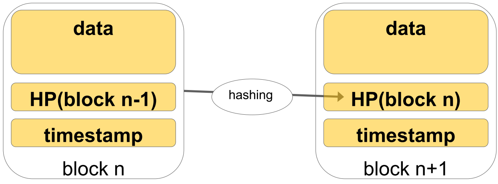

## Crypto Tools

* Hash
* Signatures
* Asymmetric crypto
* Merkle Trees

### Cryptographic Hash Function

$$
H: X = \{0,1\}* -> Y = \{0,1\}^L
$$

* with L fixed:
    * Examples for L: 128/160/256/512 bits

* Informal property
    * a small change in the input produces a completely different output
* Security properties (collisions exist, but are hard to find):
    * Pre-image resistance: $\forall y \in Y$, it is hard to find $x \in X$ such that $H(x)=y$
    * Second pre-image resistance: given a particular $M \in Y$ and this $h=H(M)$, it is hard to find $M'$ with $H(M')=h$
    * Collision-resistance: it is hard to find $x_1 \in X$ and $x_2 \in X$, with $x_1 \neq x_2$ and $H(x_1)=H(x_2)$


#### Case Study: Rock Paper Scissors

* Let us play over the internet
    * You play your rock / paper / scissors move
    * I play my move
    * One wins
* Ideally, we could play at the same time but my cam is not working, and there is some jitter on the audio
    * Or the rock-paper-scissors championship is today, and I have no 4g connection, so we play via email
* Well, tell me your move, and you can trust I will tell you mine!!!
* Or can you do something using hash functions?


##### Solution 1

* M – your move
* H – Hash function


* You tell me H(M)
* I will then tell you my move

Does this work?

* **No**! You can just run rock paper and scissors through rock

##### Solution 2

* M – your move
* H – Hash function
* S – random string computer by you (salt)
* || - concatenation


* You tell me H(M||S)
* I will then tell you my move

Does this work?

* What if I don’t trust you?
    * Nor your uncle working at NSA!

##### Solution 3

* M – your move
* H – Hash function
* S – random string computer by you (salt)
* || - concatenation
* T – a nonce / a timestamp / a string I send you


* You tell me H(T||M||S)
* I will then tell you my move


#### SHA: Secure Hash Algorithm

* The Secure Hash Algorithm is a family of cryptographic hash functions published by the National Institute of Standards and Technology (NIST) as a U.S. Federal Information Processing Standard (FIPS)


> <https://en.wikipedia.org/wiki/Secure_Hash_Algorithm>


Bad algorithms in red:


#### Usage

* I want to use hash functions to sign a large data structure
    * I compute the hash h
    * I send you the hash using a secure/expensive channel
    * I send you data using normal channel
    * If your H(data) is not h, **you know it is bad!**
* You would have to ask for the **whole data** once again
* Ok, let’s split data in chunks $c_1 \dots c_k$
    * I compute the hashes $h_1 =H(c_1) \dots h_k = H(c_k)$
    * I send you the hashes using a secure/expensive channel
    * I send you data using normal channel
    * If your $H(c_i)$ is not $h_i$, **you know it is bad**, and I just ask for $c_i$
* All cool, but sending **all the hashes** is heavy
    * **One per chunk!**


#### Lets Chain the Hashes

Let’s split data in chunks $c_1 \dots c_k$

* I compute the hashes $h_1 = H(c_1), h_2 = H(c_2 | h_1) \dots h_k =H(c_k|h_{k-1})$
* From time to time, you can ask me a hash, for example $h_{10}$ to verify the first 10 chunks (blocks). Later on, you ask me $h_{20}$ to verify the chunks 11 to 20


### Digital Signatures - Asymmetric Cryptography

Three algorithms: KeyGen, Sign, Verify

* `(sk, pk) := generateKeys(keysize)`
    * `sk`: secret signing key
    * `pk`: public verification key
* `sig := sign(sk, message)`
    * Computes the signature of the message using the secret key
* `isValid := verify(pk, message, sig)`
    * Decrypts the signature using the public key and compare the result with the message, given the property
        * `verify(pk, message, sign(sk, message)) == true`

#### **Performance**

* Algorithms using private/public keys are very slow
* Usually, the message is hashed with a known algorithm
    * known = I publicly declare which algorithm I am using
* Then, I compute the signature on the hash
* The receiver will decrypt the signature using the public key, compute the hash of the message, and compare

#### In Java

```java
import java.security.KeyPair; 
import java.security.KeyPairGenerator; 
import java.security.NoSuchAlgorithmException; 
import java.security.PrivateKey; 
import java.security.PublicKey; 
import javax.crypto.Cipher;
```


### Merkle Tree - Hash Tree

A data structure summarizing information about a big quantity of data with the goal to check the content

Introduced by Ralph Merkle in 1979

* Combines hash functions with binary tree structure

Main ingredient: a **complete binary tree** built starting from a initial set of symbols

* exploits a hash function H (SHA1, MD5)
* leaves: H applied to the initial symbols
* internal nodes: H applied to the sons of a node


#### Example

* 4 blocks


* Hash them


* Now concatenate them


* Hash the concatenation of the hashes


* And repeat, so on and so forth

    

* If data B is corrupted, it invalidates one whole branch of the tree


#### Building a Merkle Tree

* Let us organize all data as leaves of the hash tree
    * Nodes at height h will depend on 2^h^ leaf values
    * Tree of height H has $N= 2^H$ leaves
* Obtaining the root **P** requires calculating all N leaf values plus $2^H-1$ more hash function evaluations
    * Is it too much work?
        * **It is 2N**


#### Benefits of a Merkle Tree

* Let us store the root of the hash tree somewhere!
    * If suspicious, you can ask me for all data and verify the root is right
* Compute the root from all the data
    * You can cache the hashes of the “witnesses” for performance
    * You can hash elements “as you go” if data are produced slowly


## Blockchain


* *A blockchain is a digitized, decentralized, public ledger of all cryptocurrency transactions. Constantly growing as ‘mined’ blocks (the most recent transactions) are recorded and added to it in chronological order, it allows market participants to keep track of digital currency transactions without central recordkeeping. (merkle tree)*
* Wikipedia: “A distributed database that is used to maintain a continuously growing list of records, called blocks. Each block contains a timestamp and a link to a previous block”

### Hash Pointer

* A pointer to where some info is stored
* A cryptographic hash of the info

If we have a hash pointer, we can

* ask to get the info back
* verify that it hasn’t changed

Tamper-evident data pointer = Hash Pointer (HP)


### Blockchain



* Information organized into blocks
* Each block has a hash pointer (HP) to previous block
* To verify block n, has it and compare to HP(block n)
    * Which is contained into your block n+1
* Tamper free block addition


"tamper-proof linked list"


### Tampering


* If you tamper with data in block $i$
* You **have** to tamper with hash pointer $i+1$, hash pointer $i+2$ and so on
    * Since HP $i+2$ depends on HP $i+1$ and so on
* And I will store the HP on the head somewhere safe
    * Where? Everywhere!


### Blockchain as a Decentralized Database

* Information held on a blockchain exists as a shared — and continually reconciled — distributed database
* The blockchain database isn’t stored in any single location, meaning the records it keeps are truly public and easily verifiable
* No centralized version of this information exists for a hacker to corrupt
* Hosted by millions of computers simultaneously, its data is accessible to anyone on the internet


#### Blockchain Network Architecture

**Node**

* A computer connected to the blockchain network using a client that performs the task of validating and relaying transactions) gets a copy of the blockchain, which gets downloaded automatically upon joining the blockchain network
* Every node is an “administrator” of the blockchain, and joins the network voluntarily (in this sense, the network is decentralized)


### Double Spend Conundrum

Let us describe an example on bitcoins

* Information in ledger is the transaction
    * I write in the blockchain that I gave you $$$ in exchange for something
    * You can use the information in the block to show you own “my old” money
* I take status A of the blockchain, I write on a block I give you 100$ and send it around
    * You receive it from the network, you believe you can spend “my old” money, and provide me services
* Then I take status A of the blockchain and add another transaction to your colleague
    * He thinks he has “my old” money, and provides me services
* Double-spending is the result of successfully spending digital money more than once
* Protects against double spending by verifying each transaction added and ensuring that the inputs for the transaction had not previously already been spent
* Need to have just one valid blockchain, always growing with all accepted transactions, and validated by means of consensus


### Consensus

Can we use Paxos?

* As soon as you provide me services, I create 1,000,000 fake ids (Sybil attack) and I distribute the second blockchain
* It has consensus! I can double spend my $$$!!
* The problem is that creating new identities is cheap

Let us do something that is not so cheap


### A Blockchain Transaction


* Make step (4) expensive!
    * Slow
    * Lot of computation
    * High computation time


### Nakamoto Consensus

Let us decide that all the nodes send to each other the blockchain


* But a fork is natural in distributed systems!

**The rule: The longest blockchain has consensus!**


* I consider that
    * adding a block is computationally expensive
    * most nodes are honest
* If I receive a blockchain that is shorter than mine, I ignore it
    * It was created later than mine
    * It can be out of sync


A transaction is “accepted” if it is buried deep enough


* If I see a longer blockchain, I embrace it, and try to add my blocks to it.
* Statistically, the accepted transaction will not be eaten by a newer (shorter) transaction
    * All transactions added in the blocks are immutable
    * e,.g.: no double spending


### How to Make Adding a Block Expensive

**Proof of Stake** 

* For a later class

**Proof of Work**

* Provide a computational (hashing) puzzle that is
    * hard to solve when you want to add a valid block
    * easy to solve when you want to verify that a block is valid
* All the nodes working actively to support the blockchain (miners, more on this later) take e.g.: 7 seconds to add a block
    * You cannot start working on your fork before a transaction is accepted, which implies adding N blocks
    * Your malicious computers will not be able to redo the work on your fork (adding N+1 blocks) faster than all other miners add blocks

**We still have to specify 2 things**

* The *proof of work* puzzle
* What is inside this *immutable transaction* data structure


#### The Puzzle

* I insert a *nonce* in the header
    * It has to be hashed together with the rest of the header
* The *nonce* is good when H(header) starts with n zeros
    * Need to select nonces *at random* until one fits the puzzle
    * n defines how hard it is to add a new block
* We use SHA256, I give you challenge n = 36
    * Each nonce has prob $2^{-36}$ of success
    * When you succeed, only takes me one hash to check


#### The Transaction

* “User P1 transfers 200$ to User P2”
* I can go back one (or more) blocks to verify that User P1 owned the money


### Summary


## Transactions

Are you really happy with the description of the data structures and algorithms?

* User P1?
* Verification of transactions?

### User

* A user is somebody who can transfer money
    * A wallet, a user’s identity, a pair (sk : private key, pk : public key)
* Transaction: ([input transactions], [output identity pk, how much], signature)
    * The input transactions refer to previous transactions that transferred money to the user
    * It specifies to whom transfer each fraction of the money, by means of users’ public keys
    * It signs the transaction with its private key


### Transactions


### Characteristics of the Transaction

* Since it is signed with the sk, only the owner of the identity can transfer (spend) that money
    * If it points to input transactions from different identities p1 … pk, it will sign the transaction with all the s1 … sk to prove it owns the money
* All money from input transactions must be used
    * But part of the money can be transferred to the same user
    * Or another public key of the same user – for privacy
* Privacy: a real-life user can create one identity (sk,pk) each time it wants to receive money


### More General Case - Scripts


### General Output of a Transaction

* It contains a challenge script (also called locking script or scriptPubKey) with:
    * the spending conditions under which the bitcoins associated can be spent

Usually, it requires just a valid signature. Other cases:

* It can be a script, encoded in a non-Turing complete language
    * To protect miners against DOS attacks (`while true {}`)
* An m-of-n multisignature challenge script
* Temporal parameters for automatic billing over time


### Transactions in a Block

* Transactions are received continuously by nodes looking to solve the puzzle
* Organized into a Merkle tree
* Root hash is part of the new block header, thus it is part of next block’s hash


#### Why the Merkle Tree?

* The Merkle tree can be computed as transactions are received
    * No need to recompute the hash of all the transactions after one is received
* Need to have always the data of the block of the blockchain
* Anyway, possible to discard branches of the Merkle tree when all its money is spent, and keep the hash only on the disk


### How Does Everything Add Up?

A miner will:

* Verify all the transactions by looking that input transactions are covered and properly signed
* Compute the Merkle root hash for the transactions
* Solve the puzzle on the previous block, for immutability
* Broadcast the new header
* Go on collecting new transactions for next block


#### Why Be a Miner?

* Incentives: every new block that gets accepted provides a number of bitcoins by default to the miner who found the nonce
* Fees: for each transaction, some difference between input and output, and the difference is paid to the miner
* Anyway, what a waste!
    * Bitcoin blockchain network’s miners are attempting 450 thousand trillion solutions per second in efforts to validate transactions
    * Vast amounts of energy necessary to process and store transactions
    * Wasted resources: energy for $15million/day


## Beyond Bitcoin

* The challenge scripts could do much more than in Bitcoin
* Smart Contracts: Computer protocols that facilitate, verify, or enforce the negotiation or performance of a contract, or that make a contractual clause unnecessary
* Define the rules and penalties around an agreement in the same way that a traditional contract does, but also automatically enforce those obligations (code is law


### Ethereum


#### Turing Complete Contracts on a Blockchain

* Contracts are the main building blocks of Ethereum, the second most popular blockchain
* A contract is a computer program that lives inside the distributed Ethereum network and has its own ether balance of Ether (Ethereum’s cryptocurrency / cryptofuel), memory and code.
* Every time you send a transaction to a contract, it executes its code, which can store data, send transactions and interact with other contracts.


#### Like a Jukebox

* Can be activated and run, by funding it with some Ether

    * to run, create a transaction sending a payment of ETH to the contract, and possibly supplying some other input information
    * the contract runs at most for a time dependent on how much gas (1 ETH = many many gas units) you paid
    * ETH fees are for the winning miner

* Each miner runs the smart contract, and produces same output

    * winning miner will publish the block to the rest of the network
    * other miners validate that they get the same result

    


## Summary


## Five Point Test

Is blockchain for everything? 

* No!

