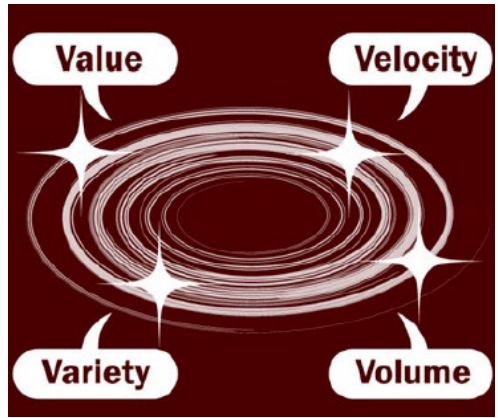
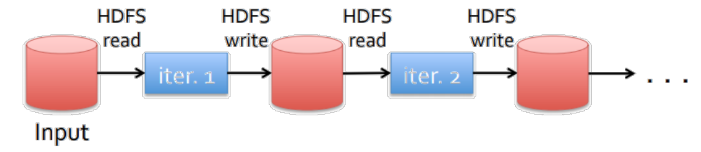
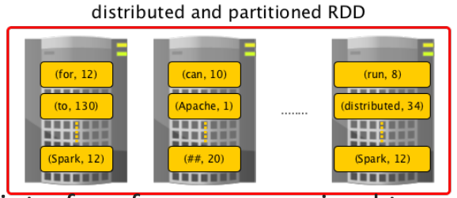
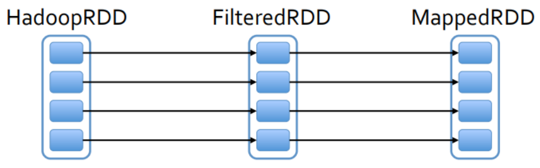
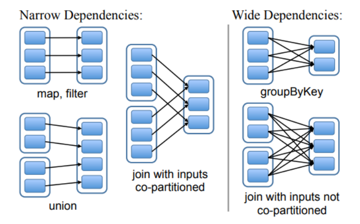
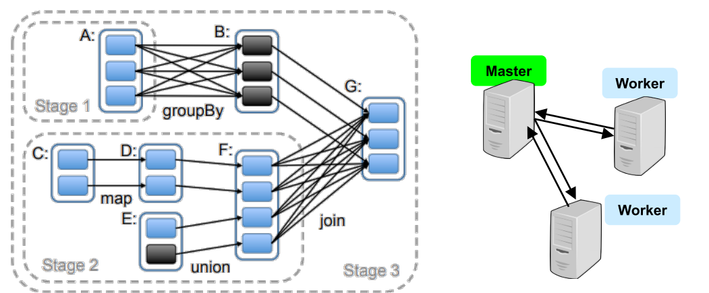
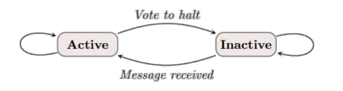
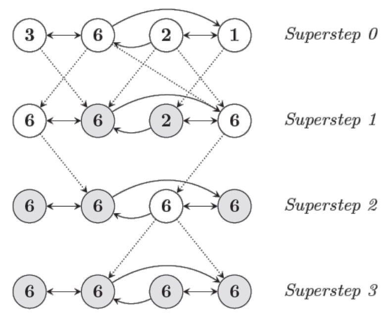

# Big Data Analytics

With a focus on Google

## Big Data

International Data Corporation:

* In 2011, 1.8 ZB of data produced (~ 10^21^ B)
* Number likely to double every 2 year

In contrast to traditional data:

* Data sets are often **less structured** (not perfectly suited for traditional data bases)
* Data require more real-time analysis


Google processes Petabytes of data each year, Facebook generates logs of 10 PB per month, Alibaba generates 10s of TB trading data per day, 72h new YouTube content per min!


### The 4 Vs

* **Volume**: the large scale of data collection and processing
* **Velocity**: timeliness of data and analysis
* **Variety**: different types of data, semi-structured and unstructured (e.g., text)
* **Value**: huge value but low density




### Examples

* Social Media and web
    * Facebook: pictures, movies, status-updates,..
    * YouTube: Videos
    * Google Analytics: ”user clicks”
* Enterprise 
    * Trading and product data
    * Parts tracking 
    * Log data
* Internet of things
    * today small, but expected that by 2030 the largest set (1 trillion sensors)
    * smart cities based on IoT, agriculture, transportation, medical data…
    * sensing: either simple numerical data or multimedia (surveillance stream) 
* Bio-medical data
    * gene sequencing and gene diagnosis
    * China national genebank: over 1 mio humans, animals and plants
    * US gene bank: over 150,000 different organisms


### Key Challenges

* Data representation
    * heterogeneity in type, structure, semantics, organization, granularity, and accessibility, …


!!! todo
    finish notes


## Spark

Nice: Map Reduce…

* let programmers write parallel computations using a set of high-level operators
* without having to worry about work distribution and fault tolerance

… however: no abstractions of distributed memory

* inefficient for an important class of emerging applications which reuse intermediate results across multiple computations



Data reuse important: in iterative machine learning and graph algorithms, e.g., PageRank, K-means clustering, regression…

… and interactive data mining: user runs multiple adhoc queries on the same subset of data

### RDD

Spark relies on a new abstraction: resilient distributed datasets (RDDs)

* Immutable, partitioned collections of records (normally in RAM)
* are fault-tolerant, parallel data structures
* enable efficient data reuse in a broad range of applications
* that let users
    * explicitly persist intermediate results in memory,
    * control their partitioning to optimize data placement, and
    * manipulate them using a rich set of operators



RDDs provide an interface for coarse-grained transformations

* e.g., map, filter and join
* can be applied to many data items simultaneously


A program performs a series of transformations

```SPARQL
lines = spark.textFile("hdfs://...") 
errors = lines.filter(_.startsWith("ERROR")) 
errors.persist() 
errors.filter(_.contains("Foo")).count() 
errors.filter(_.contains("Bar")).count()
```

A program performs a series of (lazy) transformations, each resulting in a new RDD

Action: launch computation and returns a value (e.g count)



An RDD does not have to be materialized all the time: rather, we store the „lineage“, information about how it was derived from other datasets (operations on RDDs).

* Storing the "lineage" enables efficient fault tolerance:
    * if a partition of an RDD is lost, the RDD has enough information about how it was derived from other RDDs to recompute it

When a partition is lost: RECOMPUTE


Up to 20x faster than MapReduce!


### RDD Dependencies

* Narrow Dependencies: each partition of the parent RDD is used by at most one partition of the child RDD
* Wide dependencies: multiple child partitions may depend on a parent (may require a shuffle of keys)



### RDD Execution Model

The scheduler launches tasks to compute missing partitions from each stage until it has computed the target RDD




## Pregel

* Like Spark: keeps intermediate results in memory
* However, more specific than Spark: **tailored to graph computations**
    * Scale: billions of vertices, trillions of edges
* Computational model: **Vertex-centric**
    * Typically # vertices >> # servers: good for load-balancing, and exploiting locality!
    * Programs are expressed as a sequence of iterations, in each of which a vertex (Super-steps)
        * can receive messages sent in the previous iteration,
        * send messages to other vertices,
        * and modify its own state,
        * mutate graph topology.

Vertex-centric and message-passing model often a better fit for graph algorithms than Map Reduce, e.g., shortest path computations, Page Rank, …!


### Vertex State-machine

* Algorithm termination is based on every vertex voting to halt
    * In superstep 0, every vertex is in the active state
    * A vertex deactivates itself by voting to halt
    * A message may re-activate a vertex



* The algorithm as a whole terminates when all vertices are simultaneously inactive and there are no messages in transit


### Example

Example: compute maximum



* In each super-step, any vertex that has learned a larger value from its messages sends it to all its neighbors.
* When no further vertices change in a super-step, the algorithm terminates.


### Implementation

* Master-worker model
    * Executed on Google’s clusters
    * Persistent data on GFS or BigTable
* **Master**
    * Monitors workers
    * Partitions graph verteces to workers: eg
        * `Hash(VertedID)%NoPartitions-> PartitionID`
    * More partitions per worker to balance load
* **Worker**
    * Execute compute() when starting a superstep
    * Buffer outgoing messages per destination worker
        * Flush&Send when full, or at the end of superstep
    * Report number of active vertices to master at end of every superstep.
* **Fault-tolerance through checkpointing** at every superstep