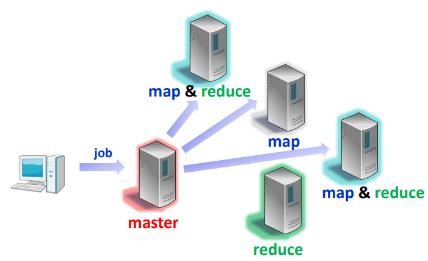
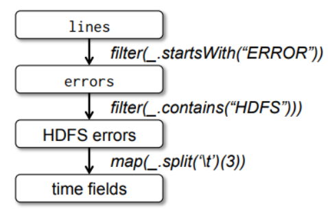

# Big Data Analytics

With a focus on Google

## Big Data

International Data Corporation:

* In 2011, 1.8 ZB of data produced (~ 10^21^ B)
* Number likely to double every 2 year

In contrast to traditional data:

* Data sets are often **less structured** (not perfectly suited for traditional data bases)
* Data require more real-time analysis

Examples

* Google processes Petabytes of data each year
* Facebook generates logs of 10 PB per month
* Alibaba generates 10s of TB trading data per day, 
* 72h new YouTube content per min!


### The 4 Vs

* **Volume**: the large scale of data collection and processing
* **Velocity**: timeliness of data and analysis
* **Variety**: different types of data, semi-structured and unstructured (e.g., text)
* **Value**: huge value but low density


### Examples

* Social Media and web
    * Facebook: pictures, movies, status-updates,..
    * YouTube: Videos
    * Google Analytics: ”user clicks”
* Enterprise 
    * Trading and product data
    * Parts tracking 
    * Log data
* Internet of things
    * today small, but expected that by 2030 the largest set (1 trillion sensors)
    * smart cities based on IoT, agriculture, transportation, medical data…
    * sensing: either simple numerical data or multimedia (surveillance stream) 
* Bio-medical data
    * gene sequencing and gene diagnosis
    * China national genebank: over 1 mio humans, animals and plants
    * US gene bank: over 150,000 different organisms


### Key Challenges

* Data representation
    * heterogeneity in type, structure, semantics, organization, granularity, and accessibility, …
* Compression
    * For example, most data generated by sensor networks are highly redundant, which may be filtered and compressed at orders
* Data life cycle management
    * Often only little data is relevant: which data shall be stored and which data shall be discarded
* Analytical mechanism
    * Traditional RDBMSs are often not scalable and flexible
    * Non-relational databases are becoming popular for processing unstructured data
    * New Computation models 
* Privacy
    * Remove sensitive data before delivering to third party for processing


### New Storage Mechanisms

File systems

* E.g., Google File System (GFS): not efficient for small files (Colossus solves some of these issues)
* Derived from GFS: Hadoop Distributed File System (HDFS) for map/reduce data

Databases

* Traditional databases do not sufficiently scale for big data and cannot deal with less structured data
* Popular paradigm NoSQL: provides eventual consistency only, much simpler and more flexible than traditional databases
* Popular non-SQL databases, e.g.:
    * **Key-Value Stores**: 
        * Amazon Dynamo, 
            * Memcachd, etc.: often based on consistent hashing (“1-hop DHT”)
    * **Column-oriented Databases**: 
        * like Google BigTable: both columns and rows can be segmented into multiple nodes, 
        * Cassandra, 
        * …


### New Programming Models

**Map Reduce**

* Two user defined functions (2 phases)
* Map
    * given key-value pairs, produce intermediate key-value pairs
    * Combine all values of the same key and send it to reducer
* Reduce: 
    *  further compress the value set of the same key

**Pregel**

* System by Google to process and analyze large graphs
* Executions in **super-steps:** In every superstep, vertex computations are parallel, and every vertex executes the same user-defined function to express a given algorithm logic
* Between super-steps, nodes can communicate (e.g., with neighbors)
* When all nodes inactive: done


### Zoo of data analysis tools and models - Layered Architecture

* NA - Non Apache projects
* Green layers are Apache/Commercial Cloud (light) to HPC (darker) integration layers


## Map-Reduce

Programming model for processing of large data sets

Used at Google: data mining on BigTable, graph algorithms (pagerank), indices, etc.

* Processes 20 pB/day

Open-source implementations widely used! 

* Apache Hadoop: Yahoo, Facebook, Amazon, …


### Computation Need - PageRank

* PageRank algorithm outputs a probability distribution that represent the likelihood that a person randomly clicking on links will arrive at any particular page.
* Initial Probability distribution: 1/N
* A nodes probability is divided among links
    * D gives 25%/3 to each of A, B, C. 
    * A receives 25%/1 from B, 25%/2 from C, 25%/3 from D: Pr(A)=0.458
* Page rank model
    * A virtual surfer continues with a probability (damping factor) d (typically=85%)
    * Picks another random page with 1-d (=15%)
        * $PR(p_i) = \frac {1-d} N + d\ \sum_{p_j \in M(p_i)} \frac {PR(p_j)} {L(p_j)}$
* May be computed iteratively until convergence


### MapReduce

* Massive parallel and distributed processing on clusters
* Inspired by functional programming
* Several frameworks and libraries that handle for you
    * Data transfer
    * Distributing the load in the cluster
    * Failure handling
    * ...


### Idea

Two functions

* **Map**: 
    * 
    * takes input data and produces (key,value) pairs
        * (k1, v1) $\to$ list of (k2, v2)
    * Combine all values of the same key and send them to reducer in charge of this key (**Shuffle**)
* **Reduce**
    * 
    * takes all values with the same key and produces result
        * (k2, list(v2)) $\to$ v3


### Classic Example - Word Count

```pseudocode
map(String key, String value):
	// key: document name
	// value: document contents
  for each word w in value:
    EmitIntermediate(w, "1")
    
    
reduce(String key, Iterator values):
	// key: a word
	// values: list of counts
	int result = 0
	for each v in values:
		result += ParseInt(v)
  Emit(key, AsString(result))
```


(*) beware: Commutative and Associative Operations

* Different reducers in charge of different keys/words.
* If same word multiple times in same document, mapper could in principle pre-aggregate those.


### Document Indexing

* Input:  Set of documents $D_1,\dots, D_N$
* Map
    * Parse document $D$ into terms $T_1, \dots, T_N$
    * Produces (key, value) pairs
        * $(T_1, D), \dots, (T_N, D)$
* Reduce
    * Receives list of (key, value) pairs for term $T$
        * $(T, D_1), \dots , (T, D_N)$
    * Emits single (key, value) pair
        * $(T, (D_1, \dots, D_N))$


### Google Maps


### MapReduce Execution

* One worker is the **master**
    * It assigns map & reduce jobs to the other workers
    * It stores the state of each map & reduce job
        * (idle,in-progress,completed) and 
        * the identify of all non-idle machines
    * It stores the locations of the output files of the map & reduce tasks




* MapReduce library in user program first splits input files into pieces (~16-64MB per piece).
* Then starts up many copies of the program on cluster of machines: M map tasks, R reduce tasks, and one Master (not a worker)
* Master assigns work: picks idle workers and assigns each one a map or a reduce task.
* Mappers read input, parse key/value pairs, and passes them to user-defined map function. The intermediate key/value pairs are buffered in memory, and periodically written to local disk. 
* The locations of these buffered pairs on the local disk are passed back to the master who responsible for forwarding these locations to the reduce workers.
* Reducer notified by master about key-value pair locations, uses remote procedure calls to read the buffered data from the mappers’ local disks. Then sorts and groups same keys. If the amount of intermediate data is too large to fit in memory, an external sort is used.
* The reducer passes the values to the user’s reduce function. The output of the reduce function is appended to a final output file for this reduce partition.
* When all map and reduce tasks have completed, the master wakes up the user program. At this point, the MapReduce call in the user program returns back to the user code.


### Performance Considerations

* **Locality**
    * Worker should be close to the GFS replica storing the data
    * 
* **Task Granularity**
    * Number of maps and reduces >> number of workers: 
        * better load balancing, but more overhead and state info at master
    * E.g., M=200000, R=5000, W=2000
* **Stragglers**
    * In large systems, nearly **always** some worker is slow
    * Schedule backup executions of remaining in-progress tasks when a phase nears completion
* User defined **partitioning function**
* **Combiners**: local reduce directly after map phase

* **Barrier synchronization / pipelining**
    * Can we start reducing while still mapping? 


### Failure Handling

* **Worker Failures**
    * Master periodically pings workers
    * Re-execution (map and reduce op’s are normally deterministic functions)
* **Master Failure**
    * Terminate whole job


### Effect on Performance - Stragglers and Worker Failures


### Hadoop - Word Count Example

```java
public class WordCount {
  // map & reduce are implemented as classes
  public static class Map extends MapReduceBase implements Mapper<LongWritable,Text,Text,IntWritable> {
    private final static IntWritable one = new IntWriteable(1);
    private Text word = new Text();
    
    public void map(
      LongWritable key, 
      Text value, 
      OutputCollector<Text,IntWritable> output, 
      Reporter reporter
    ) throws IOException {
      
      String line = value.toString();
      StringTokenizer tokenizer = new StringTokenizer(line);
      while(tokenizer.hasMoreTokens()) {
        word.set(tokenizer.nextToken());
        output.collect(word, one);
      }
    }
  }
  
  public static Reduce extends MapReduceBase implements Reducer<Text, IntWritable, Text, IntWritable> {
    public void reduce(
    	Text key,
      Iterator<IntWritable> values,
      OutputCollector<Text, IntWritable> output,
      Reporter reporter
    ) throws IOException {
      
      int sum = 0;
      while(values.hasNext()) {
        sum += values.next().get();
        output.collect(key, new IntWritable(sum))
      }
    }
  }
  
  public static void main(String[] args) throws Exception {
    JobConf conf = new JobConf(WordCount.class);
    conf.setJobName("wordcount");
    conf.setOutputKeyClass(Text.class);
    // configure map and reduce for this job
    conf.setMapperClass(Map.class);
    conf.setCombinerClass(Reduce.class);
    conf.setReducerClass(Reduce.class);
    
    conf.setInputFormat(TextInputFormat.class);
    conf.setOutputFormat(TextOutputFormat.class);
    conf.setInputPath(new Path(args[0]));
    conf.setOutputPath(new Path(args[1]));
    
    JobClient.runJob(conf);
  }
}
```

* This code can be run locally or in a fully-distributed Hadoop installation!


### Overall Execution of a Sawzall Program


### Conclusion

* Map Reduce widely used in cloud computing environments!
    * $\Rightarrow$ Open Source implementations available
* E.g., **Apache Hadoop**
    * Map/reduce for clusters of commodity HW
    * Main contributor (Yahoo)
    * Used at Yahoo, Facebook, NY Times, Amazon
        * Serialization, RPC, HDFS, …
        * Packaged in various “Enterprise Solutions” 
            * Yahoo, Cloudera, AWS Elastic MapReduce, SUN, IBM,..
* Some new research in generalized or tuned frameworks


## Spark

Map Reduce:

* let programmers write parallel computations using a set of high-level operators
* without having to worry about work distribution and fault tolerance

**However**: no abstractions of distributed memory

* inefficient for an important class of emerging applications which reuse intermediate results across multiple computations


* Overhead in data replication ,disk I/O, serialization, ...


* Data reuse important: 
    * in iterative machine learning and graph algorithms, e.g., PageRank, K-means clustering, regression
    * and interactive data mining: 
        * user runs multiple adhoc queries on the same subset of data

### RDD

Spark relies on a new abstraction: **resilient distributed datasets** (**RDDs**)

* Immutable, partitioned collections of records (normally in RAM)
* are fault-tolerant, parallel data structures
* enable efficient data reuse in a broad range of applications
* that let users
    * explicitly persist intermediate results in memory,
    * control their partitioning to optimize data placement, and
    * manipulate them using a rich set of operators


RDDs provide an interface for coarse-grained transformations

* e.g., map, filter and join
* can be applied to many data items simultaneously


A program performs a series of transformations

```SPARQL
lines = spark.textFile("hdfs://...") 
errors = lines.filter(_.startsWith("ERROR")) 
errors.persist() 
errors.filter(_.contains("Foo")).count() 
errors.filter(_.contains("Bar")).count()
```

* A program performs a series of (lazy) transformations, each resulting in a new RDD

* Action: launch computation and returns a value (e.g count)


* An RDD does not have to be materialized all the time: 
    * rather, we store the „lineage“, information about how it was derived from other datasets (operations on RDDs).
    * Storing the "lineage" enables efficient fault tolerance:
        * if a partition of an RDD is lost, the RDD has enough information about how it was derived from other RDDs to re-compute it

* When a partition is lost: RECOMPUTE



* Up to 20x faster than MapReduce!


### RDD Dependencies

* **Narrow Dependencies:** 
    * each partition of the parent RDD is used by at most one partition of the child RDD
        * map, filter, union, etc
* **Wide dependencies:** 
    * multiple child partitions may depend on a parent (may require a shuffle of keys)
        * groupByKey, reduce, etc.


### RDD Execution Model

The scheduler launches tasks to compute missing partitions from each stage until it has computed the target RDD


## Pregel

* Like Spark: keeps intermediate results in memory
* However, more specific than Spark: **tailored to graph computations**
    * Scale: billions of vertices, trillions of edges
* Computational model: **Vertex-centric**
    * Typically (number of vertices) >> (number of servers)
        * good for load-balancing, and exploiting locality!
    * Programs are expressed as a sequence of iterations, in each of which a vertex (**Super-steps**)
        * can receive messages sent in the previous iteration,
        * send messages to other vertices,
        * and modify its own state,
        * mutate graph topology.

Vertex-centric and message-passing model often a better fit for graph algorithms than Map Reduce, e.g., shortest path computations, Page Rank, …!


### Pregel Vertex State-machine

* Algorithm termination is based on every vertex voting to halt
    * In super-step 0, every vertex is in the active state
    * A vertex deactivates itself by voting to halt
    * A message may re-activate a vertex


* The algorithm as a whole terminates when all vertices are simultaneously inactive and there are no messages in transit


### Example - Compute Maximum


* In each super-step, any vertex that has learned a larger value from its messages sends it to all its neighbors.
* When no further vertices change in a super-step, the algorithm terminates.


### Implementation

* Master-worker model
    * Executed on Google’s clusters
    * Persistent data on GFS or BigTable
* **Master**
    * Monitors workers
    * Partitions graph vertices to workers: eg
        * `Hash(VertedID) % NoPartitions -> PartitionID`
    * More partitions per worker to balance load
* **Worker**
    * Execute `compute()` when starting a super-step
    * Buffer outgoing messages per destination worker
        * Flush&Send when full, or at the end of super-step
    * Report number of active vertices to master at end of every super-step.
* **Fault-tolerance through checkpointing** at every super-step