# Service-oriented Architectures

SOA is a set of principles for the design, deployment and management of both applications and software infrastructure using sets of loosely coupled services that can be dynamically discovered and then communicate with each other or are coordinated through choreography to provide enhanced services

Services become building blocks that form business flows

* Gartner 18 July 2006: SOA is entering the “trough of disillusionment”

Many different definitions

* Bad definition based on the technology used, since the principle is not just for “web-services”

Possible definitions: A service is:

* a discrete business function that operates on data
* a reusable component that can be used as a building block to form larger, more complex business-application functionality


## How Services Encapsulate Logic

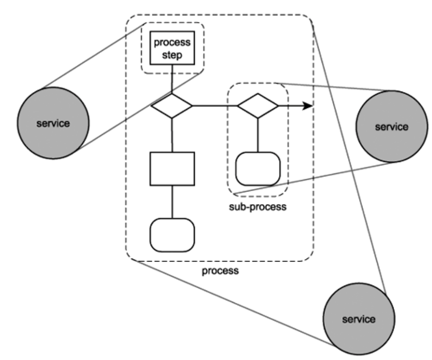

## SOA Manifesto

Made October, 2009.

* **Business value** is given more importance than technical strategy
* **Strategic goals** are given more importance than project-specific benefits
* **Intrinsic inter-operability** is given more importance than custom integration
* **Shared services** are given more importance than specific-purpose implementations
* **Flexibility** is given more importance than optimization
* **Evolutionary refinement** is given more importance than pursuit of initial perfection


## Properties of Services

Four properties of a service:

* **It is a black box for its consumers**
    * A service presents a simple interface articulated in endpoints to the requester that abstracts away the underlying complexity
    * The SOA infrastructure will provide standardized access mechanisms to *discover* services with service-level agreements
* **It is self-contained (loose-coupling between services)**
    * The consumer of the service is required to provide only the data stated on the interface definition, and to expect only the results specified on the interface definition
    * In the context of web services, loose coupling refers to minimizing the dependencies between services in order to have a flexible underlying architecture (reducing the risk that a change in one service will have a knock-on effect on other services)
* **It may consist of other underlying services**
    * It allow users to combine and reuse them in the production of applications
    * It should be based on open standards. Open standards ensure the broadest integration compatibility opportunities
* **It should be stateless**
    * The service does not maintain state between invocations
    * If a transaction is involved, the transaction is committed and the data is saved somewhere
        * The id of the transaction can provide context (sessions)


## What can we do with services?

* Multiple services can be composed (orchestrated) to provide the functionality of a large software application
    * Services must communicate with each other by passing data in a well-defined, shared format, or by coordinating an activity between two or more services
    * Thus, need for protocols that describe how they pass and parse messages using description metadata (for both functional and nonfunctional requirements such as QoS)
* Facilitated by technologies and standards that facilitate components' communication and cooperation over a network


## Innovation

Service Oriented Computing

The major innovation in SOC is the move from the object oriented paradigm to a service oriented one

* Object Oriented:
    * Object: stateful
* Service Oriented:
    * Service: stateless

### Object Oriented vs Service Oriented

| Features                                 | Object-oriented computing                                    | Service-oriented computing                                   |
| ---------------------------------------- | ------------------------------------------------------------ | ------------------------------------------------------------ |
| **Methodology**                          | Application development by identifying tightly coupled classes. Application architecture is hierarchical based on the inheritance relationships. | Application development by identifying loosely coupled services and composing them into executable applications. |
| **Level of abstraction and cooperation** | Application development is often delegated to a single team responsible for the entire life cycle of the application. Developers must have knowledge of application domain and programming. | Development is delegated to three independent parties: application builder, service provider, and service broker. Application builders need to understand application logic and may not know how individual services are implemented. Service providers can program but do not have to understand the applications that use their services. |
| **Code sharing and reuse**               | Code reuse through inheritance of class members and through library functions. Library functions have to be imported at compilation time and are platform dependent. | Code reuse at the service level. Services have standard interfaces and are published on Internet repository. They are platform-independent and can be searched and remotely accessed. Service brokerage enables systematic sharing of services. |
| **Dynamic binding and recomposition**    | Associating a name to a method at runtime. The method must have been linked to the executable code before the application is deployed. | Binding a service request to a service at runtime. The services can be discovered after the application has been deployed. This feature allows an application to be recomposed at runtime. |
| **System maintenance**                   | Users need to upgrade their software regularly. The application has to be stopped to perform the upgrading. | The service code resides on service providers' computers. Services can be updated without users' involvement. |


## Design Patterns

3 main roles:

* Service provider / publisher
    * Offers the service, registers it in the service broker for consumers to find
* Service consumer
    * Retrieves service providers from service broker, then uses the services
* Service broker / registry / repository


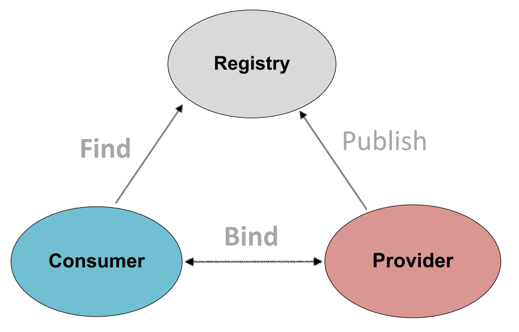


### Interoperability

* Formal interfaces and/or contracts (e.g.: [WSDL](https://en.wikipedia.org/wiki/Web_Services_Description_Language))
    * Describe the interaction protocol
    * Platform-independent, programming language-independent

* High-level programming languages (for orchestration, e.g.: BPEL) and specifications (for choreography, e.g.: WS-CDL, WSCoordination) to support the cooperation of fine-grained services into more coarse-grained business services
    * Also to incorporate into workflows and business processes


### Choreography

* Service composition where the interaction is specified from a global perspective, to describe a set of interactions, showing the behavior of each member of a set of participants
* For example: it might specify constraints on the order and the conditions in which messages are exchanged by participants
* Difference with orchestration: it is performed by the services itself
    * Orchestration is centralized


### SOLID Principles

(OOP, etc)

* Single-responsibility Principle: each component should do just one job
* Open/Closed Principle: your component should be open for extension but closed for modification
* Liskov Substitution Principle
    * if q(x) is a property provable about x of type T, q(y) should be provable for objects y of type S where S is a subtype of T
* Interface Segregation Principle: clients should not be forced to depend upon interfaces that they do not use
* Dependency Inversion Principle: an interface is an abstraction between a higher and a lower level component
    * Abstractions should not depend on details. Details should depend upon abstractions


#### SOA and SOLID

* Single-responsibility Principle: each service should be specialized
* The Open/Closed Principle: service orchestration
* The Liskov Substitution Principle: clients consume services, which consume lower granularity services
* The Interface Segregation Principle: in place of using one fat service interface, we create multiple small services
* The Dependency Inversion Principle: you can replace interface implementations without changing the interface


### Design Questions

* Service granularity: how do I decide how much functionality is offered by each service? Should I split it into 2 services?
* Service statelessness: how much state should I keep in the service provide
    * Since I have loose coupling, I will remove all info after service fruition
    * Service session (a.k.a. consumer specific context) – but with which granularity?


## Enterprise Service Bus - ESB

* An infrastructure used for building compound applications
* In its simplest form:
    * An ESB delivers a message from one point to another
* The ESB is a style for integrating enterprise applications in an implementation-independent fashion
* A binding component “speaks” the service’s protocol.
* The request gets “routed” to a service
* Same for intermediate (orchestrated) service requests
* … and – finally – back


### Key Characteristics

* Supports multiple binding strategies

* Performs data transformation

* Intelligent routing

* Real time monitoring

* Exception handling

* Service security

* Result:

    * Loose coupling
    * Location transparency
    * Transport neutral

    

### Sample ESB

Features:

* Custom services
* Transformation services
* Orchestration
* Routing
* Application server

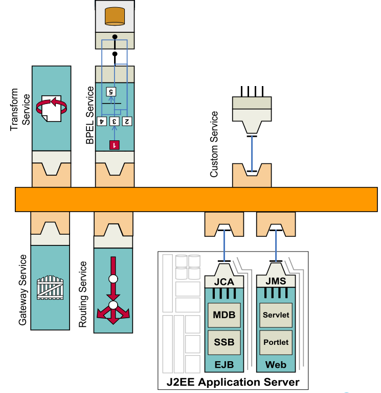


## Microservice Architecture - MSA

* MSA is a modern interpretation of SOA
* Services are still processes that communicate with each other over the network
* This style emphasizes continuous deployment and other agile practices


### SOA vs MSA

#### Principles

MSA stresses more on:

* fine-grained interfaces (to independently deployable services),
* business-driven development (e.g. domain-driven design),
* services are autonomous,
* polyglot programming and persistence
* lightweight container deployment,
* decentralized continuous delivery.


#### SOA Service Types

SOA provides 4 service types:

* Business Services:
    * Coarse-grained, define core business operations, use XML, BPEL, etc
* Enterprise Services:
    * Implement the functionality defined by business services, using AS/IS
* Application Services:
    * Fine-grained, confined to a specific application context.
* Infrastructure Services:
    * Implement non-functional tasks such as authentication, auditing, security, and logging.


#### MSA Service Types

2 service types only:

* Functional Services:
    * Support specific business operations.
    * Accessing of services is done externally and these services are not shared with other services.
* Infrastructure services:
    * As in SOA, implement tasks such as auditing, security, and logging.


#### More Info

Service Granularity:

* MSA: generally single-purpose services that do one thing really, really well
* SOA: service components can range in size. Coarse-grained to be useful to more applications

Component Sharing:

* one of the core tenets of SOA.
* MSA tries to minimize on sharing through “bounded context” (coupling of a component and its data as a single unit with minimal dependencies)

Middleware vs API layer:

* MSA provides an API layer
* SOA has a messaging middleware component (provides mediation and routing, message enhancement, message, and protocol transformation)

Remote services:

* SOA architectures rely on messaging (AMQP, MSMQ)
* Most MSAs rely on two protocols – REST and simple messaging (JMS, MSMQ), and the protocol found in MSA is usually homogeneous.

Heterogeneous interoperability:

* SOA promotes the propagation of multiple heterogeneous protocols through its messaging middleware component: to integrate several systems using different protocols in a heterogeneous environment
* MSA attempts to simplify the architecture pattern by reducing the number of choices for integration: all your services could be exposed and accessed through the same remote access protocol


| SOA                                                          | MSA                                                          |
| ------------------------------------------------------------ | ------------------------------------------------------------ |
| Follows **“share-as-much-as-possible”** architecture approach | Follows **“share-as-little-as-possible”** architecture approach |
| Importance is on **business functionality** reuse            | Importance is on the concept of **“bounded context”**        |
| They have **common governance** and **standards**            | They focus on **people, collaboration** and freedom of other options |
| Uses **Enterprise Service bus (ESB)** for communication      | Simple messaging system                                      |
| They support **multiple message protocols**                  | They use **lightweight protocols** such as HTTP/REST etc.    |
| **Multi-threaded** with more overheads to handle I/O         | **Single-threaded** usually with the use of Event Loop features for non-locking I/O handling |
| Maximizes application service **reusability**                | Focuses on **decoupling**                                    |
| **Traditional Relational Databases** are more often used     | **Modern Relational Databases** are more often used          |
| A systematic change requires modifying the monolith          | A systematic change is to create a new service               |
| DevOps / Continuous Delivery is becoming popular, but not yet mainstream | Strong focus on DevOps / Continuous Delivery                 |


#### Bottom Line

* SOA is better suited for large and complex business application environments that require integration with many heterogeneous applications using a middleware component
* Microservices are better suited for smaller and well-partitioned, web-based systems in which microservices give you much greater control as a developer


## Technologies for SOA

SOA/MSA can be implemented using many different technologies

Common implementations:

* Web services based on WSDL and SOAP
* RESTful HTTP
* Messaging, e.g., with ActiveMQ, JMS, RabbitMQ
* OPC-UA
* RPC
* It can use more than 1 technology in one (orchestrated) service
    * Quite common with SOA, less common with MSA


### Uniform Resource Identifier - URI

* URIs are a way to identify resources (and endpoints) on the Web, and other Internet resources such as electronic mailboxes
* URIs are ‘uniform’:
    * their syntax incorporates that of indefinitely many individual types of resource identifiers (that is, URI schemes), and
    * there are procedures for managing the global namespace of schemes
* Specializations: Uniform Resource Locator (URL), and Uniform Resource Name (URN)


#### Uniform Resource Locators - URL

* Some URIs contain information that can be used to locate and access a resource
* Example of URL: http://www.aau.dk/
    * a web page at the given path (‘/’) on the host www.aau.dk, and it is accessed using the HTTP protocol
* Another example: mailto:mialb@cs.aau.dk
    * mailbox of user mialb at cs.aau.dk


#### Uniform Resource Names - URN

* URNs are URIs that are just pure resource names, with no locator
* URNs are not required to be associated with a particular protocol or access method, and need not be resolvable
* They are of the form `urn:nameSpace:nameSpace-specificName`
* They still need to be unique and persistent
    * Most namespaces need a registration authority
* Example: `urn:ISBN:0-201-62433-8`
    * It is a International Standard Book Numbers identifying books that bear the name `0-201-62433-8`


### Web Service

* HTTP request-reply protocol allows general-purpose clients (browsers)
* Web services return to a model in which an application-specific client interacts with a service with a functionally specialized interface over the Internet
* In its “pure” definition, a web service uses XML, SOAP, WSDL, UDDI, BPEL, …
    * External data representation and marshalling of messages exchanged between clients and web services in XML
    * The SOAP protocol specifies the rules for using XML to package messages, for example to support a request-reply protocol
* Alternative: REST approach


### Representational State Transfer - REST

* REST is an approach to services with a very constrained style of operation, applying “verbs” to “nouns”
    * Nouns are the URLs that identify web resources
    * Verbs are the HTTP operations GET, PUT, DELETE and POST (and lately PATCH) to manipulate resources
* GET to retrieve the representation of a resource
* POST to add a new resource
* PUT to update the representation of a resource using a new one
* PATCH to change part of the representation of a resource
* DELETE to discard a resource


#### Tenets of REST

* Resources are identified by uniform resource identifiers (URIs)
* Resources are manipulated through their representations
* Messages are self-descriptive and stateless
* Multiple representations are accepted or sent
* Hypertext is the engine of application state


#### REST Messages

* Like what we already know: HTTP, URIs, etc.
* REST can support any media type, but XML is expected to be the most popular transport for structured information.
* Unlike SOAP and XML-RPC, REST does not really require a new message format


#### What if REST is not enough?

* What happens when you need application semantics that don't fit into the GET / PUT / POST / DELETE generic interfaces and representational state model?
* People tend to assume that the REST answer is:
    * If the problem doesn't fit HTTP, build another protocol
    * Extend HTTP by adding new HTTP methods

##### But in fact:

* *There are no applications you can think of which cannot be made to fit into the GET / PUT / POST / DELETE resources / representations model of the world!*
* These interfaces are sufficiently general
* Other interfaces considered harmful because they increase the costs of consuming particular services


#### Web-based Applications

A Web-based application is a dynamically changing graph of

* possible states representations (pages)
* transitions (links) between states

If it doesn’t work like that, it may be *accessible* from the Web, but it’s not really *part* of the Web


#### Two kinds of state

##### Application State

* Application state is the information necessary to understand the context of an interaction
    * Authorization and authentication information are examples of application state
* The "stateless" constraint means that all messages must include all *application* state as part of the content transferred from client to server back to client

##### Resource State

Changes in resource state are unavoidable

* Someone has to POST new resources before others can GET them

REST is about avoiding implicit or unnamed state; resource state is named by URIs


#### Sessions

* Session state is also application state
* If you want a session, you need to move it back and forth between client and server
* A purchasing client could send a single HTTP request mentioning everything it wanted to purchase in one message


#### The purpose of statelessness

* Prevents partial failures
* Allows for substrate independence
    * Load-balancing
    * Service interruptions


#### Another kind of state

* Don’t confuse REST state with state-machine state
* REST state is the representation of the values of the properties of a resource
* State machines fit into REST when the states are expressed as resources with links indicating transitions


### Messaging

* Until now, we have considered request / response protocols
* All requests were unicast, all responses were unicast, the identity of the server was explicit, the communication was synchronous

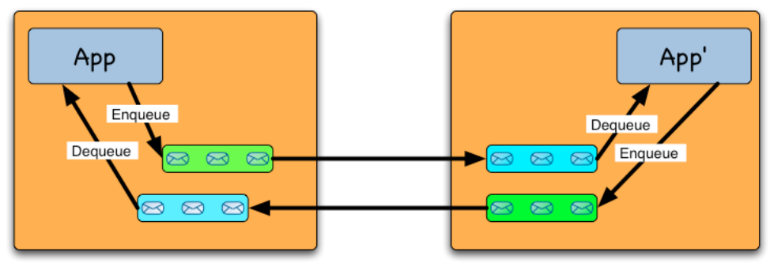


#### Publish Subscribe

* The message is not sent to the recipient anymore, but instead to an entity hosted on a broker
* Example: Topic-oriented: the subscriber requests all messages related to a topic of interest
    * Subscriber sends a topic subscription to the broker
    * Sender publishes (sends) a message on a topic rather than a destination
    * The broker relays messages to the subscribers who subscribed to related topics
* If a topic is popular, this approach implements one-to-many communication (multicast)

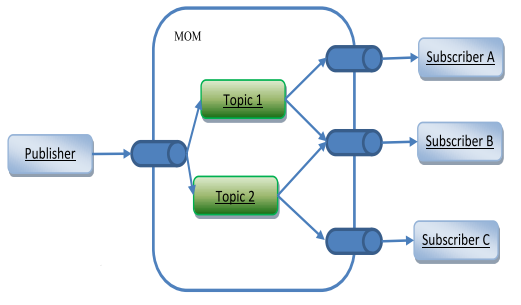


#### Message Oriented Middleware for SOA

* MOM is the plumbing for shipping messages between the services
    * SOA is all about using messages to connect services
* Goals:
    * **scalability**,
    * **decoupling**, and
    * advanced **communication semantics**


##### Scalability

* MOM systems provide an abstraction over the identity of the subscribers (topics, etc)
* This disencumbers clients from maintaining a list of the peers that subscribed to their data
* This also allows for seamless
    * Elasticity (you can add service providers / consumers), and
    * Load balancing (you can implement smart routing on the broker to split the burden)

##### Decoupling

* Space decoupling: the publisher and subscriber do not need to be aware of each other’s location or identities
* Time decoupling: publisher and subscriber do not need to be online and actively collaborating in the interaction at the same time
    * Asynchronous and non-blocking message passing
* Synchronization decoupling: allows asynchronous notification of subscribers by using event services callbacks

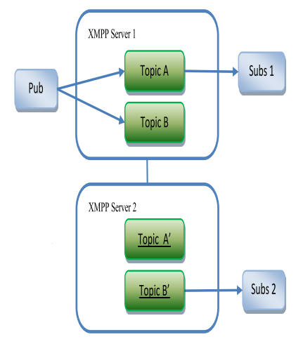

##### Advanced communication semantics

* Involves mechanisms to protect communication from message losses, message reordering of the messages caused by jitter and message duplication
* **What**: Usual semantics that can be requested (e.g.: by configuring the broker) are “At most once”, “At least once”, “Exactly once”, “In-order delivery”
* **How**: transport layer protocols, techniques that can merge messages (e.g., two data updates can become a single larger update in data-oriented middleware) and increase efficiency (e.g., by caching messages on intermediate servers for faster delivery when retransmission is requested)


#### Application to SOA

* By allowing a service consumer to ask for its request to be delivered to just one service provider, it is possible to let the broker decide which service provider will be used, implementing scalability, load balancing, robustness, elasticity
* By one-to-many communication, it is possible to ask to a number of service provider to act on a command, thus allowing to activate multiple service providers on the request


### Smart grids - ENCOURAGE

* Middleware for the “last mile” of the smart grid
* Data is collected from users’ HAN, and brought up to modules in the cloud
* This lecture:
    * Middleware component
    * Messaging infrastructure
        * AMQP

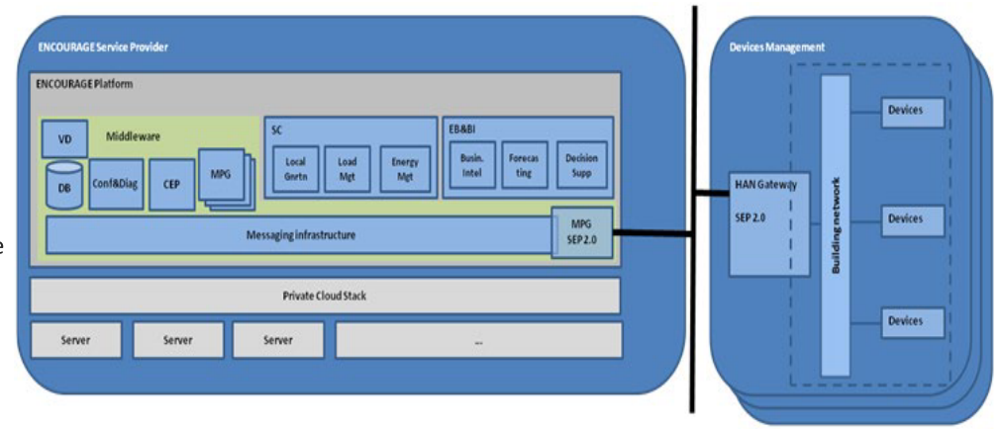


#### Messaging bus configuration

* ENCOURAGE uses RabbitMQ messaging bus, which implements AMQP
* One of the many publish/subscribe middleware

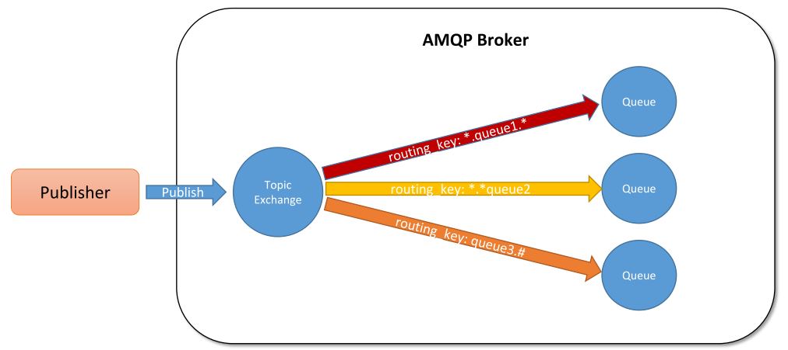


#### Topology of the exchanges / topics

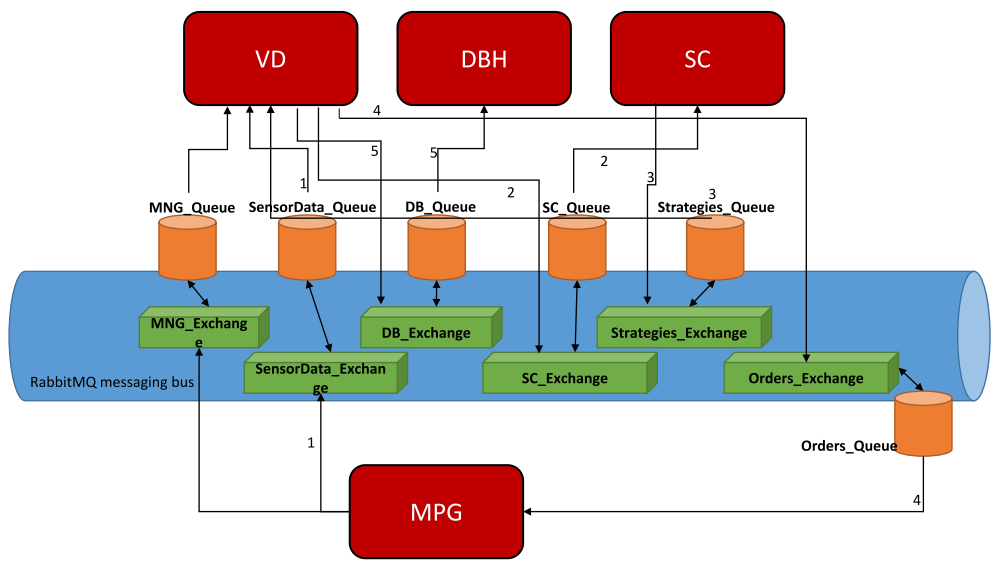

### Another Example - Arrowhead

* Minimal ingredients:
    * A service producer
    * A service consumer
    * The Arrowhead Framework
* The services are REST
    * Authorization for security
    * Service Registry to make your service known
    * Orchestrator to ask for service to consume

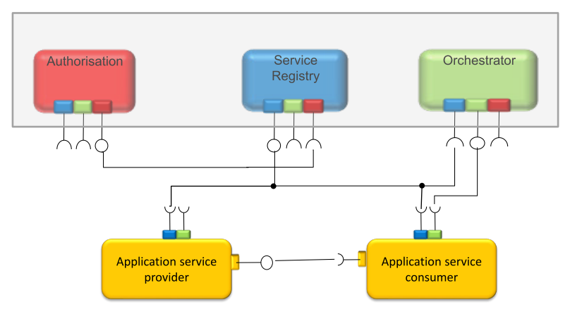

#### The services in the Arrowhead Framework

Service oriented approach supporting local cloud automation functionalities It offers a set of services that ease application development:

* Mandatory services:
    * Service Discovery;
    * Orchestration;
    * Authorization and Authentication
* A set of optional support services:
    * QoS Manager
    * Event Handler
    * etc

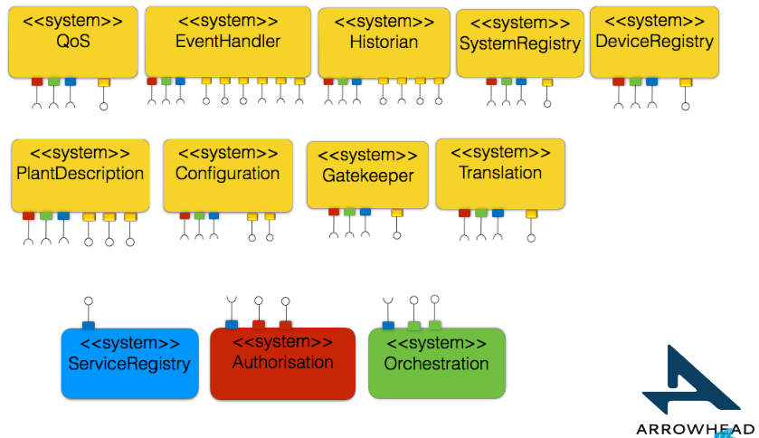


## Tools for REST Services

### Structure of a REST API

* The service is provided at an URL
* The service allow access through a set of endpoints
* Each endpoint allows for REST verbs/operations (GET, POST, PUT, PATCH, DELETE)
* The input data can be JSON or XML
* The output is a HTTP status code, and sometimes data as JSON or XML


### OpenAPI

OpenAPI Specification is an API description format for REST APIs, to describe:

* Available endpoints and operations on each endpoint
* Operation parameters Input and Output for each operation
* Authentication methods
* Contact information, license, terms of use and other information.

An OpenAPI document itself is a JSON object, which may be represented and written either in JSON or YAML format

We will use OpenAPI version 3 (the latest one)

<https://github.com/OAI/OpenAPI-Specification/blob/master/versions/3.0.3.md>

The OpenAPI document is composed by a number of parts

Most important parts (except for the “headers” `openapi`, `info` and `servers`):

* `Paths`
* `Components`


#### Paths

* A series of `path` objects
* It is the "path" of the resource URL, followed by the operations it accepts
* For each operation:
    * The specific of the input data
    * A list of HTTP status codes, and optionally the specific of return data for each use

#### Components

* It contains a set of reusable objects
    * `schemas`
    * `responses`
    * `parameters`
    * etc
* All objects defined within the `components` object will have no effect on the API unless they are explicitly referenced

#### Example

```yaml
openapi: 3.0.3
info: 
	title: ping test
	version: '1.0'
servers:
- url: 'http://localhost:8000'
paths:
  /ping:
    get:
      operationId: pingGet
      responses:
        '201':
        	description: OK
```


#### Try OpenAPI out

* Write an OpenAPI specification
* Use openapi-generator or Swagger
    * <http://api.openapi-generator.tech/index.html>
    * <https://editor.swagger.io/>
* Download the generated code
    * for a server (any language you want)
    * for a client (preferably, Elixir)
* Implement the business logic
* Try it out: Compile, execute, etc