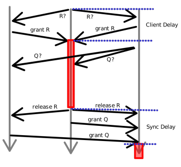
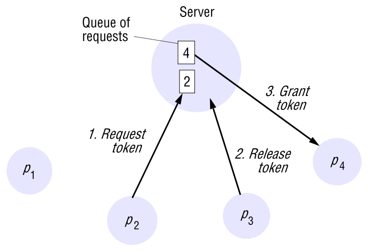
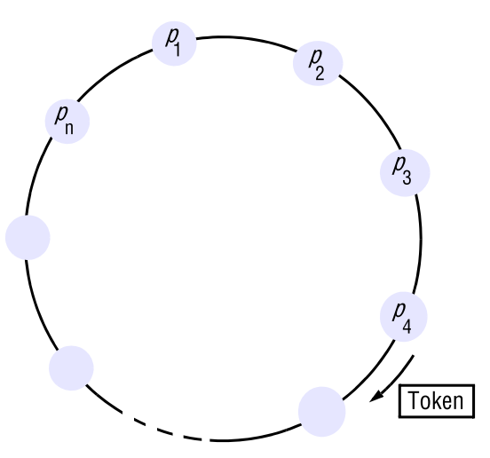
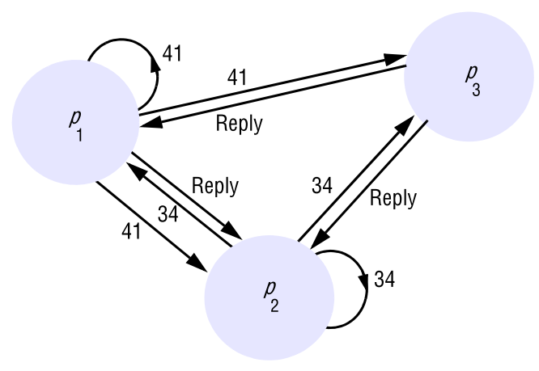
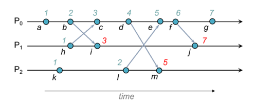

# **Question 1 - Distributed Mutual Exclusion** 

* What is DME and what are the requirements to a DME algorithm?
* What are the criteria to evaluate DME algorithms?
* Explain the centralized, token ring, and Ricart and Agrawala’s algorithms, and compare them. What are their advantages/disadvantages?

## What is DME and what are the requirements to a DME algorithm?

**Mutual exclusion** algorithms ensures that **one and only one** process can access a shared resource at any given time.

**Examples**

* Using a printer
    * should **only** print **one** document **at a time**
* Writing to a file

**Distributed** mutual exclusion (DME) is mutual exclusion by only sending messages

There **3** **requirements** to a **DME Algorithm**

1.  **Safety**
    * **at most** one at a time is given **access**
2. **Liveness**
    * **requests** for access are **eventually** granted
3. **Ordering / Fairness**
    * if **A** happens before **B** 		then **A** should be granted before **B**

## What are the criteria to evaluate DME algorithms?

We **evaluate** DME algorithms using the following **properties**

* **Fault Tolerance**
    * what happens if a process crashes?
* **Performance**
    * **Message complexity**
        * how many message to get mutex?
        * how many messages to release?
    * **Client delay**
        * **time** from a **request** 	until it is **granted**
    * **Synchronization delay**
        * **time** from a **release** of a mutex 	until the **next request** is granted

## Explain the centralized, token ring, and Ricart and Agrawala’s algorithms, and compare them. What are their advantages/disadvantages?

### Centralized

In the **centralized algorithm** we have **one** external coordinator

* has an **ordered queue**

When a process wants mutex, it **asks coordinator**

#### Evaluation

Fulfills the **safe** and **liveness** requirements.

But it is **not** **ordered** in an asynchronous system.

Has **entry delay** of **2** messages (request + grant) and **exit delay** of **1** message

The **synchronization delay** is also **2** (release + grant)

If the **either** the **coordinator** or the **mutex holder** **crashes** it will lead to a **deadlock**

#### Pros/Cons

It is **lightweight** in case of messages, but the coordinator quickly becomes a bottleneck.

### Token Ring

In the **Token Ring Algorithm** we have a ring of processes

* Pass token around in the ring

If a process is **not** using **mutex** it passes it to "next"

#### Evaluation

Also fulfils **safe** and **liveness**.

It is still **not ordered** but it is **ordered** **by ring**

**Entry delay** is $1/2 * n$ on average and $n-1$ worst case

**Exit delay** is $1$

**Synchronization delay** is also $1/2 * n$ on average and $n-1$ worst case

If **any** process crashes it causes a **deadlock**

* but if we can **detect crashes**, we can **recover**

#### Pros/Cons

The algorithm ensures **more order** than the centralized, and can **possibly recover** from **deadlock**.

However, it **keeps using bandwidth** even when **no processes** need mutex.

It also **scales badly** with **number of processes**.

### Ricard and Agrawala's

In the **Ricard and Agrawala's** algorithm we have a shared priority queue by using **Lamport Clocks**

* When a process wants mutex, 	it **requests** **all** and wait for **all** to **accept**

#### **Lamport clocks**

* Counts number of messages
* Piggybacked on messages
* On send -- Increment local clock
* On receive -- correct local clock and increment
    * $local = \max(local, received) + 1$

#### Evaluation

Ensures both **safe**, **liveness** and **order**. 

**Entry delay** is 1 + 1 multicast messages

**Exit delay** is likewise 1 + 1 multicast messages

**Synchronization delay** is 1 message

If **any** process fails we have a **deadlock**

#### Pros/Cons

Its advantage is that it is ordered, and It has a synchronization delay of $1$. 

It does however **require multicast,** and if there is **no hardware support**, it can lead to $2(n-1)$ messages for each request.

