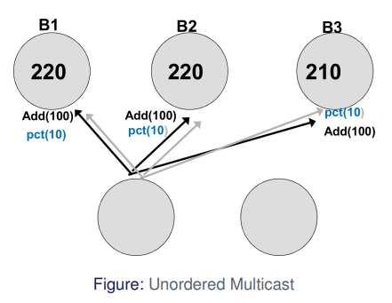
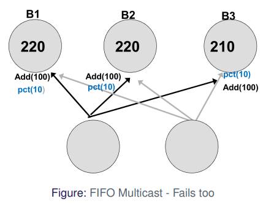
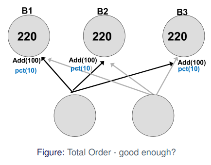
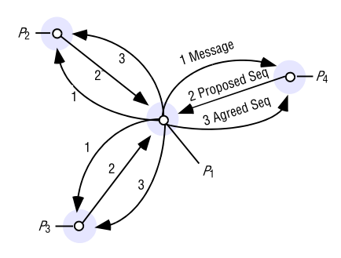

# Question 2 - Multicast

* Why do you need multicast?
* Explain basic multicast assuming reliable 1:1 communication
* What are the requirements to reliable multicast and how do you implement it over basic multicast and IP-multicast?
* Explain the difference between FIFO, Total and Causal ordering? When is it important?
* Briefly explain the two ideas to implement TO-multicast. What can you say about reliability?

## Why do you need multicast?

* Multicast is **one-to-many** communication
* Want to guarantee that all processes get same information
* With hardware support
    * send only one message to router
    * router then takes care of sending messages to members

## Explain basic multicast assuming reliable 1:1 communication

* Each process is member of a group
* when message from application
    * send message to every member of group -- including self
* when receiving message
    * send message to application

## What are the requirements to reliable multicast and how do you implement it over basic multicast and IP-multicast?

### Reliable Multicast

To have **reliable multicast** we must satisfy **3 properties**

* **Integrity**
    * a correct **process** delivers message **at most once.**
    * no "identity theft"
* **Validity**
    * If correct **process** **multicasts** a message, it **eventually** **delivers** it
    * "a process delivers to itself or crashes"
* **Agreement**
    * If **correct** process **delivers**, **all** correct **processes** in group **deliver**
    * "all deliver or none deliver"

### Reliable over Basic

* First we b-multicast to group
* When we receive message
    * If we have not already delivered message
        * if message is not from self -- b-multicast message
        * and deliver message

**Integrity** -- yes

* message is only delivered once

**Validity** -- yes

* message is delivered to self

**Agreement** -- yes

* message is sent to all devices 
* if process crashes after sending one -- message is sent from receiving process

### Reliable over IP

To implement Reliable Multicast over IP-Multicast we steal some ideas from TCP

* Sequence number
    * detect duplicates and lost messages
* hold-back-queue
    * wait for re-transmission
    * replicate messages
* track others sequence numbers
* gossip sequence numbers

#### Implementation

* Each process maintains next sequence number $S^p$, and latest sequence number received from each member $R^q$

* IP multicast message to group with $S^p$ and all pairs $<q, R^q>$ (all received sequence numbers)
    * and increment sequence number ($S^p$++)
* On IP-deliver at $q$ from $p$
    * if received sequence number $S$ is equal to $R^p + 1$
        * R-deliver message
        * Increment received sequence number ($R^p$++)
        * check hold-back queue for next message and IP-deliver it
    * else ($S > R_g^p + 1$)
        * store message in hold-back queue
    * request missing messages

## Explain the difference between FIFO, Total and Causal ordering? When is it important?

### FIFO Ordering

Messages from $p_n$ are received at $p_k$ in the order sent by $p_n$

* like speaking
* <u>Reliable IP-Multicast is FIFO</u>
    * we respect sequence-numbers of sender

### Total Ordering

All messages are received in same order at $p_n$ and $p_k$

### Casual Ordering

if $p_n$ receives $m_1$ before $m_2$, then $m1$ **happened before** $m_2$

### Why

Lets say we have a bank

* if messages are not received ordered -- it can lead to wrong state

* if we use **FIFO** order problem is inherently fixed

* If we introduce another sending process -- we have problem again

* If we use **total order** problem fixed again

* Can however still go wrong

## Briefly explain the two ideas to implement TO-multicast. What can you say about reliability?

The idea is to do like FIFO multicast -- but have only one sequence-number

* each message has unique id
* all processes agree on next message
    * global sequencer or
    * negotiation (ISIS)

### Global Sequencer

* **One** process works as a **global sequencer**
* When **sequencer** receives **message**
    * b-multicasts **order message** with **sequence number** for **message id**
    * increments its own sequence number
* when **order** is **received**
    * **update** sequence **map** with **sequence** number for **message id**
    * try-deliver

* when **normal** process receives **message**
    * put message in **hold-back queue**
    * try-deliver
* on **try-deliver**
    * check if sequence number has been received and message exists in hold-back-queue
    * deliver to application
    * try-deliver next message

#### Reliability

* Global Sequencer is single point of failure
* Also bottleneck
* on package loss -> deadlock

### ISIS

**Idea** -- Negotiate next ID

1. Process $p$ broadcasts message $m$
2. Every other process $q$ responds to $p$ with proposal
3. $p$ picks largest proposed value, broadcasts

Need to track "largest proposed value" and "largest agreed value" at each process

#### Reliability

If we have reliable crash-detection we have robust protocol

* sequence numbers increases
* no process delivers early

* however
    * every message requires 3 rounds for negotiation
        * (the sequencer takes 2 rounds)
        * 1 for proposal -- 1 for vote -- 1 for picking