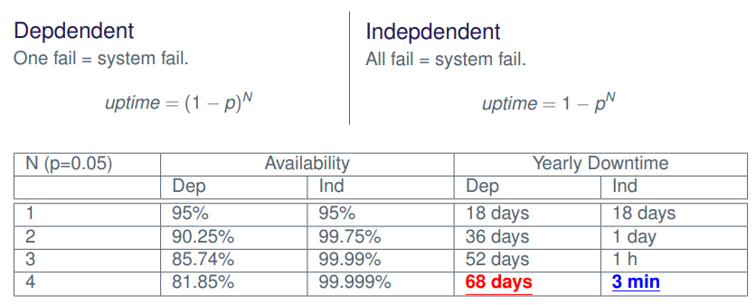

# Question 3 - Replication and Consistency

* Why do you need replication?
* Explain the challenges resulting from replication
* What consistency models exist?
* Explain the consistency model and compare them
* Present an execution which is sequentially consistent but not linearizable

## Why do you need replication?

The goals of replication is **Fault tolerance**, **high availability ** and **performance**

We want to tolerate node and network failures

We want the service to be available as much as possible

We want to be able to scale the service, as well as overcome geographic- and network limits

## Explain the challenges resulting from replication

In a distributed system, it is **impossible** to simultaneously provide **Consistency**, **Availability** and **Partition tolerance**

We can only satisfy **any two** of them at the same time but **not all three**

This is called the **CAP Theorem**

We also want to make it **transparent for the user**

* They should not worry about which server to contact

**Ideally** we would have it **indistinguishable** from **single copy** behavior

**Fault tolerance** -- what if a process crashes

* f-resilience  -- $f$ amounts processes can crash without stopping service

**Inconsistency**

* **Inconsistent** -- since what was set in replica 1 is **never** sent out to **other replicas**

### (Replication Architectures for Fault Tolerance

**Read-only replication**

* Immutable files
* Cache-servers

**Passive replication (primary/secondary)**

* High consistency

**Active replication**

* Fast failover mechanism
    * Everyone can take over if one fails
* Workload distribution
* Everybody is working on equal terms

## What consistency models exist?

We have two consistency models

* A **strong** consistency -- **Linearizability**
    * In real-time, after update A, everybody will see the modification done by A when reading
* A **weak** consistency -- **Sequential Consistency**
    * "reasonably consistent"

## Explain the consistency model and compare them

### Linearizability - Strong Consistency

We have $C_i$ operations

* $o_1^i, o_2^i, \dots, o_n^i$ for some operation $o \in O$

Let $T(o^i_n)$ be the timestamp of $o^i_n$.

We then say that an interleaving $\dots, o^i_5, o^j_{100}, o^i_6, \dots$ (where $i \neq j$) is linearizable if

* we arrive at a (single) correct copy of the object (from specification)
    * the **results** of the **client’s** operations **make sense** as they **occur** within the **interleaving**
* the order is consistent with real time
    * $T(o^i_5) \leq T(o^j_{100}) \leq T(o^i_6)$

### Sequential Consistency - Weak Consistency

We have $C_i$ operations

* $o_1^i, o_2^i, \dots , o_n^i$ for some operation $o \in O$

We then say that an interleaving $\dots, o^i_5, o^j_{100}, o^i_6, \dots$ (where $i \neq j$) is sequentially consistent if

* arrive at a (single) correct copy of the object (from specification)
    * the **results** of the **client’s** operations **make sense** as they **occur** within the **interleaving**
* the order respects causality of $C_i$
    * $a < c$, i.e. from $C_i, o^i_a$ was sent before $o^i_c$

## Present an execution which is sequentially consistent but not linearizable

* Since **Client 1'**s **operations** are done in **correct order** in **respect** to Client **1** and
* and **Client 2**'s **operations** are done in **correct order** in **respect** to Client **2**
    * the **execution** is **sequentially consistent**
* But since step (3) happens after step (2) -- client 2 should see 100$ in balance
    * maybe operation (2) has not reached replica 1 yet
    *  the **execution** is **not** **linearizable**

