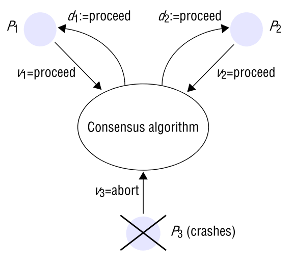
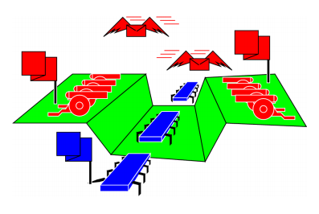
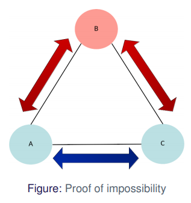
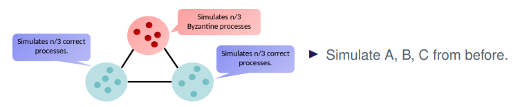

# Question 4: Consensus

* Explain the consensus problem
* Solution in synchronous system
* Explain what the Byzantine generals problem is.
* Present impossibility result for 3 Byzantine generals, 1 faulty (argue carefully!)
* Present the solution for 4 Byzantine generals, 1 faulty.
* Present clearly your assumptions on system model, failures, and message signing. 
* Discuss impossibility in asynchronous systems and practical workarounds

## Explain the consensus problem

Consensus is the ability for a **group of processes** to **agree on one, and only one** value

For example in **Mutex**, we have to agree on who is holding the mutex.

We need it in redundant systems in order.

* For example in a space ship, there is a possibility of bits flipping, so we have multiple computers, that then has to agree on values.

The big questions are

* What do we agree on? and
* When do we agree on what we agree on?

### Definition

We have a set of processes $p_i \in \{p_0,\dots,p_n\}$ and each has a decision variable $d_i$

* They all start in the *undecided* state, and **proposes** a value to each other.
* Each process then has to agree on a value and set its decision variable $d_i$

#### Requirements

A consensus algorithm has to fulfil the following requirements

* **Termination**
    * Eventually a correct process sets its decision variable $d_i$
* **Agreement**
    * The decision values of all correct processes are the same
* **Integrity**
    * If all correct processes propose the same value, then any correct process in the *decided* state decided on that value
* **Weak Integrity**
    * The agreed value must be one proposed by a correct process

### Two Army Problem

An example of a consensus problem is the **two army problem**

* We have **three armies**
    * **two red**
    * **one blue**
* The red armies has to attack at the same time
* They can send message but blue can intercept
* It is impossible to design a protocol to make sure that both armies attack at same time

This shows that we can never ensure consensus in an asynchronous system

* communication can be "blocked" indefinitely

## Solution in synchronous system

Afsnit 15.5.2 i bogen!!!!

If we have a synchronous system, we could simply take the first value proposed, and all agree on that. 

## Explain what the Byzantine generals problem is.

In the Byzantine Generals Problem we have 3 or more generals that has to agree to attack or retreat.

* One is the commander and gives the order
* Rest are lieutenants and has to decide on Attack or Retreat 

One or more of the generals may be **treacherous** -- **faulty**

* Treacherous commander may propose attack to one and retreat to another
* Treacherous lieutenants may lie about command from commander

## Present impossibility result for 3 Byzantine generals, 1 faulty (argue carefully!)

If we have 3 generals and 1 of them is faulty, it is impossible to detect who is the faulty one.

Lets say that B is faulty.

* B sends Attack to A and retreat to C
* That means A receives both attack and retreat, and will not know who is faulty

Lets say that C is faulty

* B sends Attack to both A and C
* C sends retreat to A
* Again that means A receives both attack and retreat, and will not know who is faulty

This can be generalized to mean that if 1/3 is faulty we cannot arrive at consensus

## Present the solution for 4 Byzantine generals, 1 faulty.

## Present clearly your assumptions on system model, failures, and message signing. 

## Discuss impossibility in asynchronous systems and practical workarounds

