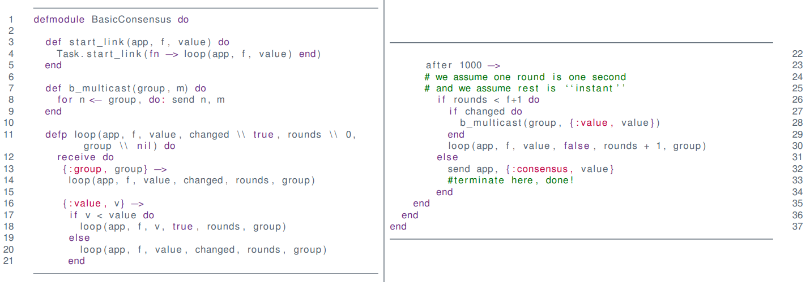
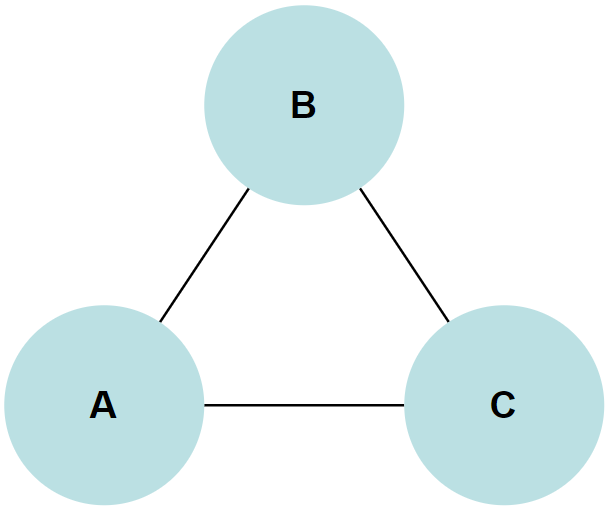
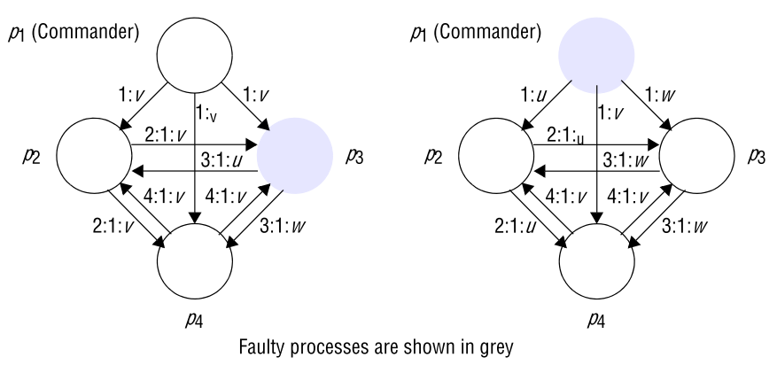
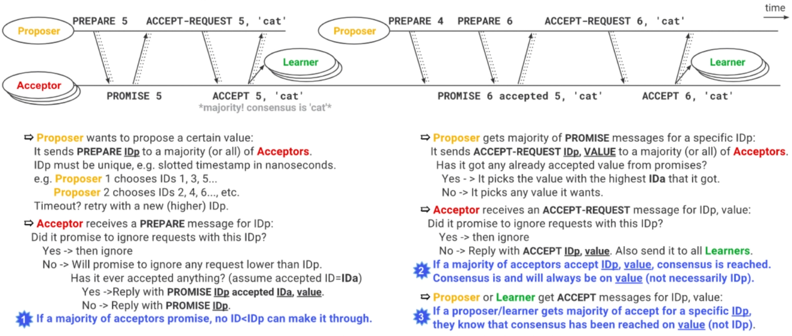
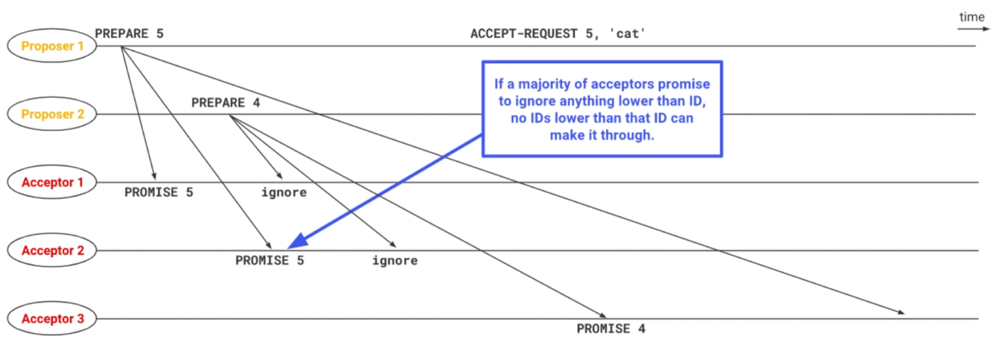
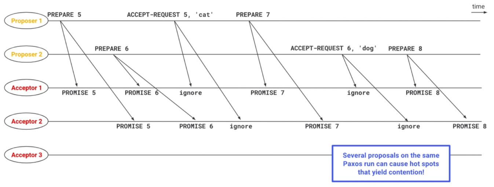
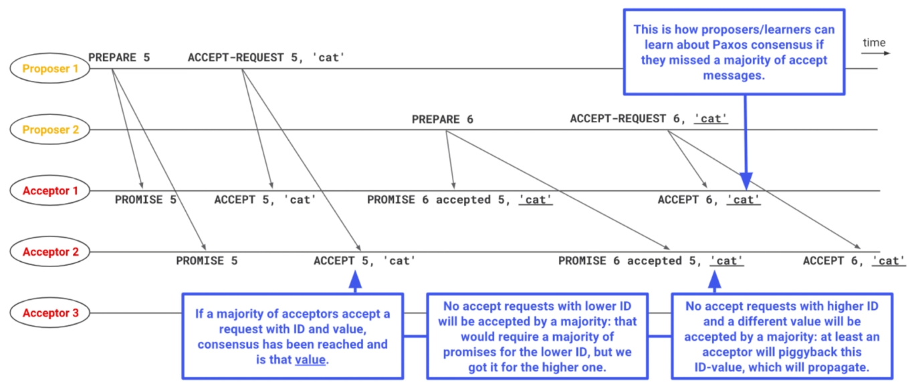
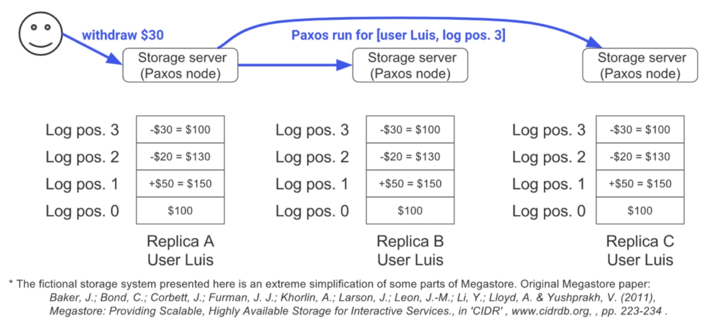

# Question 4: Consensus

* Explain the consensus problem
* Solution in synchronous system
* Explain what the Byzantine generals problem is.
* Present impossibility result for 3 Byzantine generals, 1 faulty (argue carefully!)
* Present the solution for 4 Byzantine generals, 1 faulty.
* Present clearly your assumptions on system model, failures, and message signing. 
* Discuss impossibility in asynchronous systems and practical workarounds

## Explain the consensus problem

Consensus is the ability for a **group of processes** to **agree on one, and only one** value

For example in **Mutex**, we have to agree on who is holding the mutex.

We need it in redundant systems in order.

* For example in a space ship, there is a possibility of bits flipping, so we have multiple computers, that then has to agree on values.

The big questions are

* What do we agree on? and
* When do we agree on what we agree on?

### Definition

We have a set of processes $p_i \in \{p_0,\dots,p_n\}$ and each has a decision variable $d_i$

* They all start in the *undecided* state, and **proposes** a value to each other.
* Each process then has to agree on a value and set its decision variable $d_i$

#### Requirements

A consensus algorithm has to fulfil the following requirements

* **Termination**
    * Eventually a correct process sets its decision variable $d_i$
* **Agreement**
    * The decision values of all correct processes are the same
* **Integrity**
    * If all correct processes propose the same value, then any correct process in the *decided* state decided on that value
* **Weak Integrity**
    * The agreed value must be one proposed by a correct process

## Solution in synchronous system

* Takes $f+1$ rounds -- with timeout
* At each round less than round $f+1$ -- b-multicast your value if it has changed
* When value is received -- set your value to it - if value received is less than your value
* At round $f+1$ you have reached consensus
    * all processes has sent their value to all

(image not for slides)

**Not possible** to make algorithm with that requires **less than**  $f+1$ rounds

* If $f$ devices fail -- there can be $f$ **faulty rounds**
* we need **at least 1 correct round**

## Explain what the Byzantine generals problem is.

In the Byzantine Generals Problem we have 3 or more generals that has to agree to attack or retreat.

* One is the commander and gives the order
* Rest are lieutenants and has to decide on Attack or Retreat 

One or more of the generals may be **treacherous** -- **faulty**

* Treacherous commander may propose attack to one and retreat to another
* Treacherous lieutenants may lie about command from commander

## Present impossibility result for 3 Byzantine generals, 1 faulty (argue carefully!)

If we have 3 generals and 1 of them is faulty, it is impossible to detect who is the faulty one.

Lets say that B is faulty.

* B sends Attack to A and retreat to C
* That means A receives both attack and retreat, and will not know who is faulty

Lets say that C is faulty

* B sends Attack to both A and C
* C sends retreat to A
* Again that means A receives both attack and retreat, and will not know who is faulty

This can be generalized to mean that if 1/3 is faulty we cannot arrive at consensus

## Present the solution for 4 Byzantine generals, 1 faulty.

If we have 4 generals and 1 of them is faulty, we can reach agreement.

There are 2 cases

* A faulty lieutenant
    * in the first round the commander sends the right value to all lieutenants
    * in second round lieutenants send their values to each other, but the faulty one sends different values to each
    * we then take the majority value 
* A faulty commander
    * in the first round the commander sends different values to all lieutenants
    * in second round lieutenants send their values to each other, but everyone receives 3 different values, and they therefore know that the general is faulty

## Present clearly your assumptions on system model, failures, and message signing. 

We assume that we have

* reliable communication
* crash failures and 
* byzantine failures
* and no signed messages
    * we can have "identity theft"

## Discuss impossibility in asynchronous systems and practical workarounds

It has been proved by Fischer et al. in ("Impossibility of distributed consensus with one faulty process") that no algorithm can guarantee consensus in a distributed system.

In asynchronous systems, the communication can be "blocked" indefinitely

* we cannot know if a process is slow or crashed

### Two Army Problem

An example of a consensus problem is the **two army problem**

* We have **three armies**
    * **two red**
    * **one blue**
* The red armies has to attack at the same time
* They can send message but blue can intercept
* It is impossible to design a protocol to make sure that both armies attack at same time

### Practical workarounds

**Masking Faults**

We can mask failures, for example by using a checksum with messages to ensure that they are not corrupted

We can also save sufficient data on persistent storage to be able to recover from a crash

**Failure Detection**

We cannot, by only passing messages, design a perfect failure detector.

We can agree that if a process has not responded within a timeframe we **deem** it failed.

* We can then ignore the rest of its messages if it is still working -- fail-silent

We have to be careful with the timeout

* too low and we ignore usable nodes
* too high and we potentially has to wait a long time

Problems can arrive if we have network partition

**Randomness**

If we introduce some randomness in the process's behavior, so that the system cannot be effectively thwarted.

## Paxos if it comes up

* No coordinator
* Async system
* Nodes may crash and recover
    * OK with up to $n/2$ failures
* Once a single process decides, all will (eventually) decide the same

**Inconceivable**!

* No guaranteed termination
* ... but terminates in "reasonable environments"

[The Paxos Algorithm](https://www.youtube.com/watch?v=d7nAGI_NZPk&feature=youtu.be)

### Reaching Consensus with Paxos

* Once a **majority** agrees on a proposal, that is the consensus
* The reached consensus can be **eventually** known by anyone
* Processes will agree on **any** result -- not only own
* Communication may be **faulty** -- messages can get lost

### Basics

* Paxos defines three **roles**:
    * **Proposers**
    * **Acceptors**
    * **Learners**
* Nodes can take multiple roles
* Paxos nodes must know how many **acceptors** a majority is
* Paxos nodes must be persistent: they cant forget what they accepts
* A **Paxos run** aims at reaching **a single consensus**
    * Once consensus is reached, it **cannot progress** to another consensus
    * In order to reach **another consensus**, a different **Paxos run** must happen

### The Paxos Algorithm

### Majority of Promises

### Contention

### Majority of Accepts

### Practical Example - Simple Distributed Storage System

