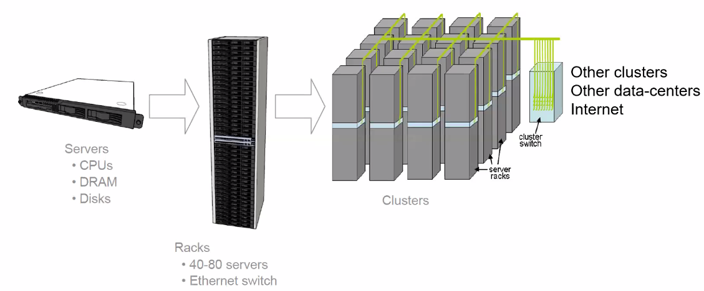
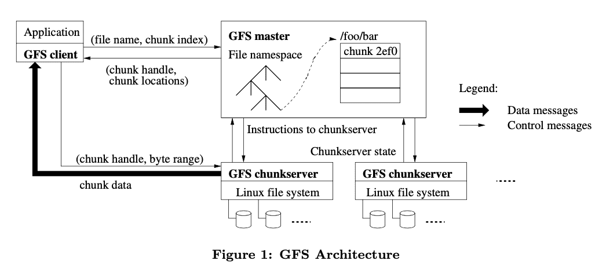
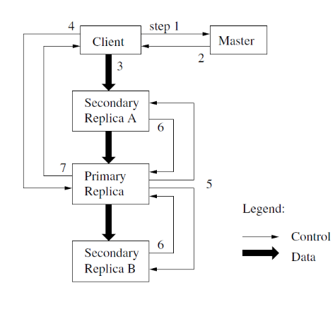
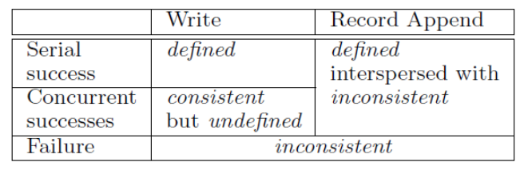
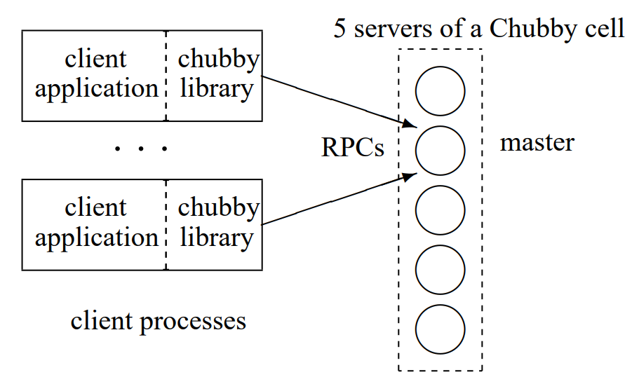
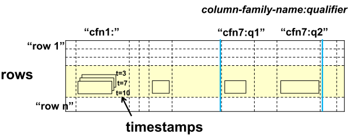
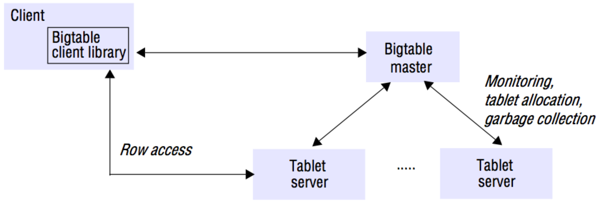
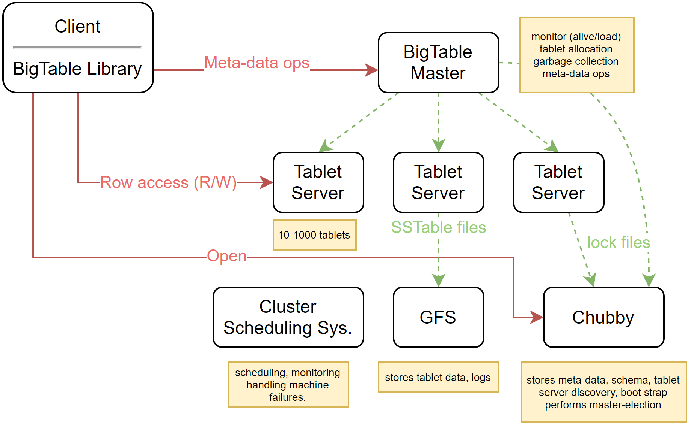

# Question 5 - Clustered Storage

* What are the design principles behind the Google Infrastructure?
* Go into depth with GFS: Explain the architecture, consistency model, replication, fault tolerance. What are its advantages and disadvantages?
* Chubby: goals, architecture.
* BigTable: goals and architecture, as difference from GFS and Chubby


## What are the design principles behind the Google Infrastructure?

Key philosophy: use large number of commodity PCs

* best performance per dollar
* high risk of failure


Use **cluster architecture**



* Use software techniques for fault tolerance
* Use replication and parallelism for throughput and availability


## Go into depth with GFS: Explain the architecture, consistency model, replication, fault tolerance. What are its advantages and disadvantages?

### Architecture



### Writing



* When a **client** wants to **write** data, it **asks master** for p**rimary replica for chunk** **(1 + 2)**
* The **client** then **pushes** the **data** to **all** the replicas **(3)**
* When **all replicas** have **acknowledged**, **client** sends **write request** to **primary** **(4)**
* The **primary** forwards write **requests** to **secondaries** **(5)**
* When the **secondaries** have **acknowledged** to primary **(6)** the **primary** **replies** to client **(7)**


### Consistency Model

* File namespace mutations such as file creation are atomic and handled by the master
* A file region is **consistent** if all clients see the same data from all replicas
* A file region is **defined** if **consistent** and all clients see writes in entirety 
* On an append, the record is **appended atomically** at least **once somewhere**
    * leads to **defined** but potentially **inconsistent**
* **Inconsistent** regions are **handled** by the applications



### Replication

* The replicas are placed across different racks to optimize availability and bandwidth
* Chunks are allocated on multiple replicas
    * based on recent allocations on disks and placement
* When replicas become unavailable, chunks are re-replicated
* The master re-balances periodically to optimize disk space and load balancing
* Garbage collection to delete unused chunks


### Fault Tolerance

* Master contains an operations log and check points in persistent storage
    * to recover from crashes
* Read-only Shadow Masters
* External failure detection to select new master and restart faulty


### Pros/cons

* High availability and throughput and works with commodity hardware
* Reliable
    * saved on multiple locations, and corrupted data can be recovered

* GFS is optimized for large file, and is thus not suitable for small files.

* The Master is a single point of failure, and can become a bottleneck
    * somewhat solved with shadow masters
* Optimized for append operations and not random writes


## Chubby: goals, architecture.

Chubby is a coarse-grained distributed lock service.

* coarse meaning hours or days

It is intended for "loosely-coupled distributed systems"

* independent nodes
    * unpredictable speed
* nodes can crash, which are difficult to detect and recover
* messages can be lost -- delayed -- re-ordered -- but not corrupted

Also has reliable but low-volume storage

It should have

* high fault-tolerant
* high availability
* high scalability

* and throughput and performance is less important

**Examples of use**

* **GFS**
    * master election 
* **BigTable**
    * master election
    * client discovery
    * table service locking


### Architecture



Chubby consists of **client library** and **chubby cell**

Typically 

* 1 cell per data center
* 5 replicas

1 replica is elected as master

Clients communicate with **master** via RPC

* reads and writes go through master
    * writes only acknowledged before majority has replicated

Chubby has a filesystem-like interface

```pseudocode
fh = Open(“/ls/exampleCell/gfs/master”)
success = tryAcquire(fh)
if(success) write(fh, myID)
```


Maintains session between client and server

* master promises service for "lease time"
* clients make "keep-alive" calls to maintain session
* on session loss -- server releases client-held handles


## BigTable: goals and architecture, as difference from GFS and Chubby

BigTable is a distributed storage system

* opposed to GFS -- designed for structured data
    * stored as strings
    * resembles a database
* petabytes of data and thousands of machines
* random access to small items

Its goals are

* wide applicability
* scalability
* high performance
* high availability


### Architecture

* uses row/column abstraction
* contains timestamps for data

```pseudocode
(row: String, column: String, time: int64) -> String
```



A BigTable is split into **tablets**

* consecutive set of rows
* about ~200 MB
* can be split and merged

Each tablet is served by one **Tablet Server**

* like GFS chunk-server

Tablets are stored in SSTable (Sorted Strings Table) in GFS 






* Add some notes here :warning: