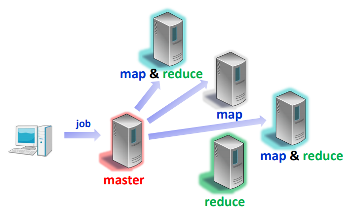
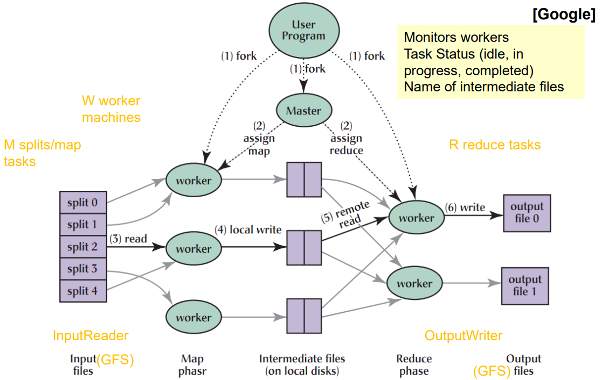
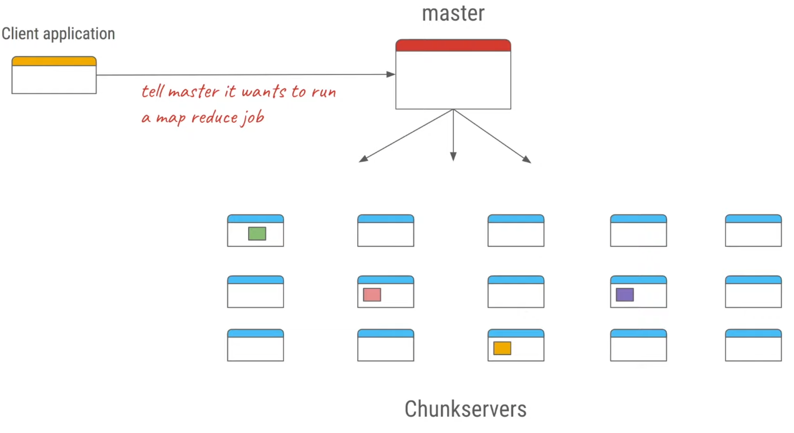
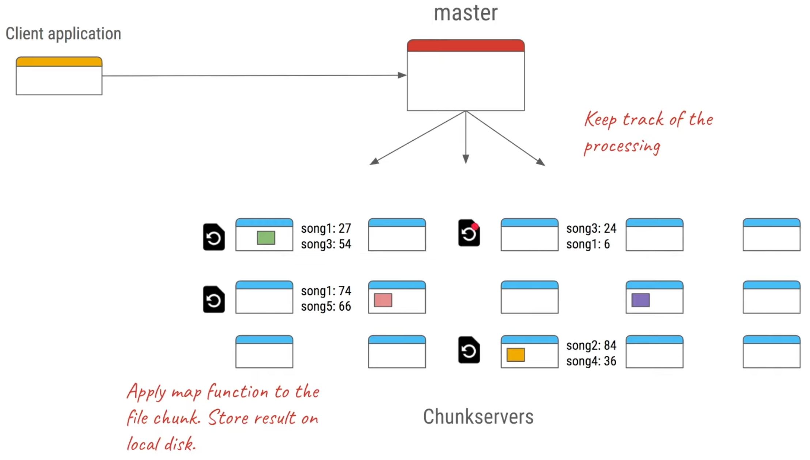
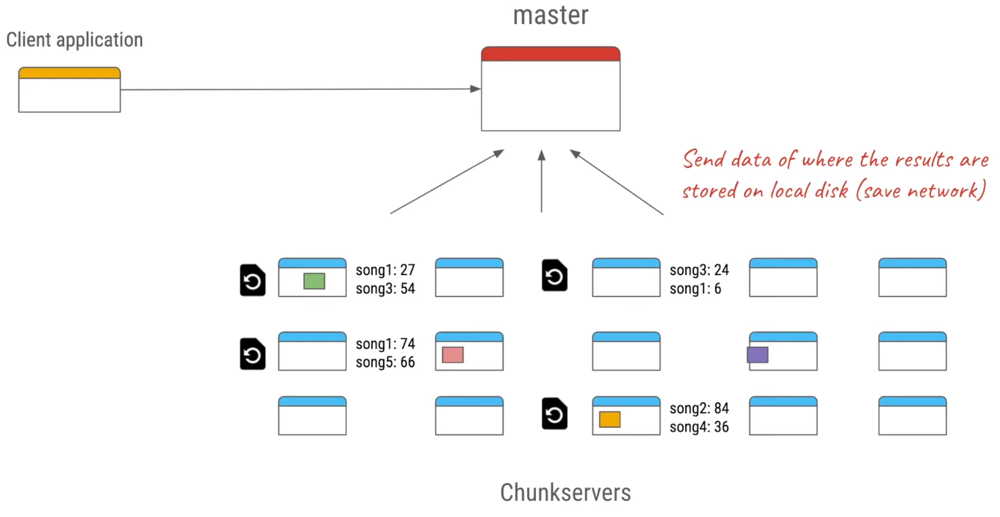
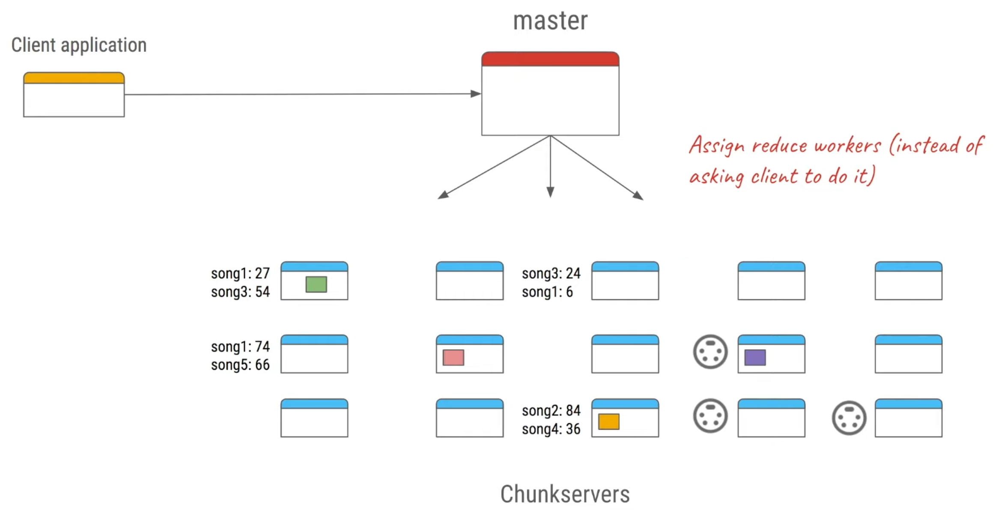
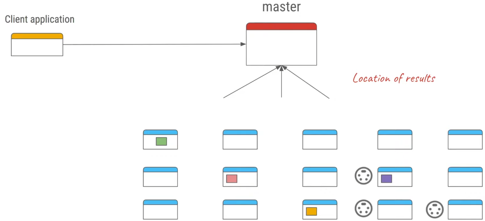
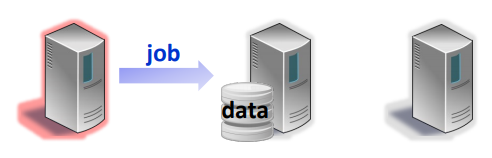
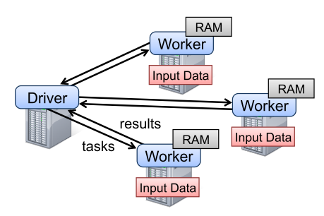

# Question 6 - Big Data Processing

* Explain the Map Reduce paradigm and programming model
* Explain the system architecture
* Explain a concrete example application and how it is executed
* Explain how to optimize the performance and how worker failures can be handled
* Describe Spark and Pregel, as difference from Hadoop

## Explain the Map Reduce paradigm and programming model

Map Reduce consists of 2 phases -- functions defined by user

* Map
    * given key-value pairs, produce intermediate key-value pairs
    * Combine values of the same key and send it to reducer
* Reduce
    * further compress the value set of the same key

Created for processing of large data sets.

Inspired by functional programming

## Explain the system architecture

The system consists of 1 master and several mappers and reducers.

The master

* assigns map and reduce jobs to other workers
* stores the state of each job
* stores the location of output files of the jobs

* First we split the input into pieces
* Master assigns mappers and reducers
* Reducers get path of map output from master 

## Explain a concrete example application and how it is executed

### Google Music Example

* Chunkservers contains analytics for music played
* We want to find the most played songs

The master tells each chunkserver to count how many times each song has been played (map-phase)

## Explain how to optimize the performance and how worker failures can be handled

### Performance

* **Locality**
    * Worker should be close to the GFS replica storing the data

* **Stragglers**
    * slow workers -- nearly always **some** worker is slow
    * when program near finished
        * in progress tasks are rescheduled at backup worker
        * done when either backup or original is done
* **Barrier synchronization / pipelining**
    * whether we can start reducing while mapping

### Fault Tolerance

* The master sends pings to workers
* If one is idle
    * if its running **map** task, task is marked **idle** and rescheduled
    * if its running **reduce** task two things can happen
        * if task task is in progress, its rescheduled
        * if task is done -- output written to global storage -- done

## Describe Spark and Pregel, as difference from Hadoop

### Spark

**Map Reduce** is **inefficient** for applications which **reuse intermediate** results across multiple computations

Spark uses **resilient distributed datasets** (**RDDs**)

* Immutable, partitioned collections of records (normally in RAM)
* fault-tolerant, parallel data structures,
* efficient data reuse

let users

* explicitly persist intermediate results in memory

RDD does not have to be materialized all the time: 

* store the „lineage“, information about how it was derived from other datasets (operations on RDDs).
    * re-computable

### Pregel

Pregel is  **tailored to graph computations**

* scale to billions of vertices, trillions of edges

Keeps **intermediate** results **like** **spark**

Algorithm termination is based on every vertex voting to halt

* In super-step 0, every vertex is in the active state
* A vertex deactivates itself by voting to halt
* A message may re-activate a vertex

**Master - worker** architecture

* Master monitors workers and partitions vertices to workers
* Workers execute at each super-step
    * report number of active vertices to master at end of step

Uses GFS or BigTable for persistent data

#### Example

