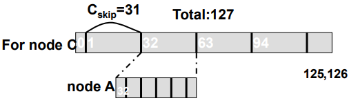

# Question 7 - Internet of Things Routing (Directed Diffusion, Tree Routing in ZigBee, AODV, DSR)

* Explain the characteristics and limitation of IoT
* Describe goals of IoT platforms
* Describe Directed Diffusion
* Explain the basics of 802.15.4 (ZigBee's lower layers)
* Describe Tree Routing in ZigBee
* Describe AODV and DSR as difference from the other routing approaches

## Explain the characteristics and limitation of IoT

IoT Network consists of many small devices

Limitations in

* Power consumption
    * Turn off idle devices
    * Reduce communication!
* Bandwidth
* Memory, CPU
* Routing

## Describe goals of IoT platforms

Designed for many small devices, such as sensors or smart home devices

* The goal is to be resource efficient and dynamic
* Communication between devices

## Describe Directed Diffusion

* Some nodes contains **interests** -- **sinks**
* System propagates interests through the system -- **diffusion**
    * Nodes that **receives** interest stores **record** of it -- **propagates** it further
* **gradients** set up -- contains **direction** and **value** such as **flow-rate**
* When **source node** is found, application is activated -- data generated
* Explorative data sent back -- find path of minimum length with heuristic
* Path is created

## Explain the basics of 802.15.4 (ZigBee's lower layers)

* **802.15.4** designed for wireless personal area networks (home automation, cars, remote metering,…)
    * Monitoring and Control
    * Ease of installation but no mobility
    * Low power 
    * Low transmission rates (< 250 kbps)
    * Low range (< 75m max)
* 802.15.4 defines **Physical** and **MAC layer**
* Devices can be one of two
    * Full Function Device ($\color{darkblue}\text{FFD}$)
        * Exist in **any topology**
        * Can be **coordinator**
        * Talk to **any** device
    * Reduced Function Device $\color{darkred} \text{RFD}$
        * Only **star topology**
        * **Cannot** be **coordinator**
        * **Talk** to **network coordinator only**
        * Simple implementation

## Describe Tree Routing in ZigBee

### Address Assignment

* Coordinator **defines** **3** network **parameters**
    * **max** number of **children** $C_m$ of a ZigBee router
    * **max** number of **child routes** $R_m$ of a parent node
    * **depth** of the network $L_m$
* Parent device **computes** parameter $C_{skip}$
    * to compute **size** of its **children's address pools**

$$
C_{skip}(d) = \left \{ \begin{array}{}
1+ C_m \cdot (L_m - d - 1), & \text{if } R_m = 1 \\
\frac {1+ C_m - R_m - C_m \cdot R_m^{L_m-d-1}} {1- R_m}, & \text{otherwise}
\end{array}\right.
$$

**Address** then assigned by **parents** **depth** $d$ and **address** $A_{parent}$:

* for n'th child router:
    * $A_{parent}+(n-1) \times C_{skip}(d) +1$
* for n'th child end device:
    * $A_{parent} + R_m \times C_{skip}(d)+n$

### Tree Routing

Uses address assignment to obtain the routing paths

* Device receives package
    * check destination by checking its address range
        * for self: accept or forward to child
        * otherwise: relay along tree

* Example 38 $\to$ 45
    * 38 - 33 - 32 - 40 - 45
* Example 38 $\to$ 92
    * 38 - 33 - 32 - 0 - 63 - 92

## Describe AODV and DSR as difference from the other routing approaches

### DSR - Dynamic Source Routing

* Instead of being based on static addresses - route calculated dynamically
* Source node (S) sends out Route Request (RREQ)
    * Nodes append their id
        * **Source routing**

* When destination (D) receives request -- send **Route Reply (RREP)**
    * using reverse route of request

* Routes are only maintained between nodes who need to communicate
* A single route discovery may yield many routes to the destination
* However
    * Packet header size grows with route length
    * Flood of requests potentially reach all nodes
    * Potential collisions between route requests (J + K $\to$ D)
        * insert random delays before forwarding RREQ to fix

### AODV - Ad Hoc On-Demand Distance Vector Routing

* Works in a similar fashion to DSR

* Instead of including source routes in packet headers -- maintain routing tables at nodes
    * Routes are still only maintained between nodes needing to communicate

* Route Request (RREQ) includes the last known **sequence number** for the destination
    * used to avoid old/broken routes
    * prevent formation of routing loops
* Intermediate nodes that forward the RREP, also record the next hop to destination
* A routing table entry maintaining a **reverse path** is purged after a timeout interval
* A routing table entry maintaining a **forward path** is purged if not used for a ***active_route_timeout*** interval